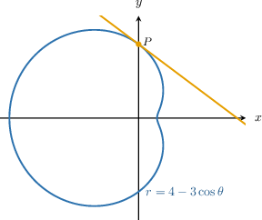
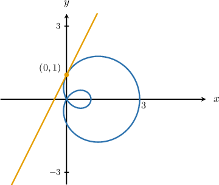
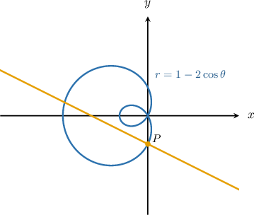

# Tangent and Normal Lines to Polar Curves

Source: https://www.mathacademy.com/topics/3834?courseId=21
Topic ID: 3834

## Prerequisites

- [Calculating Tangent and Normal Lines with Parametric Equations](./799-calculating-tangent-and-normal-lines-with-parametric-equations.md)
- [Differentiating Curves Given in Polar Form](./998-differentiating-curves-given-in-polar-form.md)

## Lesson

### Introduction

The polar curve shown above is defined as

$$

r(\theta) = 4 - 3\cos \theta, \qquad 0\leq \theta < 2\pi.

$$

We have $\theta = \dfrac{\pi}{2}$ at the point $P.$ The tangent to the curve at $P$ is shown in the diagram.

To find the equation of the tangent line to the curve at $P,$ we follow four steps.

**Step 1**: Calculate the derivative $\dfrac{\textrm{d}y}{\textrm{d}x}.$

Using techniques that we've previously discussed, we can show that

$$

\begin{aligned}𝑦^{′}(𝜃)=4cos⁡𝜃−3cos⁡2𝜃,\,𝑥^{′}(𝜃)=3sin⁡2𝜃−4sin⁡𝜃.\end{aligned}

$$

Therefore, we can find $\dfrac{\textrm{d}y}{\textrm{d}x}$ as follows:

$$

\begin{aligned}\frac{d𝑦}{d𝑥} & =\frac{𝑦^{′}(𝜃)}{𝑥^{′}(𝜃)} \\ & =\frac{4cos⁡𝜃−3cos⁡2𝜃}{3sin⁡2𝜃−4sin⁡𝜃}\end{aligned}

$$

**Step 2**: Find the slope of the tangent at $P.$

The slope of the tangent line is

$$

\begin{aligned}𝑚 & =\frac{d𝑦}{d𝑥}_{𝜃=𝜋/2} \\ & =\frac{4cos⁡(\frac{𝜋}{2})−3cos⁡(2⋅\frac{𝜋}{2})}{2} \\ & =\frac{4cos⁡(\frac{𝜋}{2})−3cos⁡(𝜋)}{2} \\ & =\frac{0+3}{0−4} \\ & =−\frac{3}{4}.\end{aligned}

$$

**Step 3**: Find the Cartesian coordinates of $P.$

We compute the $xy$-coordinates of $P$ as follows:

$$

\begin{aligned}𝑥_{1} & =𝑟cos⁡𝜃 \\ & =(4−3cos⁡𝜃)cos⁡𝜃 \\ & =(4−3cos⁡(\frac{𝜋}{2}))cos⁡(\frac{𝜋}{2}) \\ & =0 \\ 𝑦_{1} & =𝑟sin⁡𝜃 \\ & =(4−3cos⁡𝜃)sin⁡𝜃 \\ & =(4−3cos⁡(\frac{𝜋}{2}))sin⁡(\frac{𝜋}{2}) \\ & =4\end{aligned}

$$

Therefore, the coordinates of $P$ are $\left(0, 4 \right).$

**Step 4**: Using point-slope form, find the equation of the tangent.

We find the equation of the tangent as follows:

$$

\begin{aligned}𝑦−𝑦_{1} & =𝑚(𝑥−𝑥_{1}) \\ 𝑦−4 & =−\frac{3}{4}⋅(𝑥−0) \\ 𝑦 & =−\frac{3}{4}𝑥+4\end{aligned}

$$

### Example: Finding Tangent Lines to Polar Curves

#### Question

Find the equation of the tangent line to the polar curve $r = 1+2\cos\theta$ at $\theta = \dfrac{\pi}{2},$ given that

$$

\dfrac{\textrm d y}{\textrm d x} = -\dfrac{\cos\theta + 2\cos(2\theta)}{\sin\theta + 2\sin(2\theta)}.

$$

#### Explanation

To find the equation of the tangent line to a polar curve at a point $P,$ we follow four steps:

****: Calculate the derivative $\dfrac{\textrm{d}y}{\textrm{d}x}.$

In this case, we're given that

$$

\dfrac{\textrm d y}{\textrm d x} = -\dfrac{\cos\theta + 2\cos(2\theta)}{\sin\theta + 2\sin(2\theta)}.

$$

****: Find the slope of the tangent at $P.$

The slope of the tangent line is

$$

\begin{aligned}𝑚 & =\frac{d𝑦}{d𝑥}_{𝜃=𝜋/2} \\ & =−\frac{cos⁡(\frac{𝜋}{2})+2cos⁡(𝜋)}{2} \\ & =−\frac{0+2(−1)}{1+2(0)} \\ & =2.\end{aligned}

$$

****: Find the Cartesian coordinates of $P.$

We compute the $xy$-coordinates of $P$ as follows:

$$

\begin{aligned}𝑥_{1} & =𝑟cos⁡𝜃 \\ & =(1+2cos⁡𝜃)cos⁡𝜃 \\ & =(1+2cos⁡(\frac{𝜋}{2}))cos⁡(\frac{𝜋}{2}) \\ & =(1+2⋅0)⋅0 \\ & =0 \\ 𝑦_{1} & =𝑟sin⁡𝜃 \\ & =(1+2cos⁡𝜃)sin⁡𝜃 \\ & =(1+2cos⁡(\frac{𝜋}{2}))sin⁡(\frac{𝜋}{2}) \\ & =(1+2⋅0)⋅1 \\ & =1⋅1 \\ & =1\end{aligned}

$$

Therefore, the coordinates of $P$ are $(0,1).$

****: Using point-slope form, find the equation of the tangent.

We find the equation of the tangent as follows:

$$

\begin{aligned}𝑦−𝑦_{1} & =𝑚(𝑥−𝑥_{1}) \\ 𝑦−1 & =2(𝑥−0) \\ 𝑦 & =2𝑥+1\end{aligned}

$$

### Example: Finding Normal Lines to Polar Curves

#### Question

Find the equation of the **** line to the polar curve $r = 1 - 2\cos\theta$ at $\theta = \dfrac{3\pi}{2},$ given that

$$

y'(\theta) = \cos\theta-2\cos(2\theta) , \qquad x'(\theta) = 2\sin(2\theta) - \sin\theta.

$$

#### Explanation

To find the equation of the normal line to a polar curve at a point $P,$ we follow four steps:

****: Calculate the derivative $\dfrac{\textrm{d}y}{\textrm{d}x}.$

In this case, we're given that

$$

y'(\theta) = \cos\theta-2\cos(2\theta) , \qquad x'(\theta) = 2\sin(2\theta) - \sin\theta.

$$

Therefore,

$$

\begin{aligned}\frac{d𝑦}{d𝑥} & =\frac{𝑦^{′}(𝜃)}{𝑥^{′}(𝜃)} \\ & =\frac{cos⁡𝜃−2cos⁡(2𝜃)}{2sin⁡(2𝜃)−sin⁡𝜃}\end{aligned}

$$

****: Find the slope of the tangent at $P.$

The slope of the tangent line is

$$

\begin{aligned}𝑚 & =\frac{d𝑦}{d𝑥}_{𝜃=3𝜋/2} \\ & =\frac{(cos⁡(\frac{3𝜋}{2})−2cos⁡(2⋅\frac{3𝜋}{2}))}{2} \\ & =\frac{(cos⁡(\frac{3𝜋}{2})−2cos⁡(3𝜋))}{2} \\ & =\frac{0−2(−1)}{0−(−1)} \\ & =\frac{0+2}{0+1} \\ & =2.\end{aligned}

$$

****: Find the Cartesian coordinates of $P.$

We compute the $xy$-coordinates of $P$ as follows:

$$

\begin{aligned}𝑥_{1} & =𝑟cos⁡𝜃 \\ & =(1−2cos⁡𝜃)cos⁡𝜃 \\ & =(1−2cos⁡(\frac{3𝜋}{2}))cos⁡(\frac{3𝜋}{2}) \\ & =(1−2⋅0)⋅0 \\ & =0 \\ 𝑦_{1} & =𝑟sin⁡𝜃 \\ & =(1−2cos⁡𝜃)sin⁡𝜃 \\ & =(1−2cos⁡(\frac{3𝜋}{2}))sin⁡(\frac{3𝜋}{2}) \\ & =(1−2⋅0)⋅(−1) \\ & =1⋅(−1) \\ & =−1\end{aligned}

$$

Therefore, the coordinates of $P$ are $\left(0, -1 \right).$

****: Using point-slope form, find the equation of the normal.

We find the equation of the normal as follows:

$$

\begin{aligned}𝑦−𝑦_{1} & =−\frac{1}{𝑚}(𝑥−𝑥_{1}) \\ 𝑦−(−1) & =−\frac{1}{2}⋅(𝑥−0) \\ 𝑦+1 & =−\frac{1}{2}𝑥 \\ 𝑦 & =−\frac{1}{2}𝑥−1\end{aligned}

$$
