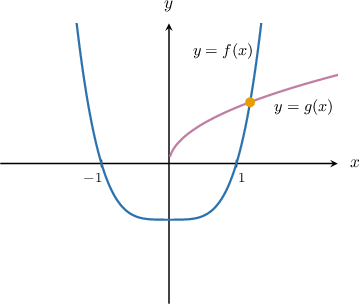
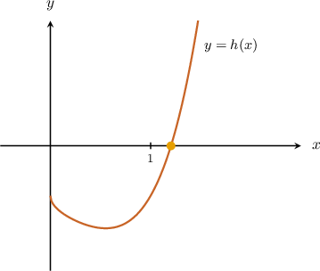
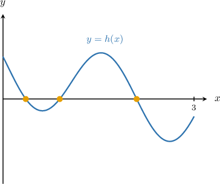
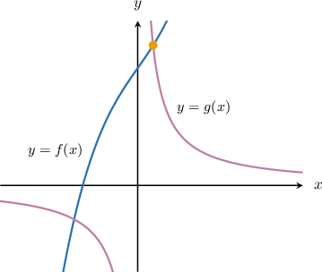
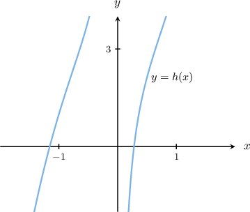
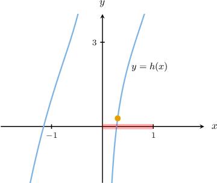
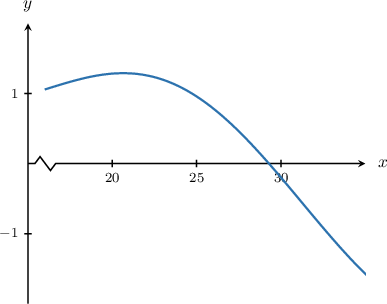
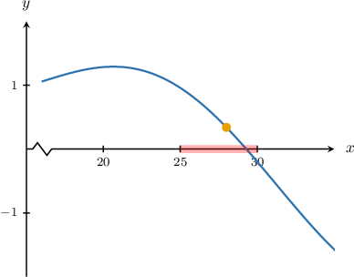

# Finding Intersections of Functions Using a Graphing Calculator

Source: https://www.mathacademy.com/topics/3956?courseId=21
Topic ID: 3956

## Prerequisites

- [The Arithmetic of Functions](../../../high-school/traditional/lessons/algebra-i/140-the-arithmetic-of-functions.md)
- [Approximating Solutions to Systems of Nonlinear Equations](../../../high-school/traditional/lessons/algebra-i/2224-approximating-solutions-to-systems-of-nonlinear-equations.md)
- [Finding Roots of Functions Using a Graphing Calculator](../ap-calculus-ab/3116-finding-roots-of-functions-using-a-graphing-calculator.md)

## Lesson

### Introduction

We can apply our graphing calculator's root-finding capabilities to accurately approximate a point of intersection of two curves.

For example, let's consider the following functions:

$$

f(x)=x^4-1, \qquad g(x)=\sqrt x

$$

A sketch of the functions and their common intersection point is shown below.

While it may be tempting to approximate the intersection point by plotting the two functions on a graphing calculator, it's often easier and more accurate to reduce the problem to one that involves finding roots.

To find the $x$-values of the intersection point, we need to solve the equation

$$

f(x) = g(x).

$$

This equation can be written as

$$

f(x)-g(x) = 0.

$$

Therefore, the problem can be reduced to finding the roots of the function $h(x),$ given by

$$

\begin{aligned}ℎ(𝑥) & =𝑓(𝑥)−𝑔(𝑥) \\ & =(𝑥^{4}−1)−(\sqrt{√𝑥}) \\ & =𝑥^{4}−1−\sqrt{√𝑥}.\end{aligned}

$$

The function $h(x)$ and its root are shown below.

We can now apply the usual root-finding techniques to find a good approximation of the root of $h(x).$ The $x$-coordinate of the root corresponds to the $x$-coordinate of the intersection point of $f(x)$ and $g(x).$

### Example: Finding the Number of Solutions to an Equation on an Interval

#### Question

Find the number of solutions of the equation $e^{-x^2} = \sin 3x$ on the interval $x \in \left[0,3\right].$

#### Explanation

The solutions of the equation correspond to the $x$-coordinates of the intersection points between the curves

$$

f(x)=e^{-x^2}, \qquad g(x)=\sin 3x.

$$

The $x$-values of the intersection points are given by the equation

$$

f(x) = g(x)

$$

which can be written as

$$

f(x)-g(x) = 0.

$$

As a result, the problem can be reduced to finding the roots of the function

$$

\begin{aligned}ℎ(𝑥) & =𝑓(𝑥)−𝑔(𝑥) \\ & =𝑒^{−𝑥^{2}}−sin⁡3𝑥.\end{aligned}

$$

First, we plot $y=h(x)$ using a graphing calculator. Since $h(x)$ contains trigonometric functions, you need to make sure your calculator is in $\boxed{\color{gray}\,\text{RAD}\,}$ (radians) mode.

To plot the function, we press $\boxed{\color{gray}\,y=\,}$ and enter the function definition in the first available space. We then press $\boxed{\color{gray}\,\text{graph}\,}$ to graph the function.

We can adjust the window settings using the $\boxed{\color{gray}\,\text{window}\,}$ button (or equivalent).

In our case, the appropriate window ranges could be the following:

- for the horizontal axis, $x \in [0, 3]$

- for the vertical axis, $y \in [-2,2]$

This gives us the following graph:

From the graph, we see that $y=h(x)$ has $3$ roots in the interval $x\in [0,3].$

Therefore, the equation $e^{-x^2} = \sin 3x$ has $3$ solutions on the interval $x \in \left[0,3\right].$

### Example: Approximating a Point of Intersection of Two Functions

#### Question

Find an approximation for the $x$-coordinate of the intersection point between the curves

$$

f(x) = x^3 + 2x + 3, \qquad g(x) = \dfrac{1}{x}

$$

that lies to the right of the $y$-axis.

#### Explanation

To find the $x$-values of the intersection points, we need to solve the equation

$$

f(x) = g(x)

$$

which can be written as

$$

f(x) - g(x) = 0.

$$

As a result, the problem can be reduced to finding the roots of the function

$$

\begin{aligned}ℎ(𝑥) & =𝑓(𝑥)−𝑔(𝑥) \\ & =𝑥^{3}+2𝑥+3−\frac{1}{𝑥}.\end{aligned}

$$

First, we plot $y = h(x)$ using a graphing calculator to find an interval that contains the root.

To plot the function, we press $\boxed{\color{gray}\,y=\,}$ and enter the function definition in the first available space. We then press $\boxed{\color{gray}\,\text{graph}\,}$ to graph the function.

To get a better view, we might need to either

- zoom in or out, or

- adjust the window ranges.

We can adjust the window settings using the $\boxed{\color{gray}\,\text{window}\,}$ button (or equivalent).

In our case, the appropriate window ranges could be the following:

- for the horizontal axis, $x \in [-2, 2]$

- for the vertical axis, $y \in [-2,4]$

This gives us the following graph:

The graph shows that the root lies inside the interval $x \in [0,1].$

To get a good approximation for the root, we use the $\boxed{\color{gray}\,\text{zero}\,}$ command (or equivalent). This is usually accessed by pressing the $\boxed{\color{gray}\,\text{calc}\,}$ button (or equivalent). Note that we sometimes need to press the $\boxed{\color{gray}\,\text{2nd}\,}$ or $\boxed{\color{gray}\,\text{shift}\,}$ button first.

We enter the following when prompted:

- The "left bound" should be a value close to the root on its left-hand side. Let's pick $0.$

- The "right bound" should be a value close to the root on its right-hand side. Let's pick $1.$

- The "guess" could be any number from $(0,1).$ Let's pick $0.3.$

The calculator returns the zero

$\qquad$ $x \approx 0.279\,299.$

Rounding to $3$ decimal places, we obtain the following:

$\qquad$ $x \approx 0.279$

### Example: Approximating a Point of Intersection of Two Functions Outside the Standard Range

#### Question

Find an approximation for the $x$-coordinate of the intersection point between the curves

$$

f(x)= 5 - \sqrt x, \qquad g(x)= \sin \left(\dfrac{x}{5}\right)

$$

that lies to the right of the $y$-axis.

#### Explanation

To find the $x$-values of the intersection points, we need to solve the equation

$$

f(x) = g(x)

$$

which can be written as

$$

f(x)-g(x) = 0.

$$

As a result, the problem can be reduced to finding the roots of the function

$$

\begin{aligned}ℎ(𝑥) & =𝑓(𝑥)−𝑔(𝑥) \\ & =(5−\sqrt{√𝑥})−sin⁡(\frac{𝑥}{5}) \\ & =5−\sqrt{√𝑥}−sin⁡(\frac{𝑥}{5}).\end{aligned}

$$

First, we plot $y=h(x)$ using a graphing calculator to find an interval that contains the root. Since $h(x)$ contains trigonometric functions, you need to make sure your calculator is in $\boxed{\color{gray}\,\text{RAD}\,}$ (radians) mode.

To plot the function, we press $\boxed{\color{gray}\,y=\,}$ and enter the function definition in the first available space. We then press $\boxed{\color{gray}\,\text{graph}\,}$ to graph the function.

The default view on most graphing calculators is $x \in [-10,10], y \in [-10,10].$ However, in this instance, the root falls outside the default view.

To get a better view, we might need to either

- zoom in or out, or

- adjust the window ranges.

We can adjust the window settings using the $\boxed{\color{gray}\,\text{window}\,}$ button (or equivalent).

In our case, the appropriate window ranges could be the following:

- for the horizontal axis, $x \in [15,35]$

- for the vertical axis, $y \in [-2,2]$

This gives us the following graph:

The graph shows that the root lies inside the interval $x\in [25,30].$

To get a good approximation for the root, we use the $\boxed{\color{gray}\,\text{zero}\,}$ command (or equivalent). This is usually accessed by pressing the $\boxed{\color{gray}\,\text{calc}\,}$ button (or equivalent). Note that we sometimes need to press the $\boxed{\color{gray}\,\text{2nd}\,}$ or $\boxed{\color{gray}\,\text{shift}\,}$ button first.

We enter the following when prompted:

- The "left bound" should be a value close to the root on its left-hand side. Let's pick $25.$

- The "right bound" should be a value close to the root on its right-hand side. Let's pick $30.$

- The "guess" could be any number from $[25,30].$ Let's pick $28.$

The calculator returns the zero

$\qquad$ $x \approx 29.291\,697.$

Rounding to $3$ decimal places, we obtain the following:

$\qquad$ $x \approx 29.292$
