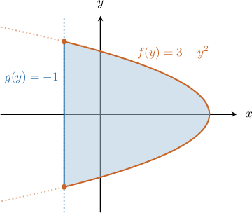
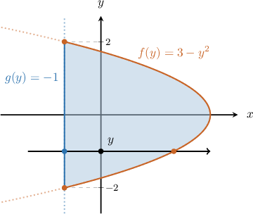
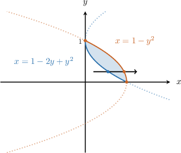
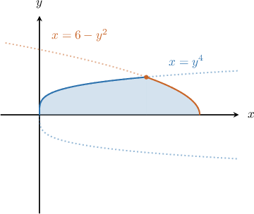
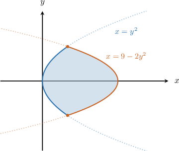
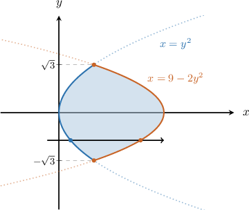

# The Area Between Curves Expressed as Functions of Y

Source: https://www.mathacademy.com/topics/402?courseId=21
Topic ID: 402

## Prerequisites

- [The Area Between Curves Expressed as Functions of X](../ap-calculus-ab/395-the-area-between-curves-expressed-as-functions-of-x.md)
- [The Area Bounded by a Curve and the Y-Axis](../ap-calculus-ab/1041-the-area-bounded-by-a-curve-and-the-y-axis.md)

## Lesson

### Introduction

Suppose we want to find the area bounded between the curves $f(y)=3-y^2$ and $g(y)=-1.$

We can adopt the same approach that we used for functions of $x.$ The only difference is that now we're working with functions of $y.$ So we write the integral in terms of $y,$ and we subtract the left curve from the right curve.

So, the area $A$ of the region is given by

$$

\begin{aligned}𝐴 & =∫_{𝑑𝑐}[\,(right function)−(left function)\,]\,d𝑦.\end{aligned}

$$

First, we find for which values of $y$ the curves intersect. In our case, the intersections of the curves are given by

$$

\begin{aligned}𝑓(𝑦) & =𝑔(𝑦) \\ 3−𝑦^{2} & =−1 \\ 𝑦^{2} & =4 \\ 𝑦 & =±2.\end{aligned}

$$

The right function is $f(y) = 3-y^2,$ and the left function is $g(y)=-1.$ So the area that we want can be found as follows:

$$

\begin{aligned}𝐴 & =∫_{2−2}(𝑓(𝑦)−𝑔(𝑦))\,d𝑦 \\ & =∫_{2−2}((3−𝑦^{2})−(−1))\,d𝑦 \\ & =∫_{2−2}(4−𝑦^{2})\,d𝑦\end{aligned}

$$

Evaluating the integral, we get $A = \dfrac{32}{3}.$

**Note:** If you're not sure which is the right function and which is the left, one way to find out is to consider some $y$ between the bounds $y=-2$ and $y=2,$ and draw a horizontal line that passes through $y$ and points in the positive direction along the $x$-axis, as shown below.

The horizontal line always *enters* the region through the left function and *leaves* through the right function.

### Example: Expressing the Area Between Two Curves as an Integral Given the Limits of Integration

#### Question

What integral gives the area of the finite region bounded between the curves $x=1-y^2$ and $x=1-2y+y^2?$

#### Explanation

From the diagram, we see that the points of intersection between the two functions occur when $y=0$ and $y=1.$ So these will be our limits of integration.

To determine which is the left function and which is the right, let's draw our horizontal arrow (from left to right).

The horizontal line

- ** the region through the left function $x=1-2y+y^2,$ and

- ** through the right function $x=1-y^2.$

Therefore, the integral that gives our area is

$$

\begin{aligned}𝐴 & =∫_{10}[\,(right function)−(left function)\,]\,d𝑦 \\ & =∫_{10}[\,(1−𝑦^{2})−(1−2𝑦+𝑦^{2})\,]\,d𝑦 \\ & =∫_{10}(−2𝑦^{2}+2𝑦)\,d𝑦.\end{aligned}

$$

### Example: Expressing the Area Between Two Curves as an Integral by First Finding the Limits of Integration

#### Question

Which integral gives the area of the finite region bounded by the curves $x=y^4,$ $x=6-y^2,$ and the $x$-axis?

#### Explanation

First, we want to determine the limits of integration. To do this, we equate the two functions and solve for $y\mathbin{:}$

$$

\begin{aligned}𝑦^{4} & =6−𝑦^{2} \\ 𝑦^{4}+𝑦^{2}−6 & =0 \\ (𝑦^{2}+3)(𝑦^{2}−2) & =0\end{aligned}

$$

Since $y^2+3=0$ has no real solutions, we get only $y=\sqrt{2}.$ Hence, we need to integrate from $y=0$ to $y=\sqrt{2}.$

To determine which is the left function and which is the right, let's draw our horizontal arrow (from left to right).

The horizontal line

- ** the region through the left function $x=y^4,$ and

- ** through the right function $x=6- y^2.$

Therefore, the integral that gives our area is

$$

\begin{aligned}𝐴 & =∫_{𝑑𝑐}[\,(right function)−(left function)\,]\,d𝑦 \\ & =∫_{\sqrt{2}0}^{}[\,(6−𝑦^{2})−(𝑦^{4})\,]\,d𝑦 \\ & =∫_{\sqrt{2}0}^{}(−𝑦^{4}−𝑦^{2}+6)\,d𝑦.\end{aligned}

$$

### Example: Calculating the Area Between Two Curves Expressed as Functions of Y

#### Question

Calculate the area of the finite region bounded between the curves $x=9-2y^2$ and $x=y^2?$

#### Explanation

First, let's draw the graphs of the two functions:

**

Now, we want to determine the limits of integration. To do this, we equate the two functions and solve for $y\mathbin{:}$

$$

\begin{aligned}𝑦^{2} & =9−2𝑦^{2} \\ 3𝑦^{2} & =9 \\ 𝑦^{2} & =3 \\ 𝑦 & =±\sqrt{3}\end{aligned}

$$

Hence, we need to integrate from $y=-\sqrt 3$ to $y=\sqrt 3.$

To determine which is the left function and which is the right, let's draw our horizontal arrow (from left to right).

The horizontal line

- ** the region through the left function $x=y^2,$ and

- ** through the right function $x=9-2y^2.$

Therefore, we can find the area as follows:

$$

\begin{aligned}𝐴 & =∫_{\sqrt{3}−\sqrt{3}}^{}[\,(right function)−(left function)\,]\,d𝑦 \\ & =∫_{\sqrt{3}−\sqrt{3}}^{}[\,(9−2𝑦^{2})−(𝑦^{2})\,]\,d𝑦 \\ & =∫_{\sqrt{3}−\sqrt{3}}^{}(9−3𝑦^{2})\,d𝑦 \\ & =9𝑦\,_{\sqrt{3}−\sqrt{3}}^{}−𝑦^{3}\,_{\sqrt{3}−\sqrt{3}}^{} \\ & =9(\sqrt{3}−(−\sqrt{3}))−((\sqrt{3})^{3}−(−\sqrt{3})^{3}) \\ & =18\sqrt{3}−6\sqrt{3} \\ & =12\sqrt{3}\end{aligned}

$$
