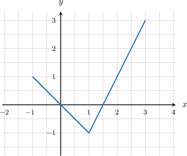
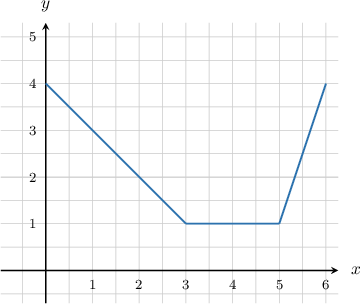
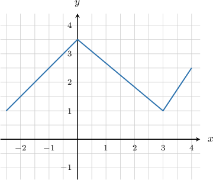
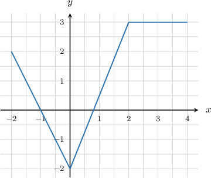
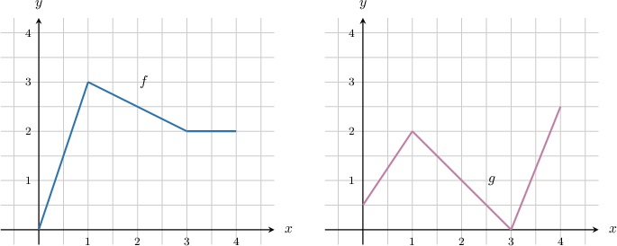

# Calculating Derivatives From Graphs Using the Chain Rule

Source: https://www.mathacademy.com/topics/4057?courseId=21
Topic ID: 4057

## Prerequisites

- [Calculating Derivatives From Graphs](../ap-calculus-ab/1117-calculating-derivatives-from-graphs.md)
- [Calculating Derivatives From Data Using the Chain Rule](../ap-calculus-ab/1282-calculating-derivatives-from-data-using-the-chain-rule.md)

## Lesson

### Introduction

Consider the graph of the function $y = f(x)$ shown below.

Suppose we define a new function $h(x)$ as

$$

h(x)=\left({f(x)}\right)^5.

$$

Let's use our knowledge of derivatives to find $h'(2),$ the derivative of $h$ at $x=2.$

To find an expression for $h'(x)$ in terms of $f(x),$ we differentiate $h(x)$ using the chain rule. This gives

$$

\begin{aligned}ℎ^{′}(𝑥) & =\frac{d}{d𝑥}(𝑓(𝑥))^{5} \\ & =5(𝑓(𝑥))^{4}⋅𝑓^{′}(𝑥).\end{aligned}

$$

Substituting $x=2$ into the above expression, we have

$$

h'(2) =5\left({f(2)}\right)^4\cdot f'(2).

$$

To evaluate this expression, we need to collect data from the graph of $y=f(x){:}$

- The graph passes through the point $(2,1).$ Therefore, $f(2) = 1.$

- Next, we need to find the slope of the tangent to $f$ at $x=2{:}$ The slope of $f(x)$ is constant on $x\in \left(1,3\right)$ and is given by Therefore, $f'(2)=2.$

Substituting this data into our expression for $h'(2),$ we get

$$

\begin{aligned}ℎ^{′}(2) & =5(𝑓(2))^{4}⋅𝑓^{′}(2) \\ & =5⋅1^{4}⋅2 \\ & =10.\end{aligned}

$$

So, we conclude that $h'(2) = 10.$

### Example: Calculating a Derivative Using the Power and Chain Rules

#### Question

The graph of $y=f(x)$ is shown above. If $h(x)=\dfrac{1}{\left(f(x)\right)^5}$, what is $h'(2)?$

#### Explanation

The chain rule gives

$$

\begin{aligned}ℎ^{′}(𝑥) & =\frac{d}{d𝑥}(𝑓(𝑥))^{−5} \\ & =−5(𝑓(𝑥))^{−6}⋅𝑓^{′}(𝑥) \\ & =−\frac{5}{(𝑓(𝑥))^{6}}⋅𝑓^{′}(𝑥) \\ & =−\frac{5𝑓^{′}(𝑥)}{(𝑓(𝑥))^{6}},\end{aligned}

$$

and therefore

$$

h'(2)= -\dfrac{5f'(2)}{\left(f(2)\right)^6}.

$$

Now, note the following:

- From the graph, we obtain $f(2)=2.$

- Additionally, the slope of $f(x)$ on $\left[0,3\right]$ equals $-1$, so $f'(2)=-1.$

Therefore, we have

$$

\begin{aligned}ℎ^{′}(2) & =−\frac{5𝑓^{′}(2)}{(𝑓(2))^{6}} \\ & =−\frac{5⋅(−1)}{2^{6}} \\ & =\frac{5}{64}.\end{aligned}

$$

### Example: Differentiating Composite Special Functions

#### Question

The graph of $y=f(x)$ is shown above. If $h(x)=e^{{f(x)}}$, what is $h'\left(-\dfrac12\right)?$

#### Explanation

The chain rule gives

$$

\begin{aligned}ℎ^{′}(𝑥) & =\frac{d}{d𝑥}(𝑒^{𝑓(𝑥)}) \\ & =𝑒^{𝑓(𝑥)}⋅𝑓^{′}(𝑥),\end{aligned}

$$

and therefore

$$

h'\left(-\dfrac12\right) = e^{f\left(-1/2\right)}\cdot f'\left(-\dfrac12\right).

$$

Now, note the following:

- From the graph, we obtain $f\left(-\dfrac12\right) = 3.$

- Additionally, the slope of $f(x)$ on $\left[-2.5,0\right]$ equals $1$, so $f'\left(-\dfrac12\right)=1.$

Therefore, we have

$$

\begin{aligned}ℎ^{′}(−\frac{1}{2}) & =𝑒^{𝑓(−1/2)}⋅𝑓^{′}(−\frac{1}{2}) \\ & =𝑒^{3}⋅1 \\ & =𝑒^{3}.\end{aligned}

$$

### Example: Differentiating a Sum of Composite Functions

#### Question

The graph of $y=f(x)$ is shown above. If $h(x)=\sin\left({f(x)}\right)+\cos\left(f(x)\right)$, what is $h'(-1)?$

#### Explanation

The chain rule gives

$$

\begin{aligned}ℎ^{′}(𝑥) & =\frac{d}{d𝑥}(sin⁡(𝑓(𝑥))+cos⁡(𝑓(𝑥))) \\ & =\frac{d}{d𝑥}(sin⁡(𝑓(𝑥)))+\frac{d}{d𝑥}(cos⁡(𝑓(𝑥))) \\ & =cos⁡(𝑓(𝑥))⋅𝑓^{′}(𝑥)−sin⁡(𝑓(𝑥))⋅𝑓^{′}(𝑥)\end{aligned}

$$

and therefore

$$

h'(-1) = \cos\left(f(-1)\right) \cdot f'(-1) -\sin(f(-1))\cdot f'(-1).

$$

Now, note the following:

- From the graph, we obtain $f(-1)=0.$

- Additionally, the slope of $f(x)$ on $\left[-2,0\right]$ equals $-2$, so $f'(-1)=-2.$

Therefore, we have

$$

\begin{aligned}ℎ^{′}(−1) & =cos⁡(𝑓(−1))⋅𝑓^{′}(−1)−sin⁡(𝑓(−1))⋅𝑓^{′}(−1) \\ & =cos⁡(0)⋅(−2)−sin⁡(0)⋅(−2) \\ & =1⋅(−2)−0 \\ & =−2.\end{aligned}

$$

### Example: Differentiating a Composite Function Given Two Graphs

#### Question

Functions $f$ and $g$ are represented by the graphs above. If $h(x)=g(f(x))$, what is $h'\left(2\right)?$

#### Explanation

The chain rule gives

$$

h'(x) = g'(f(x)) \cdot f'(x),

$$

and therefore

$$

h'(2) = g'(f(2)) \cdot f'(2).

$$

From the graph we obtain $f(2)=\dfrac{5}{2}.$

Additionally:

- The slope of $f(x)$ on $[1,3]$ equals $-\dfrac{1}{2}.$ So, $f'(2)=-\dfrac{1}{2}.$

- The slope of $g(x)$ on $\left[1,3\right]$ equals $-1.$ So, $g'\left(\dfrac{5}{2}\right)=-1.$

Therefore, we have

$$

\begin{aligned}ℎ^{′}(2) & =𝑔^{′}(𝑓(2))⋅𝑓^{′}(2) \\ & =𝑔^{′}(\frac{5}{2})⋅(−\frac{1}{2}) \\ & =(−1)⋅(−\frac{1}{2}) \\ & =\frac{1}{2}.\end{aligned}

$$
