# Volumes of Revolution Using the Washer Method: Rotation About the Coordinate Axes

Source: https://www.mathacademy.com/topics/414?courseId=21
Topic ID: 414

## Prerequisites

- [The Area Between Curves Expressed as Functions of Y](../ap-calculus-ab/402-the-area-between-curves-expressed-as-functions-of-y.md)
- [Volumes of Revolution Using the Disc Method: Rotation About the Coordinate Axes](../ap-calculus-ab/413-volumes-of-revolution-using-the-disc-method-rotation-about-the-coordinate-axes.md)

## Lesson

### Introduction

Consider the plane region enclosed by the curve $y=\sqrt{x},$ the curve $y=\dfrac{1}{2}x,$ and the vertical line $x=2,$ as shown below.

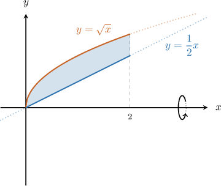

We rotate this region $360^\circ$ about the $x$-axis to get a solid of revolution, as shown below. How can we find the volume of this solid?

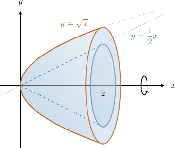

To find the volume of the solid generated when the region bounded by the outer curve $y=f(x),$ the inner curve $y=g(x),$ and the vertical lines $x=a$ and $x=b$ is rotated $360^\circ$ about the $x$-axis, we use the following formula:

$$

V = \pi \int_{a}^{b} \Big( \big[ \underbrace{f(x)}_\text{outer} \big]^2 - \big[ \underbrace{g(x)}_\text{inner} \big]^2 \Big) \:\text{d}x.

$$

This method of computing the volume is called the **washer method** because it involves breaking up the region into many thin washers (one such washer is shown below).

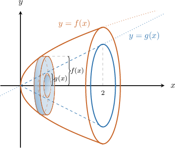

The cross-sectional area of each washer corresponds to the region between two discs of radius $f(x)$ and $g(x),$ so the area of each washer cross-section is

$$

\pi [f(x)]^2 - \pi [g(x)]^2,

$$

and this is what we integrate.

In our case, the outer curve is $f(x)=\sqrt{x}$ and the inner curve is $g(x) = \dfrac{1}{2}x,$ so the volume is given by

$$

\begin{aligned}𝑉=𝜋∫_{20}(\sqrt{𝑥})^{2}−(\frac{1}{2}𝑥)^{2}d𝑥.\end{aligned}

$$

which simplifies to

$$

\begin{aligned}𝑉=𝜋∫_{20}(𝑥−\frac{𝑥^{2}}{4})d𝑥.\end{aligned}

$$

Evaluating this integral gives

$$

\begin{aligned}𝑉 & =𝜋(∫_{20}𝑥\,d𝑥−\frac{1}{4}∫_{20}𝑥^{2}\,d𝑥) \\ & =𝜋(\frac{𝑥^{2}}{2}_{20}−\frac{1}{4}⋅\frac{𝑥^{3}}{3}_{20}) \\ & =𝜋((\frac{4}{2}−0)−\frac{1}{4}(\frac{8}{3}−0)) \\ & =𝜋(2−\frac{2}{3}) \\ & =\frac{4𝜋}{3}.\end{aligned}

$$

So the volume of the solid is $\dfrac{4\pi}{3}$ cubic units.

### Example: Constructing an Integral Representing the Volume of a Solid Generated by Rotation About the X-Axis

#### Question

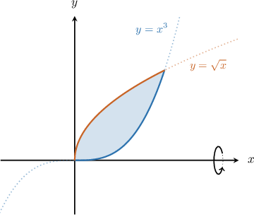

Consider the region bounded by $y=\sqrt{x}$ and $y=x^3,$ as shown above. Find an integral expression for the volume generated when this region is rotated $2\pi$ radians about the $x$-axis.

#### Explanation

Let $f(x)=\sqrt{x}$ and $g(x)=x^3.$

First, we determine the limits of integration. To do that, we find the intersections of the curves by solving the following equation for $x\mathbin{:}$

$$

\begin{aligned}𝑓(𝑥) & =𝑔(𝑥) \\ \sqrt{𝑥} & =𝑥^{3} \\ 𝑥 & =𝑥^{6} \\ 𝑥^{6}−𝑥 & =0 \\ 𝑥(𝑥^{5}−1) & =0\end{aligned}

$$

Hence, the limits of integration are from $x=0$ to $x=1.$

Let's draw our vertical arrow through the region to determine the inner function and the outer function. The arrow should be pointing ** from the axis of rotation.

The vertical arrow

- ** the region through the inner function $y=g(x)=x^3,$ and

- ** through the outer function $y=f(x)=\sqrt{x}.$

Therefore, the integral that gives our volume is

$$

\begin{aligned}𝑉 & =𝜋∫_{𝑏𝑎}([outer]^{2}−[inner]^{2})d𝑥 \\ & =𝜋∫_{10}([\sqrt{𝑥}]^{2}−[𝑥^{3}]^{2})d𝑥 \\ & =𝜋∫_{10}(𝑥−𝑥^{6})\,d𝑥.\end{aligned}

$$

### Example: Computing the Volume of a Solid Generated by Rotation About the X-Axis

#### Question

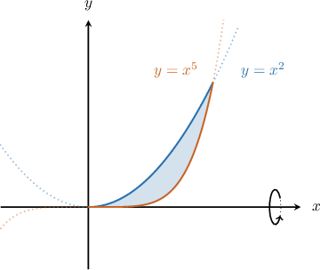

Consider the finite region bounded by $y=x^2$ and $y=x^5,$ as shown above. Calculate the volume of the solid generated when this region is rotated $2\pi$ radians about the $x$-axis.

#### Explanation

Let $f(x)=x^2$ and $g(x)=x^5.$

First, we determine the limits of integration. To do that, we find the intersections of the curves by solving the following equation for $x\mathbin{:}$

$$

\begin{aligned}𝑓(𝑥) & =𝑔(𝑥) \\ 𝑥^{2} & =𝑥^{5} \\ 𝑥^{5}−𝑥^{2} & =0 \\ 𝑥^{2}(𝑥^{3}−1) & =0\end{aligned}

$$

Hence, the limits of integration are from $x=0$ to $x=1.$

Let's draw our vertical arrow through the region to determine the inner function and the outer function. The arrow should be pointing ** from the axis of rotation.

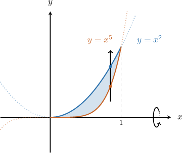

The vertical arrow

- ** the region through the inner function $y=g(x)=x^5,$ and

- ** through the outer function $y=f(x)=x^2.$

Therefore, the volume is given by

$$

\begin{aligned}𝑉 & =𝜋∫_{𝑏𝑎}([outer]^{2}−[inner]^{2})d𝑥 \\ & =𝜋∫_{10}([𝑥^{2}]^{2}−[𝑥^{5}]^{2})d𝑥 \\ & =𝜋∫_{10}(𝑥^{4}−𝑥^{10})d𝑥 \\ & =𝜋(\frac{𝑥^{5}}{5}−\frac{𝑥^{11}}{11})_{10} \\ & =𝜋[(\frac{1}{5}−\frac{1}{11})−0] \\ & =\frac{6𝜋}{55}.\end{aligned}

$$

### Rotation About the Y-Axis

Consider the plane region bounded by the curve the curve and the horizontal line as shown below.

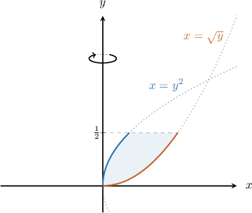

We rotate this region about the -axis to get a solid of revolution, as shown below. How can we find the volume of this solid?

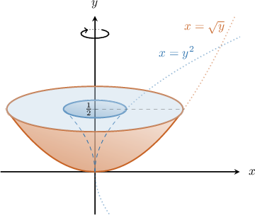

To find the volume of this solid, we can use the same washer method approach that we used earlier for the -axis. The only difference is that we need to swap and in our formula.

So, to find the volume of the solid generated when the region bounded by the outer curve the inner curve and the horizontal lines and is rotated radians about the -axis, we use the following formula:

This is the same washer method as before, the only difference is that we need to swap and It involves breaking up the region into many thin washers (one such washer is shown below).

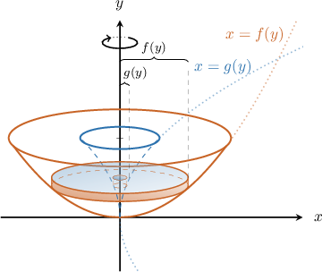

The cross-sectional area of each washer corresponds to the region between two discs of radius and so the area of each washer cross-section is

and this is what we integrate.

In our example, the outer curve is and the inner curve is so the volume is given by

which simplifies to

Evaluating this integral gives

### Example: Constructing an Integral Representing the Volume of a Solid Generated by Rotation About the Y-Axis

#### Question

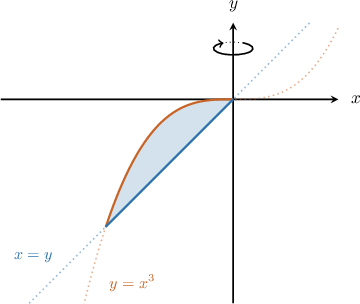

Consider the finite region bounded by $y=x^3$ and $x=y,$ where $y \leq 0,$ as shown above. Find an integral expression for the volume generated when this region is rotated $2\pi$ radians about the $y$-axis.

#### Explanation

Writing our first function in terms of $y,$ we get

$$

\begin{aligned}𝑦=𝑥^{3}\,⟹\,𝑥=\sqrt[√𝑦]{3}.\end{aligned}

$$

Let $f(y)=\sqrt[3]{y}$ and $g(y)=y.$

Now, we determine the limits of integration. To do that, we find the intersections of the curves by solving the following equation for $y\mathbin{:}$

$$

\begin{aligned}𝑓(𝑦) & =𝑔(𝑦) \\ \sqrt[√𝑦]{3} & =𝑦 \\ 𝑦 & =𝑦^{3} \\ 𝑦^{3}−𝑦 & =0 \\ 𝑦(𝑦^{2}−1) & =0\end{aligned}

$$

Hence $y=0$ and $y=\pm 1.$ But, since $y \leq 0,$ the limits of integration are from $y=0$ to $y=-1.$

Let's draw our horizontal arrow through the region to determine the inner function and the outer function. The arrow should be pointing ** from the axis of rotation.

The horizontal arrow

- ** the region through the inner function $x=g(y)=y,$ and

- ** through the outer function $x=f(y)=\sqrt[3]{y}.$

Therefore, the integral that gives our volume is

$$

\begin{aligned}𝑉 & =𝜋∫_{𝑏𝑎}([outer]^{2}−[inner]^{2})d𝑦 \\ & =𝜋∫_{0−1}([\sqrt[√𝑦]{3}]^{2}−[𝑦]^{2})d𝑦 \\ & =𝜋∫_{0−1}(\sqrt[√𝑦^{2}]{3}−𝑦^{2})d𝑦.\end{aligned}

$$

### Example: Computing the Volume of a Solid Generated by Rotation About the Y-Axis

#### Question

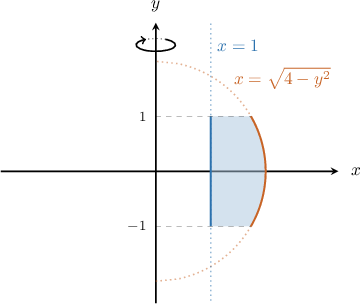

Consider the region bounded by $x=\sqrt{4-y^2},$ $x=1,$ and the horizontal lines $y=-1$ and $y=1,$ as shown above. Calculate the volume of the solid generated when this region is rotated $2\pi$ radians about the $y$-axis.

#### Explanation

Let $f(y)=\sqrt{4-y^2}\,$ and $g(y)=1.$

Let's draw our horizontal arrow through the region to determine the inner function and the outer function. The arrow should be pointing away from the axis of rotation.

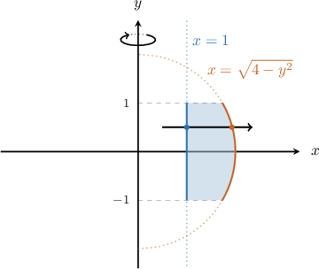

The horizontal arrow

- ** the region through the inner function $x=g(y)=1,$ and

- ** through the outer function $x=f(y)=\sqrt{4-y^2}.$

Therefore, the integral that gives our volume is

$$

\begin{aligned}𝑉 & =𝜋∫_{𝑑𝑐}([outer]^{2}−[inner]^{2})\,d𝑦 \\ & =𝜋∫_{1−1}([\sqrt{4−𝑦^{2}}]^{2}−1^{2})d𝑦 \\ & =𝜋∫_{1−1}(3−𝑦^{2})d𝑦 \\ & =2𝜋∫_{10}(3−𝑦^{2})d𝑦 \\ & =2𝜋(3𝑦−\frac{𝑦^{3}}{3})_{10} \\ & =2𝜋(3−\frac{1}{3}−0) \\ & =\frac{16𝜋}{3}.\end{aligned}

$$
