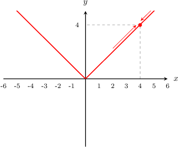

# Limits of Absolute Value Functions

Source: https://www.mathacademy.com/topics/605?courseId=21
Topic ID: 605

## Prerequisites

- [Rationalizing Denominators of Algebraic Expressions](../../../high-school/traditional/lessons/algebra-i/599-rationalizing-denominators-of-algebraic-expressions.md)
- [Limits of Piecewise Functions](../ap-calculus-ab/1262-limits-of-piecewise-functions.md)
- [Calculating Limits of Rational Functions by Factoring](../ap-calculus-ab/1813-calculating-limits-of-rational-functions-by-factoring.md)

## Lesson

### Introduction

Consider the graph of the absolute value function $y=|x|$ below.

From this graph, we see that as $x$ approaches $4,$ the value of $y$ approaches $|4|=4.$ Therefore,

$$

\lim_{x\to 4} |x| = |4| = 4.

$$

The absolute value is defined for all real $x.$ As $x$ approaches any finite number $a,$ the limit of the absolute value function can be obtained by directly substituting $x=a$ into the absolute value:

$$

\lim_{x\to a} |x| = |a|

$$

Additionally, we can see from the graph that the limits at infinity are

$$

\lim_{x\to \infty} |x| = \infty \qquad \text{and}\qquad \lim_{x\to -\infty} |x| = \infty.

$$

### Example: Evaluating a Limit Containing an Absolute Value By Direct Substitution

#### Question

Find $\lim\limits_{x \to (-2)^+} \dfrac{15x}{|x^3+x|}.$

#### Explanation

Let's attempt to evaluate this limit by direct substitution. Substituting $x=-2$ into the limit, we obtain

$$

\begin{aligned}\underset{𝑥→−2^{+}}{lim}\frac{15𝑥}{|𝑥^{3}+𝑥|} & =\frac{15(−2)}{|(−2)^{3}+(−2)|} \\ & =\frac{−30}{|−8−2|} \\ & =\frac{−30}{|−10|} \\ & =\frac{−30}{10} \\ & =−3.\end{aligned}

$$

### The Definition of Absolute Value

Remember that the absolute value function can be defined in two different ways. First, we can define it as the following piecewise function:

$$

\begin{aligned}𝑥, & \,𝑥≥0 \\ −𝑥, & \,𝑥<0\end{aligned}

$$

Second, we can define it as the square root of a square:

$$

|x| = \sqrt{x^2} .

$$

As we will see in the following examples, it is sometimes helpful to use all of these definitions together when evaluating limits.

### Example: Evaluating a Limit Containing an Absolute Value Function Using the Definition

#### Question

Find $\lim\limits_{x \to 0^-} \dfrac{\sqrt{x^2}}{x}.$

#### Explanation

First, recall that $\sqrt{x^2} = |x|.$ Therefore, we can rewrite the limit as

$$

\lim\limits_{x \to 0^-} \dfrac{|x|}{x}.

$$

Let's attempt to evaluate this limit by direct substitution. Substituting $x=0$ into the limit, we obtain

$$

\begin{aligned}\underset{𝑥→0^{−}}{lim}\frac{|𝑥|}{𝑥} & =\frac{|0|}{0}=\frac{0}{0}\end{aligned}

$$

which is an indeterminate form.

Notice, however, that we only require the left-sided limit, i.e., $x\to0^{-}.$ If $x < 0,$ then $|x| = -x.$ Therefore, we can evaluate this limit as follows:

$$

\begin{aligned}\underset{𝑥→0^{−}}{lim}(\frac{|𝑥|}{𝑥}) & =\underset{𝑥→0^{−}}{lim}(\frac{−𝑥}{𝑥}) \\ & =\underset{𝑥→0^{−}}{lim}(\frac{−𝑥}{𝑥}) \\ & =\underset{𝑥→0^{−}}{lim}(−1) \\ & =−1\end{aligned}

$$

Finally, we conclude that

$$

\lim\limits_{x \to 0^-} \dfrac{\sqrt{x^2}}{x} = -1.

$$

### Example: Evaluating a Limit Containing a Radical and an Absolute Value Function

#### Question

Evaluate $\lim\limits_{x \rightarrow 1^+}\dfrac{|x-1|}{\sqrt{x-1}}.$

#### Explanation

First, let's attempt to evaluate this limit by direct substitution. Substituting $x=1$ into the limit, we obtain

$$

\begin{aligned}\underset{𝑥→1^{+}}{lim}\frac{|𝑥−1|}{\sqrt{𝑥−1}} & =\frac{|1−1|}{\sqrt{1−1}} \\ & =\frac{|0|}{0} \\ & =\frac{0}{0}\end{aligned}

$$

which is an indeterminate form.

Notice, however, that we only require the right-sided limit, i.e., $x\to1^{+}.$ If $x > 1,$ then $|x-1| = x-1.$ Therefore, we can write this limit as follows:

$$

\begin{aligned}\underset{𝑥→1^{+}}{lim}\frac{|𝑥−1|}{\sqrt{𝑥−1}} & =\underset{𝑥→1^{+}}{lim}\frac{𝑥−1}{\sqrt{𝑥−1}}\end{aligned}

$$

Direct substitution into the above still gives an indeterminate form $\dfrac 0 0.$ However, we can rationalize the expression and then evaluate the limit, as follows:

$$

\begin{aligned}\underset{𝑥→1^{+}}{lim}\frac{𝑥−1}{\sqrt{𝑥−1}} & =\underset{𝑥→1^{+}}{lim}\frac{𝑥−1}{\sqrt{𝑥−1}}⋅\frac{\sqrt{𝑥−1}}{\sqrt{𝑥−1}} \\ & =\underset{𝑥→1^{+}}{lim}\frac{(𝑥−1)\sqrt{𝑥−1}}{𝑥−1} \\ & =\underset{𝑥→1^{+}}{lim}\frac{(𝑥−1)\sqrt{𝑥−1}}{𝑥−1} \\ & =\underset{𝑥→1^{+}}{lim}\frac{\sqrt{𝑥−1}}{1} \\ & =\underset{𝑥→1^{+}}{lim}\sqrt{𝑥−1} \\ & =\sqrt{1−1} \\ & =\sqrt{0} \\ & =0\end{aligned}

$$

### Example: Evaluating a Limit Containing a Quadratic Absolute Value Function

#### Question

Determine $\lim\limits_{x \to 2^-} \dfrac {\vert x^2 - 4 \vert} {x - 2}.$

#### Explanation

First, let's attempt to evaluate this limit by direct substitution. Substituting $x=2$ into the limit, we obtain

$$

\begin{aligned}\underset{𝑥→2^{−}}{lim}\frac{|𝑥^{2}−4|}{𝑥−2} & =\frac{|2^{2}−4|}{2−2} \\ & =\frac{|4−4|}{2−2} \\ & =\frac{0}{0}\end{aligned}

$$

which is an indeterminate form.

To evaluate the limit, we factor the numerator and rewrite the limit, as follows:

$$

\begin{aligned} \lim_{x \to 2^-} \dfrac {\vert x^2 - 4 \vert} {x - 2} &=\lim_{x \to 2^-} \dfrac {\vert (x+2)(x-2) \vert} {x - 2}\\[5pt] &=\lim_{x \to 2^-} \dfrac {\vert x+2\vert \cdot \vert x-2 \vert} {x - 2}\\[5pt] \end{aligned}

$$

Now, if $-2 \leq x<2,$ we have

- $|x+2| = x+2$ and

- $|x-2| = -(x-2).$

Substituting the above into our limit and simplifying, we get

$$

\begin{aligned}\underset{𝑥→2^{−}}{lim}\frac{|𝑥+2|⋅|𝑥−2|}{𝑥−2} & =\underset{𝑥→2^{−}}{lim}\frac{−(𝑥+2)(𝑥−2)}{𝑥−2} \\ & =\underset{𝑥→2^{−}}{lim}\frac{−(𝑥+2)(𝑥−2)}{𝑥−2} \\ & =\underset{𝑥→2^{−}}{lim}−(𝑥+2) \\ & =−(2+2) \\ & =−4.\end{aligned}

$$

Finally, we conclude that

$$

\lim\limits_{x \to 2^-} \dfrac {\vert x^2 - 4 \vert} {x - 2} = -4.

$$
