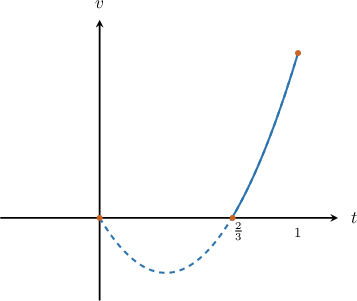
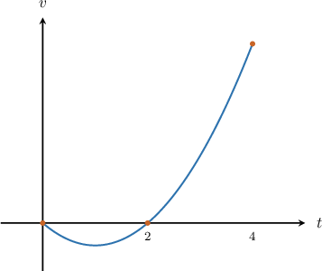
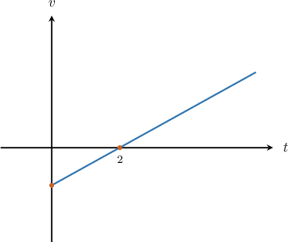
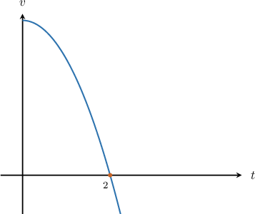

# Calculating the Total Distance Traveled by a Particle

Source: https://www.mathacademy.com/topics/636?courseId=21
Topic ID: 636

## Prerequisites

- [Finding the Area Between a Curve and the X-Axis When They Intersect](../ap-calculus-ab/1432-finding-the-area-between-a-curve-and-the-x-axis-when-they-intersect.md)
- [Calculating the Displacement of a Particle Using Integration](../ap-calculus-ab/3576-calculating-the-displacement-of-a-particle-using-integration.md)

## Lesson

### Introduction

The **total distance** $d$ traveled by a particle over the time interval $[t_1,t_2]$ is given by

$$

d = \int_{t_1}^{t_2} |v(t)|\,\textrm d t.

$$

In other words, we integrate the speed of the particle over the relevant time interval.

**Watch out!** We need to integrate the speed $|v(t)|,$ not just the velocity $v(t).$ Integrating the velocity gives us displacement, which is not the same as distance.

For example, if you take a step forward and then a step backward, your total distance traveled is $2$ steps, while your displacement is $0$ steps.

### Example: Calculating the Total Distance Traveled by a Particle

#### Question

A particle $P$ moves along a straight line relative to a fixed origin $O.$ Its velocity $v\,\text{m/s}$ is given by $v(t) =3t^2-2t,$ where $t$ is the time in seconds. Calculate the total distance traveled by $P$ in the interval $\dfrac{2}{3}\leq t\leq 1.$

#### Explanation

To find the total distance traveled, we first need to find the points where the particle changes its direction, which can only occur when the velocity is zero. Solving $v(t) = 0,$ we get

$$

\begin{aligned} v(t) &= 0 \\3t^2 - 2t&= 0 \\t(3t -2) & = 0 \\t & =0, \dfrac{2}{3} . \end{aligned}

$$

The graph of the velocity $v(t)$ is given below:

Notice that in the interval $\dfrac{2}{3} \leq t\leq 1,$ the graph of $v(t)$ doesn't cross the $t$-axis. Therefore, we don't need to split up the distance integral.

In the interval $\dfrac{2}{3} \leq t\leq 1,$ we have $v(t)\geq 0.$ Therefore,

$$

|v(t)| = v(t) = 3t^2-2t.

$$

We can now calculate the total distance traveled, as follows:

$$

\begin{aligned} d&=\int_{2/3}^1 |v(t)| \, dt\\[5pt] &=\int_{2/3}^{1} \left(3t^2-2t \right)\,\text{d}t\\[5pt] &=\Big.\left(t^3-t^2 \right)\Big|_{2/3}^{1}\\[5pt] &=\left(1^3-1^2 \right)-\left( \left(\dfrac{2}{3}\right)^3-\left(\dfrac{2}{3}\right)^2\right)\\[5pt] &=\dfrac{4}{9}-\dfrac{8}{27}\\[5pt] &=\dfrac{4}{27} \end{aligned}

$$

Therefore, the particle travels a total distance of $\dfrac{4}{27}\,\textrm m$ in the time interval $\dfrac{2}{3}\leq t\leq 1.$

### Example: Calculating the Total Distance Traveled by a Particle When It Changes Direction

#### Question

A particle $P$ moves along a straight line relative to a fixed origin $O.$ Its displacement $s\,\text{cm}$ is given by

$$

s(t) =2t^3-6t^2+4,

$$

where $t$ is the time, in seconds. Calculate the total distance traveled by $P$ in the interval $0\leq t\leq 4.$

#### Explanation

The displacement $s(t)$ is given by

$$

s(t) =2t^3-6t^2+4.

$$

The velocity $v(t)$ is obtained by differentiating $s(t).$ This gives

$$

\begin{aligned} v(t)&=\dfrac{\text{d}s}{\text{d}t}=6t^2-12t. \end{aligned}

$$

To find the total distance traveled, we need to find the points where the velocity changes direction. This occurs when the velocity is zero. Solving $v(t) = 0,$ we get

$$

\begin{aligned} 6t^2-12t &= 0 \\6t(t -2) & = 0 \\t & =0,2. \end{aligned}

$$

A sketch of $v(t)$ is shown below:

Notice that in the interval $0\leq t\leq 4,$ the curve $v(t)$ crosses the $t$-axis at $t=2.$ Therefore, total distance traveled $d$ is given by

$$

d = \left|s(2) - s(0)| + |s(4) - s(2)\right|.

$$

We calculate the total distance traveled as follows:

$$

\begin{aligned}𝑑 & =(2(2)^{3}−6(2)^{2}+4)−(4)+(2(4)^{3}−6(4)^{2}+4)−(2(2)^{3}−6(2)^{2}+4) \\ & =8+40 \\ & =48\, m\end{aligned}

$$

Therefore, the total distance traveled by $P$ in the interval $0 \leq t\leq 4$ is $48\,\text{m}.$

### Example: Finding an Expression For the Total Distance Traveled By a Particle

#### Question

The velocity of a particle, in meters per second, is given by $v(t) = \dfrac{1}{2}t - 1,$ where $t>0$ is the time in seconds. Find an expression for the total distance traveled by the particle between $t = 0$ and $t=T$ where $T > 2.$

#### Explanation

To find the total distance traveled, we first need to find the points where the particle changes its direction, which can only occur when the velocity is zero. Solving $v(t) = 0,$ we get

$$

\begin{aligned}𝑣(𝑡) & =0 \\ \frac{1}{2}𝑡−1 & =0 \\ \frac{1}{2}𝑡 & =1 \\ 𝑡 & =2.\end{aligned}

$$

A sketch of $v(t)$ is shown below:

Notice that in the interval $0\leq t\leq T$ for $T > 2,$ the curve $v(t)$ crosses the $t$-axis at $t=2.$ Therefore, we need to split up the distance integral between the intervals $0\leq t\leq 2$ and $2\leq t\leq T.$

In the interval $0 \leq t\leq 2,$ we have $v(t) \lt 0.$ Therefore,

$$

|v(t)| = -v(t) = 1 - \dfrac{1}{2}t.

$$

Similarly, in the interval $2 \leq t \leq T,$ we have $v(t) \gt 0.$ Therefore,

$$

|v(t)| = v(t) = \dfrac{1}{2}t - 1.

$$

Finally, splitting the integral over the two intervals, we can find an expression for the total distance traveled, as follows:

$$

\begin{aligned}𝑑 & =∫_{𝑇0}|𝑣(𝑡)|\,d𝑡 \\ & =∫_{20}|𝑣(𝑡)|d𝑡+∫_{𝑇2}|𝑣(𝑡)|d𝑡 \\ & =∫_{20}(1−\frac{1}{2}𝑡)d𝑡+∫_{𝑇2}(\frac{1}{2}𝑡−1)d𝑡 \\ & =(𝑡−\frac{1}{4}𝑡^{2})_{20}+(\frac{1}{4}𝑡^{2}−𝑡)_{𝑇2} \\ & =[(2−\frac{1}{4}(2)^{2})−0]+[(\frac{1}{4}𝑇^{2}−𝑇)−(\frac{1}{4}(2)^{2}−2)] \\ & =1+\frac{1}{4}𝑇^{2}−𝑇−(−1) \\ & =\frac{1}{4}𝑇^{2}−𝑇+2\end{aligned}

$$

### Example: Calculating the Time It Takes a Particle to Travel a Given Distance

#### Question

The velocity of a particle, in meters per second, is given by $v(t) = 12-3t^2,$ where $t>0$ is the time in seconds. Calculate the time taken for the particle to travel $32\,\textrm m.$

#### Explanation

To find the total distance traveled, we first need to find the points where the particle changes its direction, which can only occur when the velocity is zero. Solving $v(t) = 0,$ we get

$$

\begin{aligned}12−3𝑡^{2} & =0 \\ −3(𝑡^{2}−4) & =0 \\ 𝑡 & =±2\end{aligned}

$$

A sketch of $v(t)$ is shown below:

Notice that in the interval $0\leq t\leq T$ for $T > 2,$ the curve $v(t)$ crosses the $t$-axis at $t=2.$ Therefore, we need to split up the distance integral between the intervals $0\leq t\leq 2$ and $2\leq t\leq T.$

In the interval $0\leq t\leq 2,$ we have $v(t) > 0.$ Therefore,

$$

|v(t)| = v(t) =12-3t^2.

$$

We can work out the total distance traveled in the interval $0 < t < 2$ as follows:

$$

\begin{aligned}𝑑 & =∫_{20}|𝑣(𝑡)|\,d𝑡 \\ & =∫_{20}(12−3𝑡^{2})\,d𝑡 \\ & =(12𝑡−𝑡^{3})_{20} \\ & =12(2)−2^{3} \\ & =16\end{aligned}

$$

Since $16 < 32,$ the time taken for the particle to travel $32\,\text{m}$ is greater than $2$ seconds.

Now, in the interval $2\leq t\leq T$ for $T>2,$ we have $v(t)<0.$ Therefore,

$$

|v(t)| =- v(t) = 3t^2-12.

$$

Therefore, an expression for the total distance $d$ traveled between $t=0$ and $t=T$ for $T >2$ is given by

$$

\begin{aligned}𝑑(𝑇) & =∫_{𝑇0}|𝑣(𝑡)|\,d𝑡 \\ & =\underset{16}{\underset{}{∫_{20}|𝑣(𝑡)|\,d𝑡}}+∫_{𝑇2}|𝑣(𝑡)|\,d𝑡 \\ & =16+∫_{𝑇2}(3𝑡^{2}−12)\,d𝑡 \\ & =16+(𝑡^{3}−12𝑡)_{𝑇2} \\ & =16+[(𝑇^{3}−12𝑇)−((2)^{3}−12(2)] \\ & =16+𝑇^{3}−12𝑇−(−16) \\ & =𝑇^{3}−12𝑇+32.\end{aligned}

$$

Finally, the particle travels $32\,\text{m}$ when $d = 32.$ So, we can solve for $T$ as follows:

$$

\begin{aligned}𝑇^{3}−12𝑇+32 & =32 \\ 𝑇^{3}−12𝑇 & =0 \\ 𝑇(𝑇^{2}−12) & =0\end{aligned}

$$

The solutions are $T=0$ and $T=\pm 2\sqrt 3.$ Since we require $T> 2,$ the only valid solution is $T=2\sqrt 3.$

Therefore, we conclude that it takes $2\sqrt 3$ seconds for the particle to travel a total of $32\,\text{m}.$
