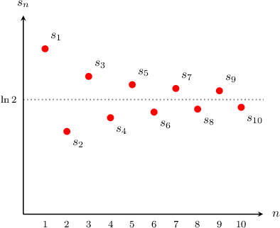

# The Alternating Series Test

Source: https://www.mathacademy.com/topics/747?courseId=21
Topic ID: 747

## Prerequisites

- [Convergent and Divergent Infinite Series](./982-convergent-and-divergent-infinite-series.md)
- [Further Determining Limits of Sequences Using Relative Magnitudes](./3539-further-determining-limits-of-sequences-using-relative-magnitudes.md)
- [Identifying Monotonic Sequences Using Differentiation](./3844-identifying-monotonic-sequences-using-differentiation.md)
- [Identifying Monotonic Sequences Using Ratios](./3861-identifying-monotonic-sequences-using-ratios.md)

## Lesson

### Introduction

An **alternating series** is a series whose terms alternate in sign. In other words, an alternating series is any series of the form

$$

\sum_{n=1}^\infty (-1)^n a_n = -a_1 + a_2 - a_3 + a_4 + \cdots

$$

or

$$

\sum_{n=1}^\infty (-1)^{n+1} a_n = a_1 - a_2 + a_3 - a_4 + \cdots,

$$

where $a_n>0$ for all $n.$

For example, the **alternating harmonic series** is given by

$$

\begin{aligned}\underset{\underset{𝑛=1}{∑}}{\overset{}{∞}}\frac{(−1)^{𝑛+1}}{𝑛} & =\frac{(−1)^{2}}{1}+\frac{(−1)^{3}}{2}+\frac{(−1)^{4}}{3}+\frac{(−1)^{5}}{4}+⋯ \\ & =1−\frac{1}{2}+\frac{1}{3}−\frac{1}{4}+⋯.\end{aligned}

$$

Unlike the harmonic series $\displaystyle\sum_{n=1}^\infty \dfrac{1}{n},$ which is divergent, the alternating harmonic series is convergent. In fact, it can be shown that

$$

\displaystyle\sum_{n=1}^\infty \dfrac{(-1)^n}{n} =\ln 2.

$$

We won't prove this result, but we can get a feel for it by plotting the first few partial sums.

### The Alternating Series Test

The **alternating series test** provides a way to test for convergence of an alternating series. The alternating series test states that if

- $a_n$ is positive and decreasing for all $n,$ and

- $a_n\rightarrow 0$ as $n\rightarrow\infty,$

then the alternating series $\displaystyle\sum_{n=1}^\infty (-1)^n a_n$ and $\displaystyle\sum_{n=1}^\infty (-1)^{n+1} a_n$ are both convergent.

The key takeaway is that, given an alternating series, we need to check *two* conditions. If it passes both conditions, then the series is convergent.

The alternating series test can only be used to test that a series is convergent. Failure of the test does *not* necessarily mean that the series is divergent. That said, if the condition $a_n\to0$ as $n\rightarrow\infty$ fails, then we *are* able to conclude that the series is divergent by the $n$th term test.

### Example: Applying the Alternating Series Test

#### Question

Use the alternating series test to show that the series $\displaystyle \sum_{n=1}^\infty \frac{(-1)^{n+1}\,n}{n^2+1}$ is convergent.

#### Explanation

Let $a_n = \dfrac{n}{n^2+1}.$ To apply the alternating series test, we need to check that $a_n$ is a decreasing sequence, and that $a_n \to 0$ as $n \to \infty.$

First, we need to check that $a_n$ is decreasing. For this, we can use differentiation.

Let $f(x) = \dfrac{x}{x^2 +1}.$ Computing $f'(x)$ using the quotient rule gives

$$

f'(x) =\frac{1-x^2}{(x^2+1)^2}.

$$

Since the numerator $1-x^2$ is always negative for $x > 1,$ while the denominator $(x^2+1)^2$ is always positive, we have that $f'(x) \leq 0$ for $x \geq 1.$ So, we conclude that $a_n$ is decreasing for $n\geq 1.$

We now need to check that $\displaystyle\lim_{n\to\infty}a_n = 0.$ In our case, we have

$$

\begin{aligned}\underset{𝑛→∞}{lim}𝑎_{𝑛} & =\underset{𝑛→∞}{lim}\frac{𝑛}{𝑛^{2}+1} \\ & =\underset{𝑛→∞}{lim}\frac{\frac{𝑛}{𝑛^{2}}}{𝑛^{2}} \\ & =\underset{𝑛→∞}{lim}\frac{\frac{1}{𝑛}}{𝑛} \\ & =\frac{0}{1+0} \\ & =0.\end{aligned}

$$

So the sequence $a_n$ is decreasing for $n\geq 1,$ and $a_n\rightarrow 0$ as $n\rightarrow\infty.$ Therefore, the alternating series test tells us that $\displaystyle\sum_{n=1}^\infty \frac{(-1)^{n+1}n}{n^2+1}$ is convergent.

### Example: Applying the Alternating Series Test to an Alternating p-Series

#### Question

For which values of $p$ does the series $\displaystyle \sum_{n=1}^\infty \dfrac{(-1)^{n+1}}{n^{p+4}}$ converge?

#### Explanation

Let $a_n = \dfrac{1}{n^{p+4}}.$ Then by the alternating series test, the series $\displaystyle \sum_{n=1}^\infty (-1)^{n+1}a_n$ converges if

- $a_n$ is positive and decreasing for all $n,$ and

- $a_n \to 0$ as $n\to \infty.$

Here, the sequence $a_n \to 0$ as $n\to\infty$ if

$$

\begin{aligned}𝑝+4 & >0 \\ 𝑝 & >−4.\end{aligned}

$$

In addition, $a_n$ is positive and decreasing for $n \geq 1$ and for all $p > -4.$

Therefore, by the alternating series test, the series is convergent for $p > -4.$

### Example: Identifying Convergent Series by Applying the Alternating Series Test

#### Question

Which of the following series converge?

1. $\displaystyle \sum_{n=1}^\infty (-1)^n \cdot 2^{n+1}$

2. $\displaystyle \sum_{n=1}^\infty \dfrac{(-1)^n}{n^{2/3}}$

3. $\displaystyle \sum_{n=1}^\infty \dfrac{(-1)^n \sqrt{n}}{2^n}$

#### Explanation

Let's examine each series in turn.

- Let $a_n = 2^{n+1}.$ Since $a_n \to \infty$ as $n\to \infty,$ the series is divergent by the $n$th term test.

- Let $a_n = \dfrac{1}{n^{2/3}}.$ Clearly, the sequence is positive and decreasing for $n \geq 1,$ and $a_n \to 0$ as $n\to \infty.$ Therefore, by the alternating series test, $\displaystyle \sum_{n=1}^\infty \dfrac{(-1)^n}{n^{2/3}}$ is convergent.

- Let $a_n = \dfrac{\sqrt{n}}{2^n}.$ Both the numerator and denominator approach infinity as $n \to \infty.$ However, the denominator is growing much faster than the numerator, and we conclude that On the other hand, $a_n$ is positive for all $n \geq 1.$ Now, we need to check if $a_n$ is decreasing. Consider the function $f(x) = \dfrac{\sqrt{x}}{2^x}.$ Then, using the quotient rule for derivatives, we obtain The function $f(x)$ is decreasing if $f'(x) < 0,$ that is So, $f(x)$ is decreasing for all $x \geq 1.$ Hence, the sequence is positive and decreasing if $n \ge 1.$ Therefore, by the alternating series test, $\displaystyle \sum_{n=1}^\infty (-1)^n a_n$ is convergent.

Therefore, the correct answer is "II and III only."
