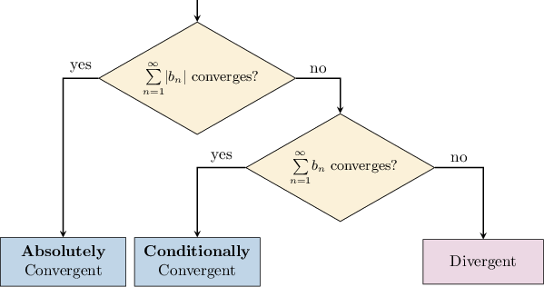

# Absolute and Conditional Convergence

Source: https://www.mathacademy.com/topics/748?courseId=21
Topic ID: 748

## Prerequisites

- [The Ratio Test](./746-the-ratio-test.md)
- [The Alternating Series Test](./747-the-alternating-series-test.md)
- [The Limit Comparison Test](./750-the-limit-comparison-test.md)

## Lesson

### Introduction

Let's consider the alternating series

$$

\sum_{n=1}^\infty b_n,

$$

where

$$

b_n = (-1)^n a_n \quad \textrm{or}\quad b_n = (-1)^{n+1} a_n, \quad a_n > 0.

$$

We have the following:

- If $\displaystyle \sum_{n =1}^\infty |b_n|$ is convergent, then $\displaystyle \sum_{n =1}^\infty b_n$ is also convergent. We say that $\displaystyle \sum_{n =1}^\infty b_n$ is **absolutely convergent**.

- If $\displaystyle \sum_{n =1}^\infty |b_n|$ is divergent yet $\displaystyle \sum_{n =1}^\infty b_n$ is convergent, we say that $\displaystyle \sum_{n =1}^\infty b_n$ is **conditionally convergent**.

We can summarize this in one diagram, shown below.

Note the following:

- If a series is absolutely convergent, we say it **converges absolutely.**

- Likewise, if a series is conditionally convergent, we say it **converges conditionally.**

- Since absolute convergence of an alternating series implies convergence, we usually check for absolute convergence first.

### Example: Determining Absolute Convergence

#### Question

Given the series $\displaystyle\sum_{n = 1}^\infty \dfrac {(-1) ^ {n+1}} {n^2},$ which of the following statements are true?

1. The series is absolutely convergent

2. The series is conditionally convergent

3. The series is convergent

#### Explanation

We can summarize the test for the ** and ** convergence in the following diagram.

With that in mind, let's check each statement in turn.

- Statement I is true. Checking for absolute convergence, we have which is a $p$-series with $p = 2 > 1.$ Therefore, the series converges absolutely.

- Statement II is false. Since the series is absolutely convergent, it cannot be conditionally convergent.

- Statement III is true. Since the series is absolutely convergent, it is also convergent.

Therefore, the correct answer is "I and III only."

### Example: Determining Conditional Convergence

#### Question

For the series $\displaystyle \sum_{n = 1} ^ \infty \dfrac {(-1) ^ {n+1}} {n},$ which of the following statements are true?

1. The series is absolutely convergent

2. The series is conditionally convergent

3. The series is divergent

#### Explanation

We can summarize the test for the ** and ** convergence in the following diagram.

With that in mind, let's check each statement in turn.

- Statement I is false. Checking for absolute convergence, we have which is a $p$-series with $p = 1.$ Therefore, the series does not converge absolutely.

- Statement II is true while statement III is false. Clearly, the sequence $a_n = \dfrac{1}{n}$ is positive and decreasing for all $n \geq 1,$ and $a_n \to 0$ as $n\to\infty.$ Hence, $\displaystyle\sum\limits_{n = 1}^\infty\dfrac{(-1)^{n+1}}{n}$ converges by the alternating series test.

Therefore, the correct answer is "II only."

### Rearranging the Terms of Infinite Series

When we permute the terms in a *finite* series, the result is always the same.

For example, if we compute the sum of the first $100$ integers, we get

$$

1+2+3+\cdots+100 = 5\,050.

$$

Now, if we sum the same terms but group them according to whether they're even or odd, we get the same answer:

$$

(1 + 3 + 5+\cdots + 99) + (2+4+6+\cdots + 100) = 5\,050

$$

For *infinite* series, things are not so simple!

Whether or not we can rearrange the order of the terms depends on whether our infinite series converges absolutely or conditionally.

Let's consider an example of each case:

- If a series is absolutely convergent, we can permute the terms, and the sum of the series will remain the same. For example, it can be shown that This series is absolutely convergent. So, if we rearrange the terms by grouping the even and odd factorials, we'll get the same result:

- If a series is *conditionally* convergent, then we *cannot* rearrange the terms and be guaranteed to get the same result! For example, consider the following alternating series: The sum of this series is zero since the partial sums become arbitrarily small as we increase the number of terms. However, suppose we rearrange the terms of this series by taking the first two positive terms, followed by the first negative term, then the next two positive terms, followed by the second negative term, etc. It can be shown that which is different from zero! Moreover, if a series converges conditionally, then given any real number, there exists a rearrangement of the terms such that the new series converges to that number! We can even rearrange the terms of a conditionally convergent series so that the new (permuted) series is *divergent*!

The key takeaway is that we can *only* permute the terms in an infinite series if it is absolutely convergent.

### Example: Rearranging Terms of an Absolutely Convergent Series

#### Question

Let $S = \displaystyle \sum_{n=1}^\infty a_n$, where $a_n= \dfrac{(-1)^{n}}{n^2\sqrt[3]{n}}.$ Which of the following statements are true?

1. $\displaystyle \sum_{n=1}^\infty |a_n|$ is convergent

2. $\displaystyle \sum_{n=1}^\infty a_n$ is convergent

3. The terms of the series $\displaystyle \sum_{n=1}^\infty a_n$ can be rearranged so that the new series converges to $\dfrac{S}{3}$

#### Explanation

We can summarize the test for the ** and ** convergence in the following diagram.

Let's check each statement in turn.

- Statement I is true. Indeed, we have which is a $p$-series with $p = \dfrac{7}{3} > 1.$ Therefore, the series is absolutely convergent.

- Statement II is true. Since the series is absolutely convergent, it is also convergent.

- Statement III is false. Since the series converges absolutely, any rearrangement of its terms results in a series that converges to the same value as the original arrangement.

Therefore, the correct answer is "I and II only."

### Example: Rearranging Terms of a Conditionally Convergent Series

#### Question

Let $a_n= \dfrac{(-1)^n}{\sqrt[3] {n}}.$ Which of the following statements are true?

1. $\displaystyle \sum_{n=1}^\infty |a_n|$ is convergent

2. $\displaystyle \sum_{n=1}^\infty a_n$ is convergent

3. The terms of the series $\displaystyle \sum_{n=1}^\infty a_n$ can be rearranged so that the new series converges to $5$

#### Explanation

We can summarize the test for the ** and ** convergence in the following diagram.

Let's check each statement in turn.

- Statement I is false. Indeed, we have which is a $p$-series with $p = \dfrac{1}{3} < 1.$ Therefore, the series does not converge absolutely.

- Statement II is true. The sequence $|a_n|=\dfrac{1}{\sqrt[3] {n}}$ is positive and decreasing for all $n\geq1,$ and $|a_n|\to0$ as $n\to\infty.$ Hence, $\displaystyle \sum_{n=1}^\infty a_n$ converges by the alternating series test.

- Statement III is true. Since the series converges but not absolutely, it is conditionally convergent. Therefore, given any number $S$, there exists a rearrangement of the terms such that the new series converges to $S.$

Therefore, the correct answer is "II and III only."
