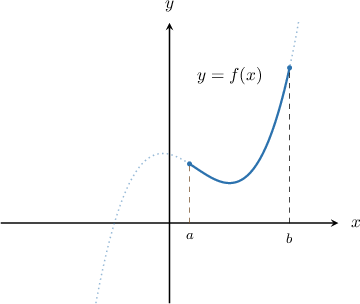
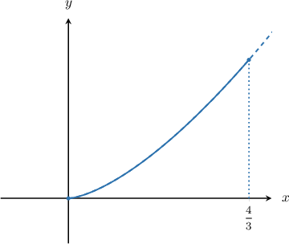
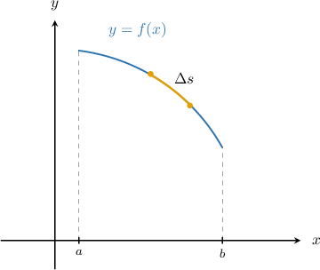
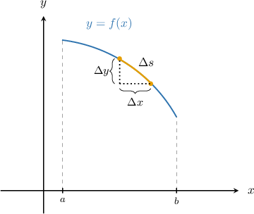

# The Arc Length of a Planar Curve

Source: https://www.mathacademy.com/topics/760?courseId=21
Topic ID: 760

## Prerequisites

- [Integration by Substitution With Inverse Trigonometric Functions](../ap-calculus-ab/315-integration-by-substitution-with-inverse-trigonometric-functions.md)
- [Integrating Trigonometric Functions Using Substitution](../ap-calculus-ab/478-integrating-trigonometric-functions-using-substitution.md)
- [Integrating Exponential Functions Using Substitution](../ap-calculus-ab/3770-integrating-exponential-functions-using-substitution.md)

## Lesson

### Introduction

Suppose we're trying to find the **arc length** of a curve $y=f(x)$ between two points where $x=a$ and $x=b.$ The arc length of a typical function between two points is shown below:

In this image, the solid line represents the length that we're trying to find, and the dotted line represents the continuation of the curve $y=f(x)$ beyond the points of interest.

The arc length of a curve $y=f(x)$ between the points where $x=a$ and $x=b$ is given by the formula

$$

L = \int_a^b \sqrt{1+\left[f'(x)\right]^2}\,\mathrm{d} x.

$$

### Example: Finding an Integral Representation For an Arc Length

#### Question

What is the arc length of the curve $y = \arccos{x}$ on $\left[0,\dfrac{1}{2}\right]?$

#### Explanation

The arc length of a curve $y=f(x)$ between $x=a$ and $x=b$ can be found using the formula

$$

L = \int _a^b \sqrt{1 + [f'(x)]^2} \, \textrm{d}x.

$$

In our case, $f(x)= \arccos{x},$ $a=0,$ and $b=\dfrac{1}{2}.$

First, we find the derivative of $f(x)\mathbin{:}$

$$

f'(x) =-\dfrac{1}{\sqrt{1-x^2}}

$$

Substituting $f'(x) = -\dfrac{1}{\sqrt{1-x^2}}$ into the arc length formula, we get

$$

\begin{aligned}𝐿 & =∫_{1/20}^{}\sqrt{√1+[𝑓^{′}(𝑥)]^{2}}\,d𝑥 \\ & =∫_{1/20}^{}\sqrt{√1+\frac{1}{1−𝑥^{2}}}\,d𝑥 \\ & =∫_{1/20}^{}\sqrt{√\frac{1−𝑥^{2}+1}{1−𝑥^{2}}}\,d𝑥 \\ & =∫_{1/20}^{}\sqrt{√\frac{2−𝑥^{2}}{1−𝑥^{2}}}\,d𝑥\,.\end{aligned}

$$

### Example: Calculating the Arc Length of a Smooth Curve Using the Arc Length Formula

#### Question

Compute the arc length of the curve $y=x^{3/2}$ between the points $x=0$ and $x=\dfrac{4}{3},$ as shown below.

#### Explanation

The arc length of a curve $y=f(x)$ between $x=a$ and $x=b$ can be found using the formula

$$

L = \int _a^b \sqrt{1 + [f'(x)]^2} \, \textrm{d}x.

$$

In our case, $f(x)= x^{3/2},$ $a=0,$ and $b=\dfrac{4}{3}.$

First, we find the derivative of $f(x)\mathbin{:}$

$$

f'(x) = \dfrac{3}{2}x^{1/2}

$$

Now, let's compute $\sqrt {1 + [f'(x)]^2}\mathbin{:}$

$$

\begin{aligned}\sqrt{√1+[𝑓^{′}(𝑥)]^{2}} & =\sqrt{√1+[\frac{3}{2}𝑥^{1/2}]^{2}} \\ & =\sqrt{√1+\frac{9}{4}𝑥} \\ & =\sqrt{√\frac{4+9𝑥}{4}} \\ & =\sqrt{√\frac{1}{4}(4+9𝑥)} \\ & =\sqrt{√\frac{1}{4}}\sqrt{√4+9𝑥} \\ & =\frac{1}{2}\sqrt{√4+9𝑥}\end{aligned}

$$

Substituting $\sqrt {1 + [f'(x)]^2} = \dfrac{1}{2}\sqrt{4 + 9x}$ to the formula for the arc length, we get

$$

\begin{aligned}𝐿 & =∫_{𝑏𝑎}^{}\sqrt{√1+[𝑓^{′}(𝑥)]^{2}}\,d𝑥 \\ & =\frac{1}{2}∫_{\frac{4}{3}0}^{}\sqrt{√4+9𝑥}\,d𝑥.\end{aligned}

$$

We evaluate this integral using the substitution $u= 4+9x.$ Then, $\textrm{d}x = \dfrac{1}{9}\textrm{d}u.$

We also need to compute new limits:

$$

\begin{aligned}𝑥 & 0 & \frac{4}{3} \\ 𝑢 & 4 & 16\end{aligned}

$$

Therefore, we get

$$

\begin{aligned}𝐿 & =\frac{1}{2}∫_{\frac{4}{3}0}^{}\sqrt{√4+9𝑥}\,d𝑥 \\ & =\frac{1}{2}∫_{164}^{}\sqrt{√𝑢}⋅\frac{1}{9}\,d𝑢 \\ & =\frac{1}{18}∫_{164}^{}𝑢^{\frac{1}{2}}\,d𝑢 \\ & =\frac{1}{18}[\frac{2}{3}𝑢^{\frac{3}{2}}]_{164}^{} \\ & =\frac{1}{18}⋅\frac{2}{3}[𝑢^{\frac{3}{2}}]_{164}^{} \\ & =\frac{1}{27}([(16)^{\frac{3}{2}}]−[(4)^{\frac{3}{2}}]) \\ & =\frac{1}{27}([64]−[8]) \\ & =\frac{56}{27}.\end{aligned}

$$

### Example: Identifying a Possible Curve Given Its Arc Length As an Integral

#### Question

The length of a curve $y=f(x)$ is given by ${\displaystyle \int_{5}^{6}} \sqrt{1+\dfrac {x^2}{x^2-16}} \,\textrm{d}x.$ Which of the following could be an equation for this curve?

1. $y= \dfrac{1}{\sqrt{x^2-16}}$

2. $y= \sqrt{x^2-16} + \sqrt 5$

3. $y= \dfrac{x}{x^2-16} + 1$

#### Explanation

The arc length of a curve $y=f(x)$ between $x=a$ and $x=b$ can be found using the formula

$$

L = \int _a^b \sqrt{1 + [f'(x)]^2} \, \textrm{d}x.

$$

We're given that

$$

L=\int_{5}^{6} \sqrt{1+\dfrac {x^2}{x^2-16}} \,\textrm{d}x.

$$

Comparing the above with the arc length formula, we see that we must have

$$

[f'(x)]^2=\dfrac {x^2}{x^2-16}\quad\Longrightarrow\quad f'(x) = \pm \dfrac {x}{\sqrt{x^2-16}}.

$$

Integrating the above equation with respect to $x,$ we get

$$

\begin{aligned}𝑓(𝑥) & =±∫\frac{𝑥}{\sqrt{√𝑥^{2}−16}} d𝑥 \\ & =±\sqrt{√𝑥^{2}−16}+𝐶.\end{aligned}

$$

From the given options, the only one that has the required form is $y= \sqrt{x^2-16} + \sqrt 5.$

### The Intuition Behind the Main Formula

We've been using the following formula for the arc length of a curve $y=f(x)$ between the points where $x=a$ and $x=b{:}$

$$

L = \int_a^b \sqrt{1+\left[f'(x)\right]^2}\,\mathrm{d} x.

$$

But where does this formula come from?

First, we divide the curve into small subintervals. Consider a part of the blue arc that corresponds to one of those subintervals and let the length of that part be $\Delta{s}$.

We can now denote the horizontal displacement as $\Delta{x}$ and the vertical shift as $\Delta{y}.$

To approximate the length $\Delta{s}$ we apply the Pythagorean theorem, as follows:

$$

\begin{aligned}Δ𝑠≈\sqrt{√(Δ𝑥)^{2}+(Δ𝑦)^{2}}=\sqrt{√1+(\frac{Δ𝑦}{Δ𝑥})^{2}}⋅Δ𝑥\end{aligned}

$$

To approximate the total length $L,$ we need to sum up all of the little $\Delta s$ terms, so

$$

L \approx \sum \Delta s = \sum \sqrt{\left( \Delta{x} \right)^2 + \left( \Delta{y} \right)^2} = \sum \left( \sqrt{1 + \left( \dfrac{\Delta{y}}{\Delta{x}} \right)^2} \cdot \Delta{x} \right).

$$

We then take the limit as $\Delta x, \Delta y \rightarrow 0.$ As we do this, we obtain that

$$

\begin{aligned}d𝑠 & =\sqrt{√1+(\frac{d𝑦}{d𝑥})^{2}}\,d𝑥=\sqrt{√1+[𝑓^{′}(𝑥)]^{2}}\,d𝑥\end{aligned}

$$

the sum becomes a definite integral, and our approximation approaches the exact value of $L{:}$

$$

\begin{aligned}𝐿 & =∫d𝑠 \\ & =∫_{𝑏𝑎}^{}\sqrt{√1+(\frac{d𝑦}{d𝑥})^{2}}\,d𝑥 \\ & =∫_{𝑏𝑎}^{}\sqrt{√1+[𝑓^{′}(𝑥)]^{2}}\,d𝑥\end{aligned}

$$
