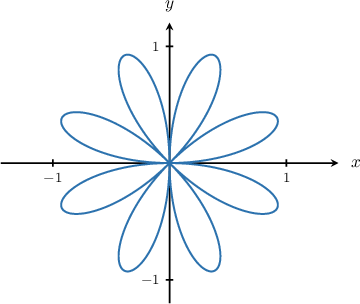
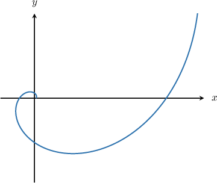
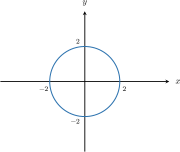
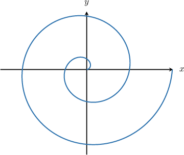

# Differentiating Curves Given in Polar Form

Source: https://www.mathacademy.com/topics/998?courseId=21
Topic ID: 998

## Prerequisites

- [Second Derivatives of Parametric Equations](./431-second-derivatives-of-parametric-equations.md)
- [Converting from Polar Coordinates to Cartesian Coordinates](../../../high-school/traditional/lessons/precalculus/936-converting-from-polar-coordinates-to-cartesian-coordinates.md)

## Lesson

### Introduction

Any curve defined using polar coordinates $(r(\theta), \theta)$ is a parametric curve in the parameter $\theta.$ For this reason, we can use the formula for differentiating parametric curves to compute the derivative of a polar curve:

$$

\dfrac{\textrm{d}y}{\textrm{d}x} = \dfrac{y'(\theta)}{x'(\theta)}

$$

As an example, suppose we want to find $\dfrac{\textrm{d}y}{\textrm{d}x}$ for the polar curve $r = \sin4\theta,$ shown below.

First, recall that to convert from polar coordinates to Cartesian coordinates, we use

$$

x(\theta) = r \cos \theta, \qquad y(\theta) = r \sin \theta.

$$

Now, using the fact that $r=\sin 4\theta$ for this particular curve, we get

$$

x(\theta) = \sin 4\theta \cos\theta, \qquad y(\theta) =\sin4\theta \sin\theta.

$$

To compute our derivative, we first need to calculate $x'(\theta)$ and $y'(\theta)\mathbin{:}$

- First, we compute the derivative of $x$ with respect to $\theta$ using the product rule:

- Then, we compute the derivative of $y$ with respect to $\theta$ using the product rule:

Therefore,

$$

\begin{aligned}\frac{d𝑦}{d𝑥} & =\frac{𝑦^{′}(𝜃)}{𝑥^{′}(𝜃)} \\ & =\frac{4cos⁡4𝜃sin⁡𝜃+sin⁡4𝜃cos⁡𝜃}{4cos⁡4𝜃cos⁡𝜃−sin⁡4𝜃sin⁡𝜃}.\end{aligned}

$$

### Example: Finding the Derivative of a Polar Curve Given the Derivatives With Respect To X and Y

#### Question

Find $\dfrac{\textrm{d}y}{\textrm{d}x}$ for the polar curve $r = 2^{\theta}$ (shown above) given that

$$

y'(\theta) = 2^{\theta}(\ln 2\sin\theta+ \cos\theta), \qquad x'(\theta) = 2^{\theta}(\ln 2\cos\theta-\sin\theta) .

$$

#### Explanation

To find $\dfrac{\textrm{d}y}{\textrm{d}x},$ we use the rule for differentiating parametric equations:

$$

\dfrac{\textrm{d}y}{\textrm{d}x} = \dfrac{y'(\theta)}{x'(\theta)}

$$

Therefore,

$$

\begin{aligned}\frac{d𝑦}{d𝑥} & =\frac{2^{𝜃}(ln⁡2sin⁡𝜃+cos⁡𝜃)}{2^{𝜃}(ln⁡2cos⁡𝜃−sin⁡𝜃)} \\ & =\frac{ln⁡2sin⁡𝜃+cos⁡𝜃}{ln⁡2cos⁡𝜃−sin⁡𝜃}.\end{aligned}

$$

### Example: Finding the Derivative of a Polar Curve at a Point Given Derivatives With Respect To X and Y

#### Question

Find the slope of the tangent line to the polar curve $r = 1-\cos\theta$ at $\theta = \dfrac{\pi}{4},$ given that

$$

y'(\theta) = \cos\theta - \cos2\theta, \qquad x'(\theta) = -\sin\theta + \sin2\theta.

$$

#### Explanation

To find $\dfrac{\textrm{d}y}{\textrm{d}x},$ we use the rule for differentiating parametric equations:

$$

\dfrac{\textrm{d}y}{\textrm{d}x} = \dfrac{y'(\theta)}{x'(\theta)}

$$

Evaluating the numerator and denominator at $\theta=\dfrac\pi4,$ we have

$$

\begin{aligned}𝑦^{′}(\frac{𝜋}{4}) & =cos⁡(\frac{𝜋}{4})−cos⁡(\frac{𝜋}{2}) \\ & =\frac{\sqrt{√2}}{2}−0 \\ & =\frac{\sqrt{√2}}{2}\end{aligned}

$$

and

$$

\begin{aligned}𝑥^{′}(\frac{𝜋}{4}) & =−sin⁡(\frac{𝜋}{4})+sin⁡(\frac{𝜋}{2}) \\ & =−\frac{\sqrt{√2}}{2}+1.\end{aligned}

$$

Hence, the slope of the tangent line is

$$

\begin{aligned}\frac{d𝑦}{d𝑥}_{𝜃=𝜋/4} & =\frac{𝑦^{′}(\frac{𝜋}{4})}{4} \\ & =\frac{(\frac{\sqrt{√2}}{2})}{2}.\end{aligned}

$$

Multiplying the numerator and denominator by $2$ and simplifying, we get

$$

\begin{aligned}\frac{d𝑦}{d𝑥}_{𝜃=𝜋/4} & =\frac{(\frac{\sqrt{√2}}{2})}{2} \\ & =\frac{2⋅(\frac{\sqrt{√2}}{2})}{2} \\ & =\frac{\sqrt{√2}}{−\sqrt{√2}+2} \\ & =\frac{\sqrt{√2}}{2−\sqrt{√2}} \\ & =\frac{\sqrt{√2}}{2−\sqrt{√2}}⋅\frac{2+\sqrt{√2}}{2+\sqrt{√2}} \\ & =\frac{2\sqrt{√2}+2}{2} \\ & =\sqrt{√2}+1.\end{aligned}

$$

### Example: Finding the Derivative of a Constant Polar Curve

#### Question

Find $\dfrac{\textrm{d}y}{\textrm{d}x}$ for the polar curve $r = 2$ (shown above) at $\theta = \dfrac{\pi}{3}.$

#### Explanation

To find $\dfrac{\textrm{d}y}{\textrm{d}x},$ we use the formula for differentiating parametric curves:

$$

\dfrac{\textrm{d}y}{\textrm{d}x} = \dfrac{y'(\theta)}{x'(\theta)}

$$

First, we recall that to convert from polar coordinates to Cartesian coordinates, we use

$$

x = r \cos \theta, \qquad y = r \sin \theta.

$$

Using the fact that $r = 2,$ we get

$$

\begin{aligned}𝑥=2cos⁡𝜃,\,𝑦=2sin⁡𝜃.\end{aligned}

$$

Calculating the necessary derivatives, we have

$$

\begin{aligned}𝑥^{′}(𝜃) & =−2sin⁡𝜃,\,𝑦^{′}(𝜃)=2cos⁡𝜃.\end{aligned}

$$

Therefore,

$$

\begin{aligned}\frac{d𝑦}{d𝑥}=\frac{2cos⁡𝜃}{−2sin⁡𝜃} \\ =−cot⁡𝜃.\end{aligned}

$$

Finally, we arrive at

$$

\begin{aligned}\frac{d𝑦}{d𝑥}_{𝜃=𝜋/3} & =−cot⁡(\frac{𝜋}{3}) \\ & =−\frac{\sqrt{√3}}{3}.\end{aligned}

$$

### Example: Finding the Derivative of a Polar Curve

#### Question

Find $\dfrac{\textrm{d}y}{\textrm{d}x}$ for the polar curve $r = \theta,$ shown above.

#### Explanation

To find $\dfrac{\textrm{d}y}{\textrm{d}x},$ we use the formula for differentiating parametric curves:

$$

\dfrac{\textrm{d}y}{\textrm{d}x} = \dfrac{y'(\theta)}{x'(\theta)}

$$

First, we recall that to convert from polar coordinates to Cartesian coordinates, we use

$$

x = r \cos \theta, \qquad y = r \sin \theta.

$$

Using the fact that $r=\theta,$ we get

$$

x = \theta\cos\theta, \qquad y=\theta\sin\theta.

$$

To compute our derivative, we first need to calculate $x'(\theta)$ and $y'(\theta)\mathbin{:}$

- First, we compute the derivative of $x$ with respect to $\theta$ using the product rule:

- Then, we compute the derivative of $y$ with respect to $\theta$ using the product rule:

Therefore,

$$

\begin{aligned}\frac{d𝑦}{d𝑥} & =\frac{𝑦^{′}(𝜃)}{𝑥^{′}(𝜃)} \\ & =\frac{sin⁡𝜃+𝜃cos⁡𝜃}{cos⁡𝜃−𝜃sin⁡𝜃}.\end{aligned}

$$
