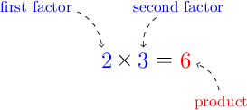
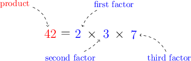

# Products and Factors

Source: https://www.mathacademy.com/topics/122?courseId=75
Topic ID: 122

## Prerequisites

- None listed on the topic page.

## Lesson

### Introduction

The result of a multiplication is called a **product**.

For example, when we multiply the numbers $2$ and $3$, the result is $6.$ We say that the number $6$ is the **product** of $2$ and $3.$ The numbers $2$ and $3$ are called **factors**.

In general, a product is a result we get when we multiply two or more factors.

### Example: Recognizing Products and Factors

#### Question

Identify the product and the factors of the equation $42 = 2 \times 3 \times 7.$

#### Explanation

The result of a multiplication problem is called the **, while the numbers being multiplied are called the **.

In this equation,

- $42$ is the result (the product), and

- $2,$ $3,$ and $7$ are the numbers being multiplied (the factors).

Therefore, "**"

### Example: Identifying Missing Factors: Two-Factor Equations

#### Question

What factor is represented by the circle in the following equation?

$$

\bigcirc \times 7=28

$$

#### Explanation

We know that

$$

{\color{blue}{4}}\times 7 =28.

$$

Therefore, the missing factor is ${\color{blue}{4}}.$

### Example: Identifying Missing Factors: Three-Factor Equations

#### Question

What factor is represented by the empty box in the following equation?

$$

𝐴

$$

#### Explanation

We know that $2 \times 3 = 6.$ Therefore, our equation can be simplified as

$$

𝐴

$$

Furthermore, we know that

$$

24 = 6 \times {\color{blue}{4}}.

$$

Therefore, the missing factor is ${\color{blue}{4}}.$
