# Adding Fractions With Like Denominators Using Models

Source: https://www.mathacademy.com/topics/2370?courseId=75
Topic ID: 2370

## Prerequisites

- [Writing Fractions in Lowest Terms](./2364-writing-fractions-in-lowest-terms.md)

## Lesson

### Introduction

When adding fractions using models, we join the shaded parts that refer to the same whole.

Let's consider the following addition problem:

$$

\dfrac{2}{4} + \dfrac{1}{4}

$$

We start by representing this problem using an area model:

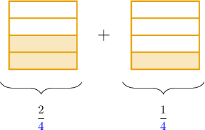

We have $2+1 = \color{red}3$ shaded parts. To add these fractions, we combine the shaded parts into one whole, as follows:

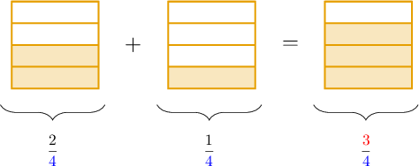

Therefore, we have

$$

\dfrac{2}{\color{blue}4} + \dfrac{1}{\color{blue}4} = \dfrac{\color{red}3}{\color{blue}4}.

$$

### Example: Adding Fractions Using Area Models

#### Question

Use the model above to find the value of $\dfrac{2}{8} + \dfrac{4}{8}.$

#### Explanation

The shape to the left of the addition sign shows $\dfrac{2}{\color{blue}8}$ and the shape to the right shows $\dfrac{4}{\color{blue}8}.$

Combined, both shapes give us $2+4 = \color{red}6$ shaded parts in total.

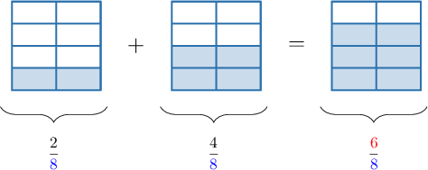

Therefore, we have

$$

\dfrac{2}{\color{blue}8} + \dfrac{4}{\color{blue}8} = \dfrac{\color{red}6}{\color{blue}8}.

$$

Finally, we can simplify this fraction by dividing the numerator and denominator by $2{:}$

$$

\dfrac{6}{8} =\dfrac{6\div 2}{8\div 2} = \dfrac{3}{4}

$$

Therefore, we conclude that

$$

\dfrac{2}{8} + \dfrac{4}{8} = \dfrac34.

$$

### Subtracting Fractions

Fraction subtraction works similarly to addition. However, this time, we *remove* shaded parts that refer to the same whole.

Let's consider the following subtraction problem:

$$

\dfrac34 - \dfrac14

$$

We start by representing this problem using an area model:

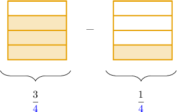

To subtract the fractions, we count the number of shaded parts in the right shape and remove the number of parts shown in the left shape. This leave us with $3-1={\color{red}2}$ shaded parts:

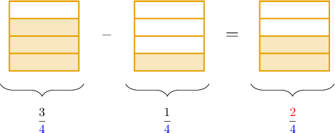

Therefore, we have

$$

\dfrac{3}{4} - \dfrac{1}{4} = \dfrac{\color{red}2}{4}.

$$

Finally, we can simplify this fraction by dividing the numerator and denominator by $2\mathbin{:}$

$$

\dfrac24 = \dfrac{2\div 2}{4\div 2} = \dfrac12

$$

Therefore, we conclude that

$$

\dfrac34 - \dfrac14 = \dfrac12.

$$

### Example: Subtracting Fractions Using Area Models

#### Question

Use the model above to find the value of $\dfrac{6}{7} - \dfrac{4}{7}.$

#### Explanation

The shape to the left of the minus sign shows $\dfrac{6}{\color{blue}7}$ and the shape to the right shows $\dfrac{4}{\color{blue}7}.$

We subtract the number of shaded parts on the right from the number of the shaded parts on the left:

$$

6 - 4 = {\color{red}2}

$$

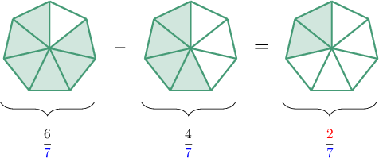

Therefore, we have

$$

\dfrac{6}{\color{blue}7} - \dfrac{4}{\color{blue}7} = \dfrac{\color{red}2}{\color{blue}7}.

$$

### Number Line Models

Number line models give us another way to add and subtract fractions.

Let's demonstrate by considering the following addition problem:

$$

{\color{red}{\dfrac15}} + {\color{blue}{\dfrac25}}

$$

Each fraction has a denominator of $5.$ So, we create a number line where the segment between $0$ and $1$ is split into $5$ equal parts. Each part represents $\dfrac{1}{5}$ of a whole.

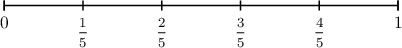

Then, we mark $\color{red}\dfrac15$ on our number line.

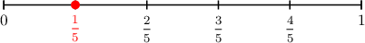

We want to add ${\color{blue}{\dfrac25}}.$ So, we need to move $2$ spaces to the *right.*

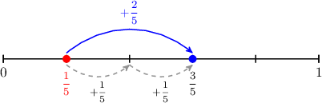

We have landed on $\dfrac35.$ Therefore,

$$

\dfrac{1}{5}+\dfrac{2}{5} = \dfrac{3}{5}.

$$

To *subtract* one fraction from another using number lines, we use the same method, except we move to the *left*. Let's see an example.

### Example: Adding and Subtracting Fractions Using Number Line Models

#### Question

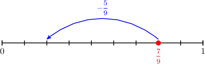

Use the number line above to find the value of $\dfrac{7}{9} - \dfrac{5}{9}.$

#### Explanation

The line segment between $0$ and $1$ is split into $9$ equal parts. So, each part gives $\dfrac{1}{9}$ of a whole.

To find ${\color{red}\dfrac{7}{9}} - \dfrac{\color{blue}5}{9},$ we start at the point $\color{red}\dfrac{7}{9}$ and move $\color{blue}5$ steps to the left:

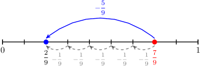

We have landed on $\dfrac29.$ Therefore,

$$

\dfrac{7}{9}-\dfrac{5}{9} = \dfrac{2}{9}.

$$
