# Comparing Fraction Models Using Common Denominators

Source: https://www.mathacademy.com/topics/2376?courseId=75
Topic ID: 2376

## Prerequisites

- [Comparing Fractions](./538-comparing-fractions.md)
- [Least Common Denominators](./2365-least-common-denominators.md)
- [Connecting Factors and Multiples](./3935-connecting-factors-and-multiples.md)

## Lesson

### Introduction

Let's compare the fractions $\dfrac{1}{\color{blue}3}$ and $\dfrac{4}{\color{red}6}$ using fraction models.

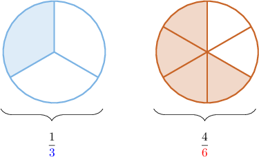

By comparing the shaded areas, we can tell that the fraction on the left is *smaller than* the fraction on the right. But how can we show this mathematically?

One way to compare the fractions is to put them over a **common denominator.** In other words, we can compare the fractions by making their denominators *the same*.

Notice that $\color{red}6$ is a multiple of ${\color{blue}{3}}.$ In fact,

$$

{\color{red}{6}} = {\color{purple}{2}} \times {\color{blue}{3}}.

$$

So, to make the denominators the same, we split each part of the *left* fraction into ${\color{purple}{2}}$ *equal pieces.*

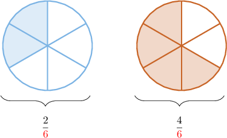

The fractions now have the same denominators, so we can compare them by comparing their numerators.

Since $2 < 4,$ the correct comparison statement is

$$

\dfrac{2}{\color{red}6} < \dfrac{4}{\color{red}6}.

$$

Therefore, we conclude that

$$

\dfrac13 < \dfrac46.

$$

### Example: Case When One Denominator Is a Multiple of the Other: Missing Numerator

#### Question

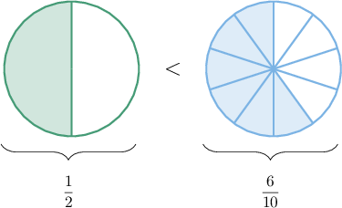

Consider the comparison statement above. By putting both fractions over a denominator of $10,$ this comparison statement becomes

$$

0

$$

What is the missing number?

#### Explanation

The denominators are $2$ and $10,$ and $10$ is a multiple of $2.$ In fact

$$

10 = {\color{purple}{5}}\times 2.

$$

We can put both fractions over a common denominator of $10$ by splitting each of the parts on the left into $\color{purple}5$ equal pieces.

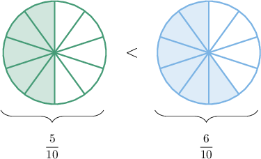

$$

\dfrac{\boxed{5}}{10} < \dfrac6{10}.

$$

Therefore, the missing number is $5.$

### Example: Case When One Denominator Is a Multiple of the Other: Missing Denominator

#### Question

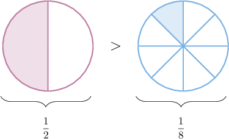

Consider the comparison statement above. By putting the fractions over a common denominator, we can rewrite this comparison statement as follows:

$$

0

$$

What is the missing fraction?

#### Explanation

The denominators are $2$ and $8,$ and $8$ is a multiple of $2.$ In fact

$$

8 = {\color{purple}{4}}\times 2.

$$

We can put both fractions over a common denominator of $8$ by splitting each of the parts on the left into $\color{purple}4$ equal pieces.

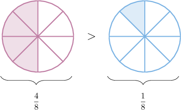

The fractions now have the same denominator, $8$, and the comparison statement is

$$

\dfrac{\boxed{4}}{\boxed{8}} > \dfrac{1}{8}.

$$

Therefore, the missing fraction is $\dfrac48.$

### Using the Product of the Denominators to Create a Common Denominator

Let's compare the fractions $\dfrac{1}{\color{blue}2}$ and $\dfrac{1}{\color{red}3}$ using the models shown below.

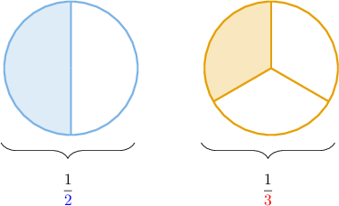

Note the following:

- ${\color{red}{3}}$ is not a multiple of ${\color{blue}{2}}$

- In cases like this, we can find a common denominator by taking the product of the two denominators.

- So for the fractions above, we can create a common denominator of ${\color{blue}{2}} \times {\color{red}{3}} = 6.$

First, we put the left fraction over a denominator of $6$ by splitting each of its parts into ${\color{red}{3}}$ equal pieces.

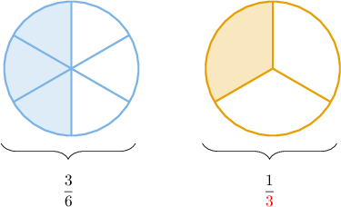

Next, we put the right fraction over a denominator of $6$ by splitting each of its parts into ${\color{blue}{2}}$ equal pieces.

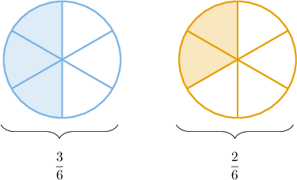

The fractions now have the same denominator, $6$, so we can compare them by comparing their numerators.

Since $3 > 2,$ the correct statement is

$$

\dfrac{3}{6} > \dfrac{2}{6}.

$$

Therefore, we conclude that

$$

\dfrac{1}{2} > \dfrac{1}{3}.

$$

### Example: Case When the LCD Is the Product of the Denominators: Missing Numerator

#### Question

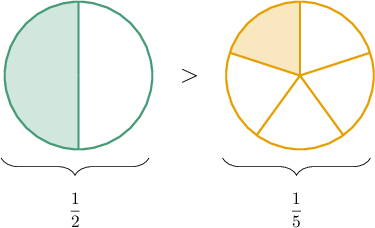

Consider the comparison statement above. By putting both fractions over a denominator of $10,$ this comparison statement becomes

$$

0

$$

What is the missing number?

#### Explanation

The left and right sides represent fractions with denominators of ${\color{red}{2}}$ and ${\color{blue}{5}},$ respectively. To compare them, we can put both fractions over a common denominator of ${\color{red}{2}} \times {\color{blue}{5}} = 10.$

We put the left fraction over a denominator of $10$ by splitting each of its parts into ${\color{blue}{5}}$ equal pieces.

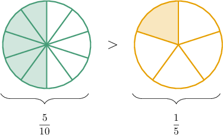

We put the right side over a denominator of $10$ by splitting each of its parts into ${\color{red}{2}}$ equal pieces.

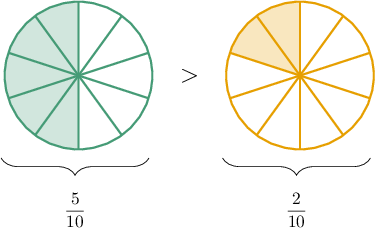

The fractions now have the same denominator, $10$, and the comparison statement is

$$

\dfrac{5}{10} > \dfrac{\boxed{2}}{10}.

$$

Therefore, the missing number is $2.$

### Example: Case When the LCD Is the Product of the Denominators: Missing Denominator

#### Question

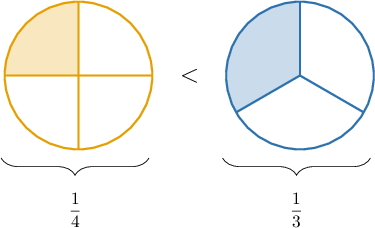

Consider the fraction comparison above. By putting the fractions over a common denominator, we can rewrite this comparison statement as follows:

$$

0

$$

What number is missing from ** boxes?

#### Explanation

The left and right sides represent fractions with denominators of ${\color{red}{4}}$ and ${\color{blue}{3}},$ respectively. To compare them, we can put both fractions over a common denominator of ${\color{red}{4}} \times {\color{blue}{3}} = 12.$

We put the left fraction over a denominator of $12$ by splitting each of its parts into ${\color{blue}{3}}$ equal pieces.

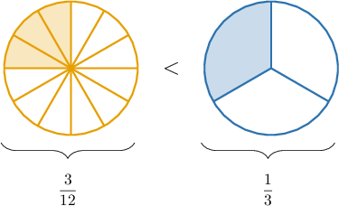

We put the right side over a denominator of $12$ by splitting each of its parts into ${\color{red}{4}}$ equal pieces.

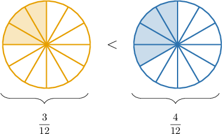

The fractions now have the same denominator, $12$, and the comparison statement is

$$

\dfrac{3}{\boxed{12}} \lt \dfrac{4}{\boxed{12}}.

$$

Therefore, the number missing from both boxes is $12.$
