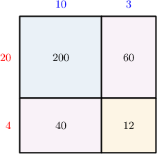

# Two-Digit by Two-Digit Multiplication Using Place Value

Source: https://www.mathacademy.com/topics/2394?courseId=75
Topic ID: 2394

## Prerequisites

- [Two-Digit by One-Digit Multiplication Using Place Value](./2416-two-digit-by-one-digit-multiplication-using-place-value.md)
- [Two-Digit by Two-Digit Multiplication Using Area Models](./2418-two-digit-by-two-digit-multiplication-using-area-models.md)

## Lesson

### Introduction

We've seen how to use area models to multiply two-digit numbers. Let's now discuss a similar method that does not require models.

For example, let's consider the following multiplication problem:

$$

13 \times 24

$$

We begin by expressing both factors in expanded form:

$$

\begin{aligned}13 & =10+3,\,24=20+4\end{aligned}

$$

Next, we multiply *both* numbers in the first factor's expanded form by *both* numbers in the second factor's expanded form:

- First, we multiply ${\color{blue}{10}}$ by ${\color{red}{20}}$ and ${\color{red}{4}} \mathbin{:}$

- Then, we multiply ${\color{blue}{3}}$ by ${\color{red}{20}}$ and ${\color{red}{4}} \mathbin{:}$

Let's now add all our results:

$$

\begin{aligned} & \,\,\,\,1\,\,\,\, & \,\,\,\,\,\,\,\, & \,\,\,\,\,\,\,\, \\ & \,\,\,\,2\,\,\,\, & \,\,\,\,0\,\,\,\, & \,\,\,\,0\,\,\,\, \\ \,\,\,\,+\,\,\,\, & \,\,\,\,\,\,\,\, & \,\,\,\,4\,\,\,\, & \,\,\,\,0\,\,\,\, \\ \,\,\,\,+\,\,\,\, & \,\,\,\,\,\,\,\, & \,\,\,\,6\,\,\,\, & \,\,\,\,0\,\,\,\, \\ \,\,\,\,+\,\,\,\, & \,\,\,\,\,\,\,\, & \,\,\,\,1\,\,\,\, & \,\,\,\,2\,\,\,\, \\ & \,\,\,\,3\,\,\,\, & \,\,\,\,1\,\,\,\, & \,\,\,\,2\,\,\,\,\end{aligned}

$$

Therefore,

$$

13 \times 24 = 312.

$$

It's worth taking a moment to compare this computation to the corresponding area model.

Notice the following:

- The intermediate products $(200,40,60,$ and $12)$ we found during our calculation all correspond to the areas of small rectangles in the area model.

- Summing these intermediate products corresponds to finding the area of the large rectangle by adding the areas of the small rectangles.

### Example: Multiplying Two-Digit Numbers Given a Decomposition

#### Question

Ann wishes to find the value of $36\times 19.$ She starts by writing both factors in expanded form.

$$

36 = {\color{blue}{30}}+{\color{blue}{6}},\qquad 19 = {\color{red}{10}}+{\color{red}{9}}

$$

Then, she proceeds as follows:

$$

\begin{aligned}30×10 & =\phantom{000} \\ 30×9 & =\phantom{000} \\ 6×10 & =\phantom{10} \\ 6×9 & =\phantom{10}\end{aligned}

$$

Find the missing numbers, and use your answers to find the value of $36\times 19.$

#### Explanation

We can compute $36\times 19$ by filling in the missing numbers and adding the results. So, let's find the missing values:

$$

\begin{aligned}30×10 & =\,300\, \\ 30×9 & =\,270\, \\ 6×10 & =\,60\, \\ 6×9 & =\,54\,\end{aligned}

$$

Let's now add these results:

$$

\begin{aligned} & \,\,\,\,1\,\,\,\, & \,\,\,\,\,\,\,\, & \,\,\,\,\,\,\,\, & \\ & \,\,\,\,3\,\,\,\, & \,\,\,\,0\,\,\,\, & \,\,\,\,0\,\,\,\, & \\ \,\,\,\,+\,\,\,\, & \,\,\,\,2\,\,\,\, & \,\,\,\,7\,\,\,\, & \,\,\,\,0\,\,\,\, & \\ \,\,\,\,+\,\,\,\, & \,\,\,\,\,\,\,\, & \,\,\,\,6\,\,\,\, & \,\,\,\,0\,\,\,\, & \\ \,\,\,\,+\,\,\,\, & \,\,\,\,\,\,\,\, & \,\,\,\,5\,\,\,\, & \,\,\,\,4\,\,\,\, & \\ & \,\,\,\,6\,\,\,\, & \,\,\,\,8\,\,\,\, & \,\,\,\,4\,\,\,\, & \end{aligned}

$$

Therefore,

$$

36\times 19 = 684.

$$

### Example: Multiplying Two-Digit Numbers

#### Question

What is the value of $83 \times 47?$

#### Explanation

First, let's write our factors in expanded form:

$$

\begin{aligned}83 & =80+3,\,47=40+7\end{aligned}

$$

Next, we multiply ** numbers in the first factor's expanded form by ** numbers in the second factor's expanded form:

- First, we multiply ${\color{blue}{80}}$ by ${\color{red}{40}}$ and ${\color{red}{7}} \mathbin{:}$

- Then, we multiply ${\color{blue}{3}}$ by ${\color{red}{40}}$ and ${\color{red}{7}} \mathbin{:}$

Let's now add all our results:

$$

\begin{aligned} & \,\,\,\,\,\,\,\, & \,\,\,\,1\,\,\,\, & \,\,\,\,\,\,\,\, & \\ & \,\,\,\,3\,\,\,\, & \,\,\,\,2\,\,\,\, & \,\,\,\,0\,\,\,\, & \,\,\,\,0\,\,\,\, \\ \,\,\,\,+\,\,\,\, & \,\,\,\,\,\,\,\, & \,\,\,\,5\,\,\,\, & \,\,\,\,6\,\,\,\, & \,\,\,\,0\,\,\,\, \\ \,\,\,\,+\,\,\,\, & \,\,\,\,\,\,\,\, & \,\,\,\,1\,\,\,\, & \,\,\,\,2\,\,\,\, & \,\,\,\,0\,\,\,\, \\ \,\,\,\,+\,\,\,\, & \,\,\,\,\,\,\,\, & \,\,\,\,\,\,\,\, & \,\,\,\,2\,\,\,\, & \,\,\,\,1\,\,\,\, \\ & \,\,\,\,3\,\,\,\, & \,\,\,\,9\,\,\,\, & \,\,\,\,0\,\,\,\, & \,\,\,\,1\,\,\,\,\end{aligned}

$$

Therefore,

$$

83 \times 47 = 3,901.

$$

### Example: Multiplying Two-Digit Numbers: Word Problems

#### Question

A maximum of $68$ people can enter a particular gym every hour. What is the maximum number of people that can enter the gym over a $36$-hour period?

#### Explanation

To determine the maximum number of people, we need to compute the value of

$$

68 \times 36.

$$

First, let's write our factors in expanded form:

$$

\begin{aligned}68 & =60+8,\,36=30+6\end{aligned}

$$

Next, we multiply ** numbers in the first factor's expanded form by ** numbers in the second factor's expanded form:

- First, we multiply ${\color{blue}{60}}$ by ${\color{red}{30}}$ and ${\color{red}{6}} \mathbin{:}$

- Then, we multiply ${\color{blue}{8}}$ by ${\color{red}{30}}$ and ${\color{red}{6}} \mathbin{:}$

Let's now add all our results:

$$

\begin{aligned} & \,\,\,\,1\,\,\,\, & \,\,\,\,1\,\,\,\, & \,\,\,\,\,\,\,\, & \,\,\,\,\,\,\,\, & \\ & \,\,\,\,1\,\,\,\, & \,\,\,\,8\,\,\,\, & \,\,\,\,0\,\,\,\, & \,\,\,\,0\,\,\,\, & \\ \,\,\,\,+\,\,\,\, & \,\,\,\,\,\,\,\, & \,\,\,\,3\,\,\,\, & \,\,\,\,6\,\,\,\, & \,\,\,\,0\,\,\,\, & \\ \,\,\,\,+\,\,\,\, & \,\,\,\,\,\,\,\, & \,\,\,\,2\,\,\,\, & \,\,\,\,4\,\,\,\, & \,\,\,\,0\,\,\,\, & \\ \,\,\,\,+\,\,\,\, & \,\,\,\,\,\,\,\, & \,\,\,\,\,\,\,\, & \,\,\,\,4\,\,\,\, & \,\,\,\,8\,\,\,\, & \\ & \,\,\,\,2\,\,\,\, & \,\,\,\,4\,\,\,\, & \,\,\,\,4\,\,\,\, & \,\,\,\,8\,\,\,\, & \end{aligned}

$$

Therefore, the maximum number of people that can enter the gym is $2,448.$
