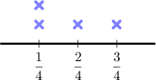
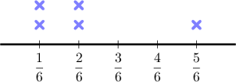
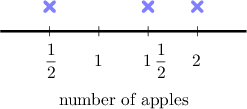
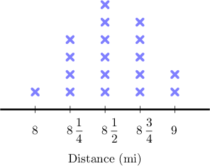
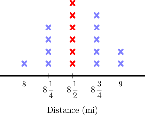
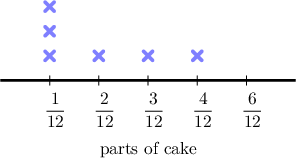
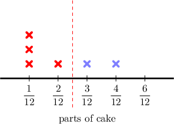

# Creating and Interpreting Line Plots With Fractions

Source: https://www.mathacademy.com/topics/2408?courseId=75
Topic ID: 2408

## Prerequisites

- [Multiplying Fractions by Whole Numbers](./2360-multiplying-fractions-by-whole-numbers.md)
- [Creating and Interpreting Line Plots](./2400-creating-and-interpreting-line-plots.md)
- [Comparing Fractions Using Common Denominators](./4204-comparing-fractions-using-common-denominators.md)

## Lesson

### Introduction

Let's create a line plot for the following dataset:

$$

\dfrac{1}{4} \quad \dfrac{1}{2} \quad \dfrac{1}{4} \quad \dfrac{3}{4}

$$

**Step 1.** First, we identify any values that are the same:

$$

{\color{blue}{\dfrac{1}{4}}} \quad {\color{red}{\dfrac{1}{2}}} \quad {\color{blue}{\dfrac{1}{4}}} \quad \dfrac{3}{4}

$$

**Step 2.** Second, we order the data from smallest to largest. To compare fractions with unlike denominators, we need to express each fraction as an equivalent fraction with a common denominator.

Here, we can make a common denominator of $4.$

To put ${\color{red}\dfrac{1}{2}}$ over a denominator of $4,$ we multiply the numerator and denominator by $2\mathbin{:}$

$$

\dfrac{1}{2}= \dfrac{1 \times 2}{2 \times 2} = {\color{red}\dfrac{2}{4}}

$$

So, our data set is equivalent to the following:

$$

{\color{blue}{\dfrac{1}{4}}} \quad {\color{red}{\dfrac{2}{4}}} \quad {\color{blue}{\dfrac{1}{4}}} \quad \dfrac{3}{4}

$$

**Step 3.** Thirdly, we order the dataset:

$$

\underbrace{{\color{blue}\dfrac{1}{4}} \quad {\color{blue}\dfrac{1}{4}} }_{2} \quad \underbrace{{\color{red}\dfrac{2}{4}} }_{1} \quad \underbrace{{\color{black}\dfrac{3}{4}} }_{1}

$$

**Step 4.** Finally, we can create a line plot. We write each fraction on a number line, and then place a cross above the fraction for each occurance in the dataset. This gives us the following line plot:

### Example: Constructing a Line Plot From Given Data

#### Question

What line plot represents the data set below?

$$

\dfrac{1}{3} \quad \dfrac{5}{6} \quad \dfrac{1}{6} \quad \dfrac{1}{3} \quad \dfrac{1}{6}

$$

#### Explanation

First, we identify any values that are the same:

$$

{\color{blue}{\dfrac{1}{3}}} \quad {\color{red}{\dfrac{5}{6}}} \quad \dfrac{1}{6} \quad {\color{blue}{\dfrac{1}{3}}} \quad \dfrac{1}{6}

$$

Then, we order the data from the least to the greatest. To compare fractions with unlike denominators, we need to express each fraction as an equivalent fraction with a common denominator.

Here, we can make a common denominator of $6.$

To put ${\color{blue}\dfrac{1}{3}}$ over a denominator of $6,$ we multiply the numerator and denominator by $2\mathbin{:}$

$$

\dfrac{1}{3}= \dfrac{1 \times 2}{3 \times 2} = {\color{blue}\dfrac{2}{6}}

$$

So our data set is equivalent to:

$$

{\color{blue}{\dfrac{2}{6}}} \quad {\color{red}{\dfrac{5}{6}}} \quad \dfrac{1}{6} \quad {\color{blue}{\dfrac{2}{6}}} \quad \dfrac{1}{6}

$$

Now, we order the dataset:

$$

\underbrace{{\color{black}\dfrac{1}{6}} \quad {\color{black}\dfrac{1}{6}} }_{2} \quad \underbrace{{\color{blue}\dfrac{2}{6}} \quad {\color{blue}\dfrac{2}{6}} }_{2} \quad \underbrace{{\color{red}\dfrac{5}{6}} }_{1}

$$

Finally, we can create a line plot. We write each fraction on the number line, and then place a cross above the fraction for each time it occurs in the dataset:

### Example: Constructing a Line Plot From Given Data When Computation Is Required

#### Question

Mrs. Smith distributes pieces of half-apple to her students. These pieces are given to Margaret, Daniel, and Rose. The table below shows the number of half-apples each child received.

By letting each cross represent a different child, create a line plot showing the frequency of ** apples handed out to the children.

#### Explanation

First, we find the number of whole apples given to each child.

- $4$ halves is equivalent to $4 \times \dfrac{1}{2} = \dfrac{4}{2} = 2$ apples.

- $3$ halves is equivalent to $3 \times \dfrac{1}{2} = \dfrac{3}{2} = 1\, \dfrac{1}{2}$ apples.

- $1$ half is equivalent to $1 \times \dfrac{1}{2} = \dfrac{1}{2}$ of an apple.

We organize these results in the table:

So, we have the following dataset for the number of apples given to each child:

$$

\dfrac{1}{2} \qquad 1\, \dfrac{1}{2} \qquad 2

$$

This dataset has the following line plot:

### Example: Finding the Most Common Value in a Line Plot

#### Question

The following line plot shows the distance traveled, in miles, by various professional cyclists as part of their morning training. Each cross represents a different cyclist. What is the most common distance the cyclists travel during training?

#### Explanation

Looking at the graph, the most common distance traveled by cyclists is $8 \, \dfrac{1}{2}\, \textrm{mi}.$ A total of $6$ cyclists traveled this far.

### Example: Counting Values in a Line Plot

#### Question

John's mother made a chocolate cake for a charity day. She divided the cake into $12$ equal parts. The line plot above shows the fraction of cake each customer bought, where each cross represents a different person. How many people purchased at most $2$ pieces of this cake?

#### Explanation

John's mother divided the cake into $12$ equal parts, so a piece of cake is $\dfrac{1}{12}$ of the whole cake.

To see how many people bought $2$ pieces or less, we focus on the portion of the graph that corresponds to $\dfrac{2}{12}$ or less:

The plot tells us the following information:

- ${\color{red}{3}}$ people bought $\dfrac{1}{12}$ of cake.

- ${\color{red}{1}}$ person bought $\dfrac{2}{12}$ of cake.

Therefore, a total of $3 + 1 = 4$ people bought at most $2$ pieces of the cake.
