# Two-Digit by One-Digit Multiplication Using Area Models

Source: https://www.mathacademy.com/topics/2415?courseId=75
Topic ID: 2415

## Prerequisites

- [Products and Factors](./122-products-and-factors.md)
- [Multiplying Whole Numbers Ending in Zeros](./488-multiplying-whole-numbers-ending-in-zeros.md)
- [Adding Three-Digit and Two-Digit Numbers](./3910-adding-three-digit-and-two-digit-numbers.md)

## Lesson

### Introduction

An **area model** is a large rectangle containing two (or more) smaller rectangles. A sketch of a typical area model is shown below:

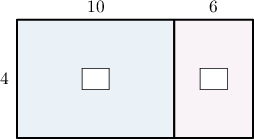

We complete this area model by finding the areas of the blue and pink rectangles and placing these values on our diagram:

- Let's first look at the blue rectangle (the one on the left-hand side). Its length is $10,$ and its width is $4.$ Therefore, the area of this rectangle must be Let's add this to our model:

- Now, let's look at the pink rectangle (the one on the right-hand side). Its length is $6,$ and its width is $4.$ Therefore, the area of this rectangle must be Let's add this to our model:

And we're done!

**Note**: Area models are not usually drawn to scale. In other words, the lengths shown on the model might not be in the correct proportion.

### Example: Completing an Area Model

#### Question

From left to right, find the missing numbers in the area model below.

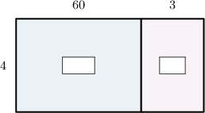

#### Explanation

We need to look at the blue and pink rectangles:

- Let's first look at the blue rectangle (the one on the left-hand side). Its length is $60,$ and its width is $4.$ Therefore, the area of this rectangle must be Let's add this to our model:

- Now, let's look at the pink rectangle (the one on the right-hand side). Its length is $3,$ and its width is $4.$ Therefore, the area of this rectangle must be Let's add this to our model:

Therefore, from left to right, the missing numbers are $240$ and $12.$

### Using Area Models to Represent Multiplication Problems

Area models can be used to represent multiplication problems.

For example, let's return to the following area model:

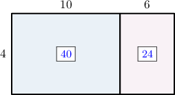

Now, let's look at the big rectangle:

- its length is $10+6=16$

- its width is $4$

- its area is ${\color{blue}{40}}+{\color{blue}{24}}=64$

Since the area of the big rectangle equals its length multiplied by its width, this model represents the following multiplication problem:

$$

16 \times 4= 64

$$

### Example: Interpreting an Area Model

#### Question

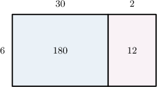

The area model above can be used to represent the following multiplication problem:

$$

00

$$

What is the missing number?

#### Explanation

Let's look at the big rectangle:

- its length is $30+2=32$

- its width is $6$

- its area is $180+12=192$

Hence, this area model can be used to represent the following multiplication problem:

$$

32 \times \fbox{6}= 192

$$

Therefore, the missing number is $6.$

### Example: Multiplying Numbers Using a Partially Filled Area Model

#### Question

Using the area model below, find the value of $29 \times 6.$

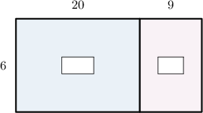

#### Explanation

First, we compute the areas of the blue and pink rectangles. This gives the following picture:

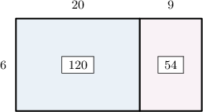

Now, notice the following regarding the big rectangle:

- its length is $20 + 9 = 29$

- its width is $6$

- its area is $120 + 54= 174$

Therefore, this area model can be used to represent the following multiplication problem:

$$

29 \times 6 = 174

$$

### Multiplying One-Digit Numbers by Two-Digit Numbers Using Area Models

Let's solve the following multiplication problem using an area model:

$$

{\color{blue}{16}} \times {\color{red}{8}}

$$

The number $16$ in expanded form is ${\color{blue}{16}} = {\color{blue}10}+{\color{blue}6}.$ So, we place ${\color{blue}10}$ and ${\color{blue}6}$ above the left and right rectangles, and ${\color{red}8}$ to the left of the big rectangle.

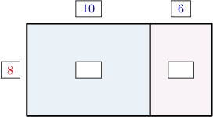

Next, we compute the areas of the blue and pink rectangles. This gives the following picture:

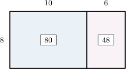

Now, notice the following regarding the big rectangle:

- its length is $10 + 6 = 16$

- its width is $8$

- its area is $80 + 48 = 128$

Therefore, this area model can be used to represent the following multiplication problem:

$$

16 \times 8 = 128

$$

### Example: Multiplying Two-Digit Numbers by One-Digit Numbers

#### Question

Using the area model below, find the value of $53 \times 8.$

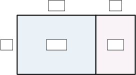

#### Explanation

First, we set up the model. The number $53$ can be expressed in expanded form as ${\color{blue}50}+{\color{blue}3}.$ So, we place ${\color{blue}50}$ and ${\color{blue}3}$ above the left and right rectangles, respectively, and ${\color{red}8}$ to the left of the big rectangle.

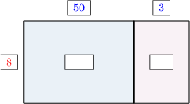

Next, we compute the areas of the blue and pink rectangles. This gives the following picture:

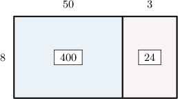

Now, notice the following regarding the big rectangle:

- its length is $50 + 3 = 53$

- its width is $8$

- its area is $400 + 24 = 424$

Therefore, this area model can be used to represent the following multiplication problem:

$$

53 \times 8 = 424

$$
