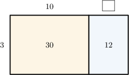
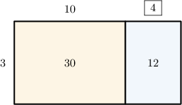
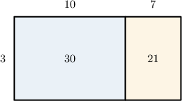
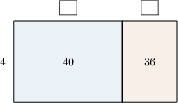
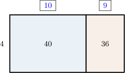

# Two-Digit by One-Digit Division Using Area Models

Source: https://www.mathacademy.com/topics/2423?courseId=75
Topic ID: 2423

## Prerequisites

- [Two-Digit by One-Digit Multiplication Using Area Models](./2415-two-digit-by-one-digit-multiplication-using-area-models.md)
- [Dividing by One-Digit Numbers by Connecting Multiplication and Division](./2422-dividing-by-one-digit-numbers-by-connecting-multiplication-and-division.md)
- [Dividing Numbers Using Place-Value Strategies](./3886-dividing-numbers-using-place-value-strategies.md)

## Lesson

### Introduction

Let's consider the following area model.

To determine the missing length, we consider the area of the blue rectangle (the one on the right-hand side).

The area of the blue rectangle is $12,$ and its width is $3.$ Therefore, the length of this rectangle must be

$$

12 \div 3 = 4.

$$

Let's add this length to our area model.

And we're done! Let's see another example.

### Example: Completing an Area Model

#### Question

From left to right, find the missing numbers in the area model above.

#### Explanation

We need to look at the blue and pink rectangles:

- Let's first look at the blue rectangle (the one on the left-hand side). Its area is $80,$ and its width is $8.$ Therefore, the length of this rectangle must be Let's add this to our model:

- Now, let's look at the pink rectangle (the one on the right-hand side). Its area is $32,$ and its width is $8.$ Therefore, the length of this rectangle must be Let's add this to our model:

Therefore, from left to right, the missing numbers are $10$ and $4.$

### Using Area Models to Represent Division Problems

Area models can be used to represent division problems.

For example, let's take a look at the following area model.

Now, let's look at the big rectangle:

- its length is $10+6=16$

- its width is $4$

- its area is ${\color{blue}{40}}+{\color{blue}{24}}=64$

Since the area of the big rectangle equals its length multiplied by its width, this model represents the following multiplication problem:

$$

16 \times 4= 64

$$

Writing this as a division problem, we get

$$

16 = 64\div 4.

$$

**Note:** When using area models to represent division problems, the divisor ($4$ in this case) is the number on the *left-hand side* of our model.

### Example: Interpreting an Area Model

#### Question

The area model above can be used to represent the following division problem:

$$

00

$$

What is the missing number?

#### Explanation

Let's look at the big rectangle:

- its length is $10+7= 17$

- its width is $3$

- its area $30+21 = 51$

Therefore, this area model can be used to represent the following multiplication problem:

$$

51 = 17\times 3

$$

Writing this as a division problem, we get

$$

51 \div 3 = 17.

$$

Therefore, the missing number is $17.$

### Example: Completing an Area Model and Stating a Result

#### Question

Using the area model above, find the value of $76\div 4.$

#### Explanation

First, we find the missing values. This gives the following:

Now, notice the following regarding the big rectangle:

- its length is $10+9 = 19$

- its width is $4$

- its area $40+36 = 76$

Therefore, this area model can be used to represent the following multiplication problem:

$$

76 = 19\times 4

$$

Writing this as a division problem, we get

$$

76\div 4 = 19.

$$
