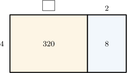
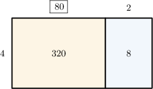
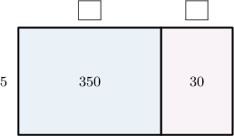
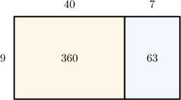

# Multi-Digit by One-Digit Division Using Area Models

Source: https://www.mathacademy.com/topics/2426?courseId=75
Topic ID: 2426

## Prerequisites

- [Two-Digit by One-Digit Division Using Area Models](./2423-two-digit-by-one-digit-division-using-area-models.md)

## Lesson

### Introduction

We can use area models to represent division problems involving three-digit numbers.

Let's consider the area model below.

To determine the missing length, we consider the area of the yellow rectangle (the one on the left-hand side).

The area of the yellow rectangle is $320,$ and its width is $4.$ Hence, the length of this rectangle must be

$$

320\div 4.

$$

To carry out this division, we write $320$ as a product with $10$ as one of the factors and then swap the order of multiplication and division:

$$

\begin{aligned}320÷4 & = \\ 32×10÷4 & = \\ 32÷4×10 & = \\ (32÷4)×10 & = \\ 8×10 & = \\ 80 & \end{aligned}

$$

We can now add this length to the area model.

### Example: Completing an Area Model

#### Question

From left to right, find the missing numbers in the area model below.

#### Explanation

We need to look at the blue and pink rectangles:

- Let's first look at the blue rectangle (the one on the left-hand side). Its area is $350,$ and its width is $5.$ Therefore, the length of the rectangle must be To carry out this division, we write $350$ as a product with $10$ as one of the factors and then swap the order of multiplication and division: Let's add this to our model:

- Now, let's look at the pink rectangle (the one on the right-hand side). Its area is $30,$ and its width is $5.$ Therefore, the length of the rectangle must be Let's add this to our model:

Therefore, from left to right, the missing numbers are $70$ and $6.$

### Example: Interpreting an Area Model

#### Question

The area model above can be used to represent the following division problem

$$

00

$$

What is the missing number?

#### Explanation

Let's look at the big rectangle:

- its length is $40+7=47$

- its width is $9$

- its area is $360 + 63 = 423$

Therefore, this area model can be used to represent the following multiplication problem:

$$

423 = 47 \times 9

$$

Writing this as a division problem, we get

$$

423 \div 9 = 47.

$$

Therefore, the missing number is $423.$

### Example: Completing an Area Model and Stating a Result

#### Question

Leonard packed $812$ apples into bags. One bag holds $4$ apples. Using the area model below, find how many bags of apples Leonard packed.

#### Explanation

To determine the number of bags Leonard packed, we need to calculate $812\div 4.$

- Let's first look at the blue rectangle (the one on the left-hand side). Its area is $800,$ and its width is $4.$ Hence, the length of this rectangle must be To carry out this division, we write $800$ as a product with $100$ as one of the factors and then swap the order of multiplication and division: Let's add this to our model:

- Now, let's look at the pink rectangle (the one on the right-hand side). Its area is $12,$ and its width is $4.$ Hence, the length of this rectangle must be Let's add this to our model:

Now, notice the following regarding the big rectangle:

- its length is $200+3=203$

- its width is $4$

- its area is $800+12=812$

Therefore, this area model can be used to represent the following multiplication problem:

$$

812 = 203 \times 4

$$

Writing this as a division problem, we get

$$

812 \div 4 = 203.

$$

Therefore, Leonard packed $203$ bags of apples.
