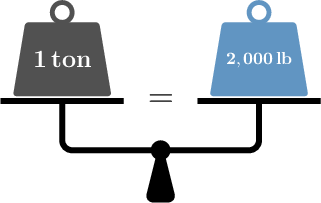
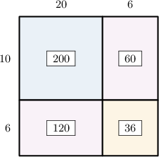

# Converting Units of Mass to Smaller Units

Source: https://www.mathacademy.com/topics/2428?courseId=75
Topic ID: 2428

## Prerequisites

- [Two-Digit by Two-Digit Multiplication Using Area Models](./2418-two-digit-by-two-digit-multiplication-using-area-models.md)
- [Units of Mass](./4196-units-of-mass.md)

## Lesson

### Introduction

When solving problems with units, we often want to convert from one unit of measurement to another.

To convert between customary units of mass, we use the following unit conversions:

- $1$ ton $= 2,000$ pounds

- $1$ pound $=16$ ounces

We can think of unit conversions of mass concretely by picturing a set of weighing scales.

For example, if we placed a $1\,\text{lb}$ mass on one scale and sixteen $1\,\text{oz}$ masses on the other, the scales would balance perfectly.

Similarly, we can picture a set of weighing scales showing the equivalence between $1$ ton and $2,000\,\text{lb}.$

Let's get some practice at converting between customary units of mass.

### Example: Converting Masses From Tons to Pounds

#### Question

How many pounds are in $24$ tons?

#### Explanation

We start with the unit conversion between tons and pounds:

$$

1\, \text{ton} =2,000\, \text{lb}

$$

Remember that $\text{lb}$ is the unit symbol for pounds.

We want to figure out how many pounds are in ${\color{blue}{24}}$ tons. So, we multiply ** sides of the above equation by ${\color{blue}{24}}{:}$

$$

\begin{aligned}24×1\,ton & =24×2,000\,lb \\ 24\,tons & =48,000\,lb\end{aligned}

$$

Therefore, $24$ tons is equal to $48,000\,\text{lb}.$

### Example: Converting Masses From Pounds to Ounces

#### Question

Luis wants to lose $26\,\text{lb}$ in weight over the next twelve months. How much is this in ounces?

#### Explanation

We start with the unit conversion between pounds and ounces:

$$

1 \,\text{lb}=16 \,\text{oz}

$$

We want to figure out how many ounces are in $26$ pounds. So, we multiply both sides of the above equation by $26{:}$

$$

\begin{aligned}26×1\,lb & =26×16\,oz \\ 26\,lb & =26×16\,oz\end{aligned}

$$

We can find the value of $26\times 16$ using an area model:

According to our model,

$$

26\times 16 = 200+60+120+36 = 416.

$$

Therefore, $26\,\text{lb}$ is equivalent to $416\,\text{oz}.$

### Converting Between Metric Units of Weight

For metric units of weight, there are two primary conversions that we need to be aware of:

- $1$ kilogram $=1,000$ grams

- $1$ gram $=1,000$ milligrams

For example, suppose we want to determine how many grams are in $17$ kilograms.

We start with the unit conversion between kilograms and grams:

$$

1\, \text{kilogram} =1,000\, \text{grams}

$$

We want to figure out how many grams are in $17$ kilograms. So, we multiply both sides of the above equation by $17{:}$

$$

\begin{aligned}17×1\,kilogram & =17×1,000\,grams \\ 17\,kilograms & =17,000\,grams\end{aligned}

$$

Therefore, $17$ kilograms equals $17,000$ grams.

### Example: Converting Masses From Kilograms to Grams

#### Question

The weight of a watermelon is $8\,\text{kg}.$ How much is this in grams?

#### Explanation

We start with the unit conversion between kilograms and grams:

$$

1 \,\text{kg}=1,000 \,\text{g}

$$

We want to figure out how many grams are in $8$ kilograms. So, we multiply both sides of the above equation by $8{:}$

$$

\begin{aligned}8×1\,kg & =8×1,000\,g \\ 8\,kg & =8,000\,g\end{aligned}

$$

Therefore, the weight of the watermelon is $8,000\,\text{g}.$

### Example: Converting Masses From Grams to Milligrams

#### Question

How many milligrams are in $40\,\text{g}?$

#### Explanation

We need to convert $40$ grams into milligrams.

We start with the unit conversion between grams and milligrams:

$$

1\, \text{g} =1,000\, \text{mg}

$$

We want to figure out how many milligrams are in $40$ grams. So, we multiply both sides of the above equation by $40{:}$

$$

\begin{aligned}40×1\,g & =40×1,000\,mg \\ 40\,g & =40,000\,mg\end{aligned}

$$

Therefore, $40\,\text{g}$ equals $40,000\, \text{mg}.$
