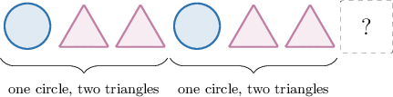
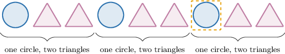
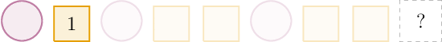
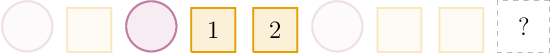
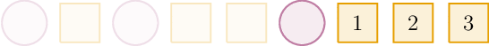
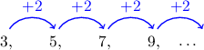

# Generating Patterns

Source: https://www.mathacademy.com/topics/2430?courseId=75
Topic ID: 2430

## Prerequisites

- None listed on the topic page.

## Lesson

### Introduction

Math is full of **patterns**. One type of pattern is a **list** (or **sequence**) of shapes, such as the following:

The pattern is read from left to right. Each item in our pattern is called a **term.**

Patterns normally have a **rule.** A rule is an instruction we use to generate the terms in our pattern.

The rule for our pattern above is as follows:

$\qquad$ "*one circle, two triangles, and repeat.*"

Let's use this rule to determine the next term of our pattern.

If we apply the rule, we find that the next term must be a circle:

### Example: Finding a Missing Shape in a Shape Pattern

#### Question

The rule for the pattern below is "one circle, one square, one circle, two squares,...," where the number of squares increases by $1$ each time. What is the missing shape?

#### Explanation

The rule is "one circle, one square, one circle, two squares,...," where the number of squares increases by $1$ each time.

First, we have a circle followed by ${\color{blue}1}$ square.

Then, a circle followed by $1+1={\color{blue}2}$ squares.

So next, we expect a circle followed by $2 + 1 = {\color{blue}3}$ squares.

Therefore, the missing shape is a square.

### Patterns in Number Sequences

Another type of pattern is a list (or sequence) of numbers, such as the following:

$$

3,\qquad 5,\qquad 7,\qquad 9

$$

The rule for the pattern above is *"add ${\color{blue}{2}}.$"*

In other words, we add ${\color{blue}{2}}$ to the previous number to generate the next number.

Knowing this rule, what is the next term in this pattern?

The rule is "add ${\color{blue}{2}}$," and the last given number is $9,$ so the next number is

$$

9+{\color{blue}{2}}=11 \, .

$$

### Example: Finding a Missing Number in a Pattern

#### Question

The rule for the pattern below is "multiply by $2.$"

$$

0

$$

What is the missing number?

#### Explanation

The rule is "multiply by $2$" and the missing number comes after $6.$ Therefore, the missing number is

$$

6 \times 2 = 12.

$$

### Example: Finding Multiple Missing Numbers

#### Question

The rule for the pattern below is "divide by $2.$" What are the missing numbers?

$$

0

$$

#### Explanation

The rule is "divide by $2$" and the first missing number comes after $8.$ Therefore, the first missing number is

$$

8 \div 2=4.

$$

The second missing number comes after $2.$ Therefore, the second missing number is

$$

2 \div 2=1.

$$

So, we have the following pattern:

$$

16,\qquad 8,\qquad \boxed{4},\qquad 2,\qquad \boxed{1}

$$

The missing numbers are $4$ and $1.$

### Example: Finding Numbers Appearing Later in a Pattern

#### Question

The rule for the pattern below is "subtract $3.$"

$$

53,\qquad 50,\qquad 47,\qquad 44,\qquad 41

$$

If the pattern is continued, what will be the $7$th number?

#### Explanation

The rule is "subtract $3$", and the last given number is $41,$ which is the $5$th number.

To find the $6$th number, we subtract $3$ from $41\mathbin{:}$

$$

41 - 3 = 38

$$

To find the $7$th number, we subtract $3$ from $38\mathbin{:}$

$$

38 - 3 = 35

$$

So, the $7$th number is $35.$
