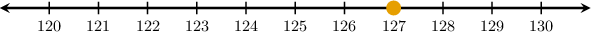
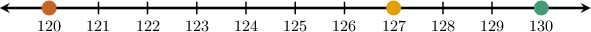
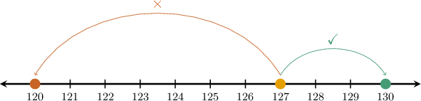
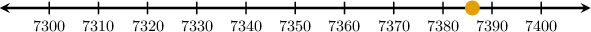
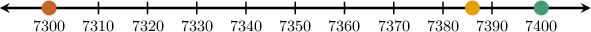
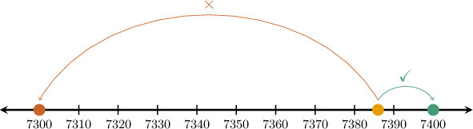

# Rounding Up Whole Numbers

Source: https://www.mathacademy.com/topics/3884?courseId=75
Topic ID: 3884

## Prerequisites

- [Rounding Down Whole Numbers](./3883-rounding-down-whole-numbers.md)

## Lesson

### Introduction

In this lesson, we'll extend our knowledge of rounding to situations where we must round *up* instead of down.

For example, let's round $127$ to the nearest ten:

We begin by drawing a number line and plotting our number.

Rounding a number to the nearest ten means finding the closest multiple of ten to our number.

The closest multiples of ten to $127$ are $120$ and $130.$ Let's add these multiples of $10$ to our diagram:

Now, since $127$ is closer to ${\color{DarkGreen}130}$ than ${\color{SaddleBrown}120},$ this is the number we round to.

Therefore, $127$ rounded to the nearest ten is $130.$

### Recognizing Multiples of 10 and 100

We can use the following rules to recognize multiples of $10$ and $100{:}$

- Multiples of $10$ always end in *at least* one zero. For example, all the following numbers are multiples of $10{:}$

- Multiples of $100$ always end in *at least* two zeros. For example, all the following numbers are multiples of $100{:}$

Let's look at an example of rounding up to the nearest $100.$

### Example: Rounding Up Using a Number Line

#### Question

Using the number line below, round $7,386$ to the nearest hundred.

#### Explanation

Rounding a number to the nearest hundred means finding the closest multiple of one hundred to our number.

The closest multiples of $100$ to $7,386$ are $7,300$ and $7,400.$

Let's add these multiples of $100$ to our diagram.

Since $7,386$ is closer to ${\color{DarkGreen}7,400}$ than ${\color{SaddleBrown}7,300},$ this is the number we round to.

Therefore, $7,386$ rounded to the nearest hundred is $7,400.$

### Rounding Up Whole Numbers Using Place Value Charts

We can also round whole numbers using place value charts.

To demonstrate, let's again round the following number to the nearest ten:

$$

127

$$

We start by writing our number's digits in a place value chart. Since we're rounding to the nearest *ten*, we highlight the tens place:

We then look one digit to the right in the chart (this will be the *ones* place) and compare it to the number $5{:}$

Now, since $\color{red}7$ is *greater or equal to* $5$, we must round *up*. To do this, we follow two steps:

- We put $\color{blue}0$ into the ones place:

- Then, we increase the tens value by one:

Therefore, $127$ rounded to the nearest ten is $130.$

### Example: Rounding Up to the Nearest Ten

#### Question

Round $54,385$ to the nearest ten.

#### Explanation

We start by writing our number into a place value chart, highlighting the ** place:

We then look one digit to the right in the chart (this will be the ** place) and compare it to the number $5{:}$

Since $\color{red}5$ is ** $5$, we must round **. To do this, we follow two steps:

- We put $\color{blue}0$ into the ones place:

- Then, we increase the tens value by one:

Therefore, $54,385$ rounded to the nearest ten is $54,390.$

### Rounding to Other Value Places

We can round whole numbers to the nearest hundred, thousand, and so on.

For example, let's round $261$ to the nearest hundred.

We start by writing our number into a place value chart. And since we're rounding to the nearest *hundred*, we highlight the hundreds place:

We then look one digit to the right in the chart (this will be the *tens* place) and compare it to the number $5{:}$

Since $\color{red}6$ is *greater or equal to* $5$, we must round *up*. To do this, we follow two steps:

- We put $\color{blue}0$ into *all places* to the right of the hundreds (tens and ones):

- Then, we increase the *hundreds* value by one:

Therefore, $261$ rounded to the nearest hundred is $300.$

### Example: Rounding Up to Some Other Place Value

#### Question

Round $7,825$ to the nearest thousand.

#### Explanation

We start by writing our number into a place value chart, highlighting the ** place.

We then look one digit to the right in the chart (this will be the ** place) and compare it to the number $5{:}$

Since $\color{red}8$ is ** $5$, we must round **. To do this, we follow two steps:

- We put $\color{blue}0$ into all places to the right of the thousands (into hundreds, tens, and ones):

- Then, we increase the ** value by one:

Therefore, $7,825$ rounded to the nearest thousand is $8,000.$
