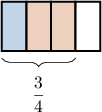
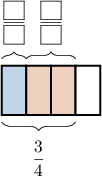
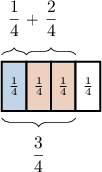
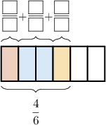
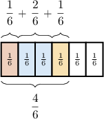
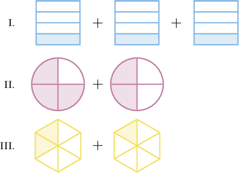
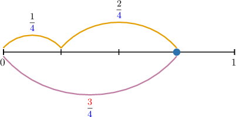
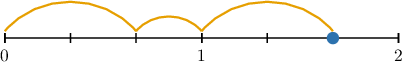
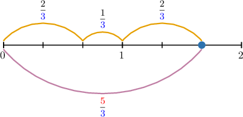

# Decomposing Fractions Into Sums Using Models

Source: https://www.mathacademy.com/topics/3889?courseId=75
Topic ID: 3889

## Prerequisites

- [Comparing Fractions](./538-comparing-fractions.md)
- [Adding Fractions With Like Denominators Using Models](./2370-adding-fractions-with-like-denominators-using-models.md)

## Lesson

### Introduction

Let's take a look at the following fraction model (sometimes called a **tape diagram**):

This model has $4$ parts, and $3$ parts are shaded. Therefore, this fraction represents $\dfrac34.$

Notice that the shaded parts have two different colors, blue and red. This creates two more fractions, as shown below:

Let's fill in the empty boxes:

- Since there is $1$ blue shaded part out of $4,$ the area shaded blue represents $\dfrac14.$

- Since there are $2$ red shaded parts out of $4,$ the area shaded red represents $\dfrac24.$

Let's add these to our diagram.

These two fractions must add up to $\dfrac{3}{4}.$ Therefore,

$$

\dfrac{3}{4} = \dfrac{1}{4} + \dfrac{2}{4}.

$$

Writing a larger fraction as the sum of two (or more) smaller fractions is called **fraction decomposition**.

### Example: Finding a Decomposition From a Tape Diagram

#### Question

What is the decomposition of $\dfrac{4}{6}$ shown in the diagram below?

#### Explanation

The diagram represents one whole, and there are $6$ small rectangles. Therefore, each small rectangle represents $\dfrac{1}{6}.$

As a result:

- the $1$st fraction above the tape is $\dfrac{1}{6}$

- the $2$nd fraction above the tape is $\dfrac{2}{6}$

- the $3$rd fraction above the tape is $\dfrac{1}{6}$

These three fractions add up to $\dfrac{4}{6}.$ Therefore, we have the following decomposition:

$$

\dfrac{4}{6} = \dfrac{1}{6} + \dfrac{2}{6} + \dfrac{1}{6}

$$

### Example: Identifying Valid Fraction Decompositions

#### Question

Which of the above are decompositions of the fraction $\dfrac{3}{4}?$

#### Explanation

Let's examine each model in turn.

- I is a decomposition of $\dfrac{3}{4}.$ Indeed, each fraction model contains $4$ parts, and the total number of shaded parts equals $3.$

- II is ** a decomposition of $\dfrac{3}{4}.$ Each fraction model contains $4$ parts. But the total number of shaded parts equals $5,$ not $3.$ As a result, this cannot be a decomposition of a fraction with a numerator of $3.$

- III is ** a decomposition of $\dfrac{3}{4}.$ Notice that each fraction model contains $6$ parts. As a result, this cannot be a decomposition of a fraction with a denominator of $4.$

Therefore, the correct answer is "I only."

### Representing Fraction Decompositions Using a Number Line

Let's again consider the decomposition of $\dfrac 34$ we've seen before:

$$

\dfrac 34 = \dfrac 14 + \dfrac 24

$$

We can represent the same decomposition using a number line diagram:

Notice that the line segment from $0$ to $1$ is split into $\color{blue}4$ equal parts. So, each part represents $\dfrac{1}{\color{blue}4}$ of a whole.

- Starting from zero, the $1$st jump covers $1$ part. So, it corresponds to the fraction $\dfrac{1}{\color{blue}4}.$

- The $2$nd jump covers $2$ parts. So, it corresponds to the fraction $\dfrac{2}{\color{blue}4}.$

In total, there are $1+2={\color{red}3}$ jumps. So, the resulting fraction is $\dfrac{\color{red}3}{\color{blue}4}.$

### Example: Finding a Decomposition From a Number Line

#### Question

What is the decomposition of $\dfrac{5}{3}$ shown in the diagram below?

#### Explanation

Notice that the line segment from $0$ to $1$ is split into $\color{blue}3$ equal parts. So, each part represents $\dfrac{1}{\color{blue}3}$ of a whole.

- Starting from zero, the $1$st jump covers $2$ parts. So, it corresponds to the fraction $\dfrac{2}{\color{blue}3}.$

- The $2$nd jump covers $1$ part. So, it corresponds to the fraction $\dfrac{1}{\color{blue}3}.$

- The $3$rd jump covers $2$ parts. So, it corresponds to the fraction $\dfrac{2}{\color{blue}3}.$

In total, there are $2+1+2={\color{red}5}$ jumps. So, the resulting fraction is $\dfrac{\color{red}5}{\color{blue}3}.$

Therefore, we obtain the following decomposition:

$$

\dfrac{2}{3} + \dfrac{1}{3} + \dfrac{2}{3} = \dfrac{5}{3}

$$
