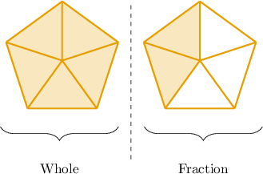

# Models for Mixed Numbers

Source: https://www.mathacademy.com/topics/3893?courseId=75
Topic ID: 3893

## Prerequisites

- [Improper Fractions](./2367-improper-fractions.md)

## Lesson

### Introduction

Another way to represent an improper fraction is to write it as a **mixed number**.

Let's look at the improper fraction $\dfrac{7}{5},$ shown below.

We can separate this improper fraction into "wholes" and "fractions" like so:

We see that we have $\color{red}1$ whole and a fraction of $\color{blue}\dfrac 2 5.$ Therefore, this picture represents the mixed number

$$

{\color{red}{1}}\,{\color{blue}{\dfrac 2 5}}\,.

$$

It's important to realize that $\dfrac 7 5$ and $1\,\dfrac 2 5$ represent the *same* number!

### Example: Representing Mixed Numbers Using Area Models

#### Question

What mixed number is shown in the picture below?

#### Explanation

There are $\color{red}2$ shapes completely shaded:

So, there are $\color{red}2$ wholes.

Additionally, one shape is partially shaded:

This shape has $\color{blue}3$ parts, and $\color{blue}2$ parts are shaded. So, $\color{blue}\dfrac{2}{3}$ of this shape is shaded.

Therefore, the mixed number is ${\color{red}2}\, {\color{blue}\dfrac{2}{3}}.$

### Example: Selecting an Area Model Representing a Mixed Number

#### Question

Draw a picture that represents the mixed number $2\dfrac{3}{7}.$

#### Explanation

The mixed number ${\color{red}2}\dfrac{\color{blue}3}{\color{blue}7}$ means we must have

- $\color{red}2$ entirely shaded shapes, and

- an additional shape that represents $\color{blue}\dfrac37.$

Therefore, we could represent $2\dfrac{3}{7}$ using the following picture:

