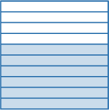
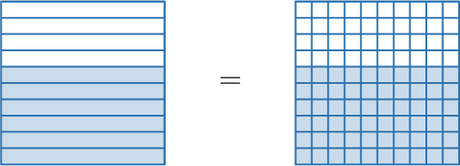
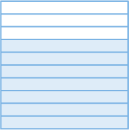
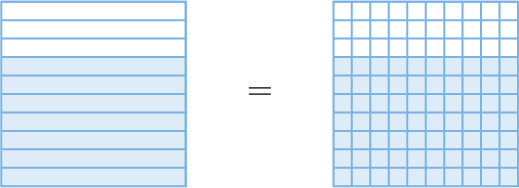

# Adding Decimal Fractions

Source: https://www.mathacademy.com/topics/3916?courseId=75
Topic ID: 3916

## Prerequisites

- [Adding Fractions With Like Denominators](./2351-adding-fractions-with-like-denominators.md)
- [Dividing by 10, 100, and 1,000 Using the Pattern of Zeros](./3882-dividing-by-10-100-and-1-000-using-the-pattern-of-zeros.md)

## Lesson

### Introduction

Consider the following decimal fraction:

$$

\dfrac{6}{10}

$$

Let's use an area model to convert this fraction into a decimal fraction with a denominator of $100.$

First, we draw the area model corresponding to six-tenths:

We are looking for a fraction of the form

$$

\,0\,

$$

So, we need to find another shape with the same shaded area divided into $100$ equal parts. To do that, we subdivide each part into $10$ equal pieces:

The shape on the right is divided into $10 \times 10 = 100$ equal parts. Of them, $6 \times 10 = 60$ parts are shaded. So, $\dfrac{60}{100}$ of the shape is shaded.

Therefore, we obtain

$$

\dfrac{6}{10} = \dfrac{\color{blue}60}{100}.

$$

### Example: Finding Equivalent Decimal Fractions Using Area Models

#### Question

The fraction given below is equivalent to the fraction shown in the picture. What number is missing?

$$

\,0\,

$$

#### Explanation

There are $10$ equal parts in the given shape in total. Of them, $7$ parts are shaded. So, $\dfrac{7}{10}$ of the shape is shaded.

Since we are looking for a fraction of the form

$$

\,0\,

$$

we now draw another shape that has the same shaded area but is divided into $100$ equal parts. To do that, we subdivide each part into $10$ equal pieces:

The shape on the right is divided into $10 \times 10 = 100$ equal parts. Of them, $7 \times 10 = 70$ parts are shaded. So, $\dfrac{70}{100}$ of the shape is shaded.

Hence, we obtain

$$

\,70\,

$$

Therefore, the missing number is $\color{blue}70.$

### Equivalent Fractions With Denominators of Ten and One Hundred

We can convert between equivalent decimal fractions without drawing area models.

For example, we can make a denominator of $100$ in $\dfrac{2}{10}$ if we multiply the numerator and denominator of the fraction by $10{:}$

$$

\dfrac{2}{10} = \dfrac{2 \times 10}{10 \times 10} = \dfrac{{\color{black}{20}}}{100}

$$

Therefore,

$$

\dfrac{2}{10} = \dfrac{20}{100}.

$$

Similarly, to make an equivalent decimal fraction, we can divide the numerator and denominator by $10.$ Let's see an example.

### Example: Finding Equivalent Decimal Fractions

#### Question

Find a decimal fraction with a denominator of $10$ that's equivalent to $\dfrac{40}{100}.$

#### Explanation

To make a denominator of $10,$ we divide the numerator and the denominator of $\dfrac{40}{100}$ by $10.$

$$

\dfrac{40}{100} = \dfrac{40 \div 10}{100 \div 10} = \dfrac{4}{10}

$$

Therefore, $\dfrac{40}{100}$ is equivalent to $\dfrac{4}{10}.$

### Adding Fractions With Denominators of Ten and One Hundred

Using what we've learned, we can now add fractions with denominators $10$ and $100.$

For example, let's find the value of

$$

\dfrac{5}{10} + \dfrac{3}{100}.

$$

Note the following:

- The denominators of our two fractions are *not* the same. Therefore, we *cannot* add these fractions straight off the bat.

- However, we *can* add these fractions if we convert the first fraction to an equivalent decimal fraction with a denominator of $100$ before adding.

To put $\dfrac{5}{10}$ over a denominator of $100,$ we multiply the numerator and denominator by $10{:}$

$$

\dfrac{5}{10} = \dfrac{5 \times 10}{10 \times 10} = \dfrac{50}{100}

$$

We can now add the fractions. We keep the denominator the same, and we add the numerators:

$$

\begin{aligned}\frac{5}{10}+\frac{3}{100} & = \\ \frac{50}{100}+\frac{3}{100} & = \\ \frac{50+3}{100} & = \\ \frac{53}{100} & \end{aligned}

$$

Therefore, we conclude that

$$

\dfrac{5}{10} + \dfrac{3}{100} = \dfrac{53}{100}.

$$

### Example: Finding a Sum of Decimal Fractions

#### Question

Compute $\dfrac{3}{10} + \dfrac{27}{100}.$

#### Explanation

To add the fractions, we need to express each fraction as an equivalent fraction with a denominator of $100.$

To put $\dfrac{3}{10}$ over a denominator of $100,$ we multiply the numerator and denominator by $10{:}$

$$

\dfrac{3}{10} = \dfrac{3 \times 10}{10 \times 10} = \dfrac{30}{100}

$$

We can now add the fractions. We keep the denominator the same, and we add the numerators:

$$

\begin{aligned}\frac{30}{100}+\frac{27}{100}=\frac{30+27}{100}=\frac{57}{100}\end{aligned}

$$
