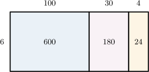
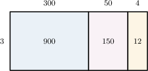
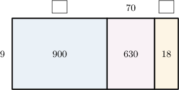
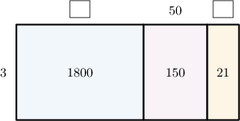

# More Multi-Digit by One-Digit Division Using Area Models

Source: https://www.mathacademy.com/topics/3920?courseId=75
Topic ID: 3920

## Prerequisites

- [Multi-Digit by One-Digit Multiplication Using Area Models](./2393-multi-digit-by-one-digit-multiplication-using-area-models.md)
- [Multi-Digit by One-Digit Division Using Area Models](./2426-multi-digit-by-one-digit-division-using-area-models.md)

## Lesson

### Introduction

Consider the following area model.

Let's write down the multiplication and division problems this area model represents:

- the length of the big rectangle is $100+30+4=134$

- the width of the big rectangle is $6$

- the area of the big rectangle is $600+180+24 = 804$

Therefore, this area model can be used to represent the following multiplication problem:

$$

804 = 134 \times 6

$$

Writing this as a division problem, we get

$$

804 \div 6 = 134.

$$

### Example: Interpreting an Area Model

#### Question

The area model above can be used to represent the following division problem:

$$

00

$$

What is the missing number?

#### Explanation

Let's look at the big rectangle:

- its length is $300 + 50 + 4 = 354$

- its width is $3$

- its area is $900 + 150 + 12 = 1,062$

Therefore, this area model can be used to represent the following multiplication problem:

$$

1,062 = 354 \times 3

$$

Writing this as a division problem, we get

$$

1,062 \div 3 = 354.

$$

Therefore, the missing number is $354.$

### Example: Completing an Area Model

#### Question

From left to right, find the missing numbers in the area model below.

#### Explanation

We need to look at the blue and orange rectangles:

- Let's first look at the blue rectangle (the one on the left-hand side). Its area is $900,$ and its width is $9.$ Therefore, the length of this rectangle must be Let's add this to our model.

- Now, let's look at the orange rectangle (the one on the right-hand side). Its area is $18,$ and its width is $9.$ Therefore, the length of this rectangle must be Let's add this to our model.

Therefore, from left to right, the missing numbers are $100$ and $2.$

### Example: Completing an Area Model and Stating a Result

#### Question

A $1,971\,\text{ft}^3$ load of coal is equally distributed between $3$ hopper wagons. Using the area model above, find how much coal is loaded into each wagon.

#### Explanation

To find how much coal is loaded into each wagon, we need to calculate $1,971 \div 3.$

We need to look at the orange and blue rectangles:

- Let's first look at the blue rectangle (the one on the left-hand side). Its area is $1,800,$ and its width is $3.$ Hence, the length of this rectangle must be Let's add this to our model:

- Now, let's look at the orange rectangle (the one on the right-hand side). Its area is $21,$ and its width is $3.$ Hence, the length of this rectangle must be Let's add this to our model:

Now, notice the following regarding the big rectangle:

- its length is $600 + 50 + 7 = 657$

- its width is $3$

- its area is $1,800 + 150 + 21 = 1,971$

Therefore, this area model can be used to represent the following multiplication problem:

$$

1,971 = 657 \times 3

$$

Writing this as a division problem, we get

$$

1,971 \div 3 = 657.

$$

Therefore, each wagon is loaded with $657\,\text{ft}^3$ of coal.
