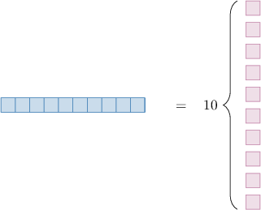
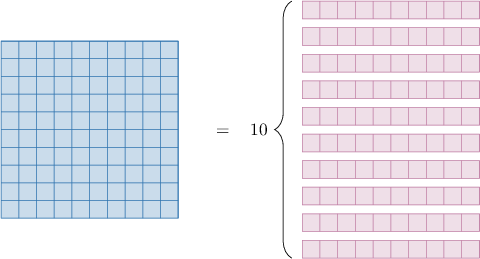

# Equivalent Place Value Representations

Source: https://www.mathacademy.com/topics/3921?courseId=75
Topic ID: 3921

## Prerequisites

- [Converting From Standard Form to Expanded Form](./2320-converting-from-standard-form-to-expanded-form.md)

## Lesson

### Introduction

It's sometimes helpful to switch between different place value representations of the same number.

For example, let's consider the following three-digit whole number:

$$

{\color{purple}4}{\color{blue}7}{\color{magenta}2}

$$

The place value chart for this number is shown below:

So, $472$ represents "$4$ hundreds, $7$ tens and $2$ ones."

However, $472$ also represents $472$ ones, because

$$

472 = \underbrace{1 + 1 + 1 + \cdots + 1}_{472\,\text{times}}.

$$

Therefore, "$4$ hundreds, $7$ tens and $2$ ones" is the same as $472$ ones.

In math, we use the word **equivalent** (e-quiv-a-lent) to mean "the same as."

### Example: Expressing a Multi-Digit Number in Terms of Ones

#### Question

"$7$ thousands and $3$ tens" is equivalent to how many ones?

#### Explanation

Let's write "$7$ thousands and $3$ tens" in a place value chart:

Therefore, "$7$ thousands and $3$ tens" is equivalent to "$7,030$ ones."

### Example: Switching From Ones

#### Question

"$4,700$ ones" is equivalent to how many thousands and hundreds?

#### Explanation

Let's write the number $4,700$ in a place value chart:

Therefore, "$4,700$ ones" is equivalent to "$4$ thousands and $7$ hundreds."

### Using Place Value Charts To Deal With a Ten in the Ones Place

Let's think about the different place value representations of the number ${\color{blue}{1}}{\color{magenta}{0}}\mathbin{:}$

- The number ${\color{blue}{1}}{\color{magenta}{0}}$ represents "${\color{blue}{1}}{\color{magenta}{0}}$ ones." This has the following place value representation: **tens** **ones** $0$ ${\color{blue}{1}}{\color{magenta}{0}}$

- The number ${\color{blue}{1}}{\color{magenta}{0}}$ also represents "${\color{blue}{1}}$ ten and ${\color{magenta}{0}}$ ones." This has the following place value representation: **tens** **ones** ${\color{blue}{1}}$ ${\color{magenta}{0}}$

To go from the first representation to the second, we moved the first digit $({\color{blue}{1}})$ one place to the left (into the tens column).

The equivalence of the two place value charts simply means that a list of $10$ individual objects (i.e., ${\color{blue}{1}}{\color{magenta}{0}}$ ones) can be viewed as a single block of length $10$ (i.e., ${\color{blue}{1}}$ ten):

### Using Place Value Charts To Deal With a Ten in the Tens Place

Let's now think about the different place value representations of

$$

{\color{blue}{1}}{\color{magenta}{0}} \, \text{tens.}

$$

As it's written, its place-value chart is as follows:

There are two digits in the "tens" column, so we move the first digit $(\color{blue}{1})$ to the "hundreds" column:

Therefore, "${\color{blue}{1}}{\color{magenta}{0}}$ tens" is equivalent to "${\color{blue}{1}}$ hundred."

The equivalence of the two place value charts simply means that a list of $10$ individual blocks of length $10$ (i.e., ${\color{blue}{1}}{\color{magenta}{0}}$ tens) can be viewed as a single block with $100$ objects (i.e., ${\color{blue}{1}}$ hundred):

### A Pattern for Dealing With Tens

Proceeding similarly, we're able to deduce the following pattern:

- ${\color{blue}{1}}{\color{magenta}{0}}$ ones is equivalent to ${\color{blue}{1}}$ ten

- ${\color{blue}{1}}{\color{magenta}{0}}$ tens is equivalent to ${\color{blue}{1}}$ hundred

- ${\color{blue}{1}}{\color{magenta}{0}}$ hundreds is equivalent to ${\color{blue}{1}}$ thousand

- ${\color{blue}{1}}{\color{magenta}{0}}$ thousands is equivalent to ${\color{blue}{1}}$ ten-thousand

- ${\color{blue}{1}}{\color{magenta}{0}}$ ten-thousands is equivalent to ${\color{blue}{1}}$ hundred-thousand

- ${\color{blue}{1}}{\color{magenta}{0}}$ hundred-thousands is equivalent to ${\color{blue}{1}}$ million

- $\vdots$

By combining this pattern with our understanding of expanded form, we can find more equivalent representations of numbers.

Let's see an example.

### Example: Expanding a Number With Two Digits in One Place Value

#### Question

"$16$ thousands" is equivalent to how many ten-thousands and thousands?

#### Explanation

Since $16 = 10+6,$ we can write $16$ thousands as

$$

10\,\text{thousands} + 6\,\text{thousands}.

$$

Now, since $10$ thousands is the same as $1$ ten-thousand, the statement above is equal to

$$

1\,\text{ten-thousands} + 6\,\text{thousands}.

$$

Therefore, "$16$ thousands" is equivalent to "$1$ ten-thousand and $6$ thousands".
