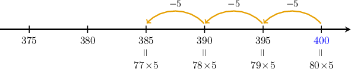

# Multiplying Numbers Using Repeated Subtraction

Source: https://www.mathacademy.com/topics/3933?courseId=75
Topic ID: 3933

## Prerequisites

- [Multiplying Numbers Using Repeated Addition](./3878-multiplying-numbers-using-repeated-addition.md)
- [Subtracting Numbers Up to Five Digits](./3908-subtracting-numbers-up-to-five-digits.md)

## Lesson

### Introduction

We can also use repeated *subtraction* to multiply large numbers.

For example, suppose we have the following multiplication problem:

$$

80 \times 5 = {\color{blue}{400}}

$$

Let's use repeated subtraction to generate some more multiplication facts:

- We can find $79\times 5$ by subtracting $5$ from this result:

- We can find $78\times 5$ by subtracting $5$ from the previous result:

- We can find $77\times 5$ by subtracting $5$ from the previous result:

And so on.

We can visualize this process using the following number line diagram.

Note that ${\color{blue}{400}}, 395, 390, 385,$, etc., are all multiples of $5.$

### Example: Multiplying Two-Digit Numbers by One-Digit Numbers

#### Question

You're given the following multiplication problem:

$$

50\times 6 = 300

$$

Use this to find the value of $46\times 6.$

#### Explanation

We start with the given multiplication problem:

$$

50\times 6 = {\color{blue}{300}}

$$

We can find the correct answer for $46\times 6$ using repeated subtraction:

$$

\begin{aligned}49×6 & =300−6=294 \\ 48×6 & =294−6=288 \\ 47×6 & =288−6=282 \\ 46×6 & =282−6=276\end{aligned}

$$

Therefore, $46\times 6 = 276.$

### Example: Multiplying Three-Digit Numbers by One-Digit Numbers

#### Question

You're given the following multiplication problem:

$$

110\times 6 = 660

$$

Use this to find the value of $107\times 6.$

#### Explanation

We start with the given multiplication problem:

$$

110\times 6 = {\color{blue}{660}}

$$

We can find the correct answer for $107\times 6$ using repeated subtraction:

$$

\begin{aligned}109×6 & =660−6=654 \\ 108×6 & =654−6=648 \\ 107×6 & =648−6=642\end{aligned}

$$

Therefore, $107\times 6 = 642.$

### Example: Multiplying Four-Digit Numbers by One-Digit Numbers

#### Question

You're given the following multiplication problem:

$$

1,200\times 4 = 4,800

$$

Use this to find the value of $1,196\times 4.$

#### Explanation

We start with the given multiplication problem:

$$

1,200\times 4 = {\color{blue}{4,800}}

$$

We can find the correct answer for $1,196\times 4$ using repeated subtraction:

$$

\begin{aligned}1,199×4 & =4,800−4=4,796 \\ 1,198×4 & =4,796−4=4,792 \\ 1,197×4 & =4,792−4=4,788 \\ 1,196×4 & =4,788−4=4,784\end{aligned}

$$

Therefore, $1,196\times 4= 4,784.$
