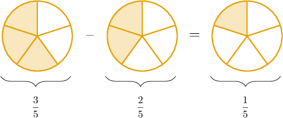

# Subtracting Fractions With Like Denominators

Source: https://www.mathacademy.com/topics/3934?courseId=75
Topic ID: 3934

## Prerequisites

- [Adding Fractions With Like Denominators](./2351-adding-fractions-with-like-denominators.md)

## Lesson

### Introduction

When subtracting two fractions with the *same* denominator, we

- subtract their numerators, and

- keep the denominator the same.

For example, let's compute the following difference:

$$

\dfrac{3}{5} - \dfrac{2}{5}

$$

We subtract the numerators and keep the denominators the same. Therefore,

$$

\begin{aligned}\frac{3}{5}−\frac{2}{5}=\frac{3−2}{5}=\frac{1}{5}.\end{aligned}

$$

We can use a fraction model to confirm this result:

### Example: Subtracting Fractions With Like Denominators

#### Question

Find the value of $\dfrac 3 7 - \dfrac 1 7.$

#### Explanation

To subtract two fractions with like denominators, we subtract the numerators and keep the denominators the same. Therefore,

$$

\begin{aligned}\frac{3}{7}−\frac{1}{7}=\frac{3−1}{7}=\frac{2}{7}.\end{aligned}

$$

### Example: Subtracting Fractions With Like Denominators and Simplifying

#### Question

What is the value of $\dfrac{5}{6} - \dfrac{3}{6}?$

#### Explanation

To subtract two fractions with like denominators, we subtract the numerators and keep the denominators the same. Therefore,

$$

\begin{aligned}\frac{5}{6}−\frac{3}{6}=\frac{5−3}{6}=\frac{2}{6}.\end{aligned}

$$

We can simplify this fraction by dividing the numerator and the denominator by $2{:}$

$$

\dfrac{2}{6} = \dfrac{2\div 2}{6\div 2} = \dfrac{1}{3}

$$

Therefore, we conclude that

$$

\dfrac{5}{6} - \dfrac{3}{6} = \dfrac 1 3.

$$

### Example: Converting the Result to a Mixed Number

#### Question

Find the value of $\dfrac{23}{9} - \dfrac{8}{9}.$

#### Explanation

To subtract two fractions with like denominators, we subtract the numerators and keep the denominators the same. Therefore,

$$

\dfrac{23}{9} - \dfrac{8}{9} = \dfrac{23 - 8}{9} = \dfrac{15}{9}.

$$

We can simplify this fraction by dividing the numerator and the denominator by $3{:}$

$$

\dfrac{15}{9} = \dfrac{15 \div 3}{9 \div 3} = \dfrac{5}{3}

$$

Since $5 \div 3 = 1 \, \text{R} \, 2,$ we can write the answer as a mixed number:

$$

\dfrac{5}{3} = 1 \, \dfrac{2}{3}

$$

Therefore, we conclude that

$$

\dfrac{23}{9} - \dfrac{8}{9} = 1 \, \dfrac{2}{3}.

$$
