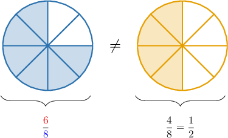
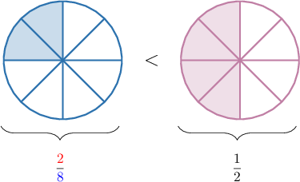
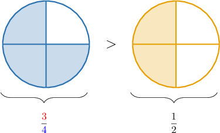
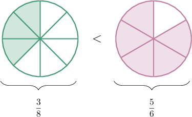
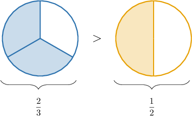
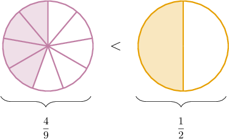
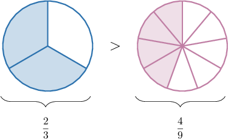

# Comparing Fractions Using One-Half Benchmarks

Source: https://www.mathacademy.com/topics/3936?courseId=75
Topic ID: 3936

## Prerequisites

- [Comparing Fractions](./538-comparing-fractions.md)
- [Interpreting Division Problems as Mixed Numbers](./3898-interpreting-division-problems-as-mixed-numbers.md)

## Lesson

### Introduction

A fraction is equivalent to $\dfrac12$ if its numerator is one-half of its denominator.

For example, the following fractions are all equivalent to $\dfrac12\mathbin{:}$

$$

\dfrac{\color{red}2}{\color{blue}4}, \qquad \dfrac{\color{red}3}{\color{blue}6}, \qquad \dfrac{\color{red}9}{\color{blue}18}

$$

These fractions are equivalent to $\dfrac12$ because when we divide the denominator by $2,$ we get the numerator:

- $\dfrac{\color{red}2}{\color{blue}4}$ is equivalent to one-half because ${\color{blue}{4}} \div 2 = {\color{red}{2}}$

- $\dfrac{\color{red}3}{\color{blue}6}$ is equivalent to one-half because ${\color{blue}{6}} \div 2 = {\color{red}{3}}$

- $\dfrac{\color{red}9}{\color{blue}18}$ is equivalent to one-half because ${\color{blue}{18}} \div 2 = {\color{red}{9}}$

Learning to quickly recognize fractions equivalent to $\dfrac12$ is a valuable skill.

### Example: Identifying Fractions Equivalent to One-Half

#### Question

Which of the following fractions is **** equivalent to $\dfrac12?$

1. $\dfrac{4}{8}$

2. $\dfrac{6}{12}$

3. $\dfrac{6}{8}$

#### Explanation

A fraction is equivalent to $\dfrac12$ if its numerator is one-half of its denominator.

From the given options, the only fraction where the numerator is **** one-half of its denominator is $\dfrac{\color{red}6}{\color{blue}8}.$ Notice that

$$

{\color{blue}8} \div 2 = 4 \neq {\color{red}6}.

$$

The symbol $\neq$ means "is not equal to."

We can also represent this visually using a fraction model.

Notice that the shaded areas are ** the same. Therefore, the fractions are ** equal.

### Comparing Fractions to One-Half

Let's consider the following fraction:

$$

\dfrac{\color{red}{2}}{\color{blue}{8}}

$$

Is this fraction *greater than* or *less than* $\dfrac12?$

To answer this question, we notice the following:

- the numerator is ${\color{red}{2}}$

- the denominator is ${\color{blue}{8}}$

- one-half of the denominator is ${\color{blue}{8}} \div 2 = {\color{purple}{4}}$

So, the numerator is *less than* one-half of the denominator:

$$

{\color{red}{2}} < {\color{purple}{4}}

$$

Therefore, we conclude that

$$

\dfrac{\color{red}{2}}{\color{blue}{8}} < \dfrac12.

$$

We can also represent this comparison using a fraction model:

The fraction on the left has $\color{blue}2$ shaded parts, while the fraction on the right has $\color{purple}4$ shaded parts. Therefore, the fraction on the left is smaller.

### A Rule for Comparing Fractions to One-Half

In general, we have the following handy rule to compare fractions to $\dfrac12{:}$

- A fraction is *greater than* $\dfrac12$ if its numerator is *greater than* one-half its denominator.

- A fraction is *less than* $\dfrac12$ if its numerator is *less than* one-half its denominator.

After some practice, you'll be able to spot whether a fraction is greater than or less than $\dfrac12$ quickly.

### Example: Comparing Fractions to One-Half

#### Question

$$

\dfrac{3}{4}\,\square \,\dfrac 1 2

$$

Determine which of the following symbols could replace the empty box above to make the statement true.

1. $>$

2. $<$

3. $=$

#### Explanation

When comparing fractions to $\dfrac12,$ we recall the following:

- A fraction is ** $\dfrac12$ if its numerator is ** one-half of its denominator.

- A fraction is ** $\dfrac12$ if its numerator is ** one-half of its denominator.

We wish to compare $\dfrac{\color{red}{3}}{\color{blue}{4}}$ to $\dfrac12.$ In this case,

- the numerator is ${\color{red}{3}},$

- the denominator is ${\color{blue}{4}},$

- one-half of the denominator is ${\color{blue}{4}} \div 2 = {\color{purple}{2}}.$

So, the numerator is ** one-half of the denominator:

$$

{\color{red}{3}} > {\color{purple}{2}}

$$

Therefore, we conclude that

$$

\dfrac{\color{red}{3}}{\color{blue}{4}} > \dfrac12.

$$

We can also represent this comparison using a fraction model:

The fraction on the left has $\color{blue}3$ shaded parts, while the fraction on the right has $\color{purple}2$ shaded parts. Therefore, the fraction on the left is larger.

### Comparing Fractions Using a Benchmark of One-Half

One way to compare fractions with no common numerators or denominators is to compare both fractions to $\dfrac{1}{2}.$

As an example, let's fill in the empty box in the comparison statement below:

$$

00

$$

Now, we note the following:

- The fraction $\dfrac{3}{8}$ is *less than* $\dfrac{1}{2}$ because its numerator is less than one-half of its denominator.

- The fraction $\dfrac{5}{6}$ is *greater than* $\dfrac{1}{2}$ because its numerator is greater than one-half of its denominator.

- Since $\dfrac{3}{8}$ is less than one-half yet $\dfrac{5}{6}$ is greater than one-half, we conclude that $\dfrac{3}{8}$ is less than $\dfrac{5}{6}.$

Therefore, the correct statement is the following:

$$

\dfrac{3}{8} < \dfrac{5}{6}

$$

We can verify this result using a fraction model:

Determining whether a fraction is greater than or less than $\dfrac{1}{2},$ or which of two fractions is closer to $\dfrac{1}{2},$ is known as **comparing using the benchmark of $\dfrac{1}{2}.$**

### Example: Comparing Fractions Using the One-Half Strategy

#### Question

$$

\dfrac{2}{3} \,\square \,\dfrac{4}{9}

$$

Using a benchmark of $\dfrac12,$ determine which of the following symbols could replace the empty box above to make the statement true.

1. $>$

2. $<$

3. $=$

#### Explanation

Let's compare each fraction to $\dfrac12\mathbin{:}$

- The fraction $\dfrac {\color{red}{2}} {\color{blue}{3}}$ is ** $\dfrac 1 2$ because ${\color{red}{2}}$ is ** ${\color{blue}{3}}\div 2 = 1\,\textrm{R}1 = 1\,\dfrac12.$

- The fraction $\dfrac{\color{red}{4}} {\color{blue}{9}}$ is ** $\dfrac 1 2$ because ${\color{red}{4}}$ is ** ${\color{blue}{9}}\div 2 = 4\,\textrm{R}1 = 4\,\dfrac{1}{2}.$

Since $\dfrac{2}{3}$ is ** $\dfrac12,$ but $\dfrac{4}{9}$ is ** $\dfrac12,$ this means that $\dfrac{2}{3}$ is ** $\dfrac{4}{9}\mathbin{:}$

$$

\dfrac{2}{3} > \dfrac{4}{9}

$$

So, the correct answer is "I only."

