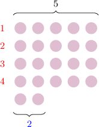

# Finding Remainders

Source: https://www.mathacademy.com/topics/3949?courseId=75
Topic ID: 3949

## Prerequisites

- [The Relationship Between Multiplication and Division](./3877-the-relationship-between-multiplication-and-division.md)
- [Understanding Remainders Using Models](./3888-understanding-remainders-using-models.md)
- [Evaluating Expressions Involving Addition and Multiplication](./3953-evaluating-expressions-involving-addition-and-multiplication.md)

## Lesson

### Introduction

Let's consider the following division problem model:

This model represents the division problem

$$

22 \div 5 = {\color{red}{4}} \, \text{R} \: {\color{blue}{2}}\,.

$$

We can express this division as a multiplication problem. However, as well as multiplying, we must *add the remainder*:

$$

22 = 5 \times {\color{red}{4}} + {\color{blue}{2}}

$$

We can also swap the order of the multiplication as follows:

$$

22 = {\color{red}{4}} \times 5 + {\color{blue}{2}}

$$

### Example: Writing Division Problems With Remainders as a Multiplication Problem

#### Question

Consider the following division problem:

$$

14 \div 4 = 3 \, \text{R} \: 2

$$

Which of the following problems are equivalent to our division problem?

1. $14 = 4\times 3 + 2$

2. $14 = 4\times 2 + 3$

3. $14 = 3\times 4 + 2$

#### Explanation

First, we express our division as a multiplication problem. However, as well as multiplying, we **

$$

14 = 4\times 3 + {\color{blue}{2}}

$$

We can swap the order of the multiplication, as follows:

$$

14 = 3\times 4 + {\color{blue}{2}}

$$

Therefore, the correct answer is "I and III only."

### Finding a Remainder

How would we find the remainder in the division problem below?

$$

𝐴

$$

First, we express our division as a multiplication problem. However, as well as multiplying, we *add the remainder.*

$$

27 = 6 \times 4 \,\,+\,\, \boxed{\color{blue}?}

$$

Now, since $6 \times 4 = 24,$ the above equation becomes

$$

27 = 24 \,\, +\,\, \boxed{\color{blue}?}.

$$

So, the remainder must be ${\color{blue}{3}}.$

$$

27 = 24 \,+\, \boxed{\color{blue}3}

$$

Finally, we can write

$$

27 \div 6 = 4 \, \text{R} \, \boxed{\color{blue}3}.

$$

### Example: Finding a Remainder Given an Equivalent Multiplication Problem

#### Question

Consider the following division problem with an unknown remainder.

$$

23 \div 5 = 4 \, \text{R} \: \boxed{\color{blue}?}

$$

We can rewrite this division problem as follows:

$$

23 = 5\times 4 \,\,+\,\, \boxed{\color{blue}?}

$$

What is the unknown remainder?

#### Explanation

Since $5\times 4 = 20,$ our equation becomes

$$

23 = 20 \,\,+\,\, \boxed{\color{blue}?}.

$$

So, the remainder must be ${\color{blue}{3}}.$

$$

23 = 20 \,\,+\,\, \boxed{\color{blue}3}

$$

Finally, we can write

$$

23 \div 5 = 4 \, \text{R} \, \boxed{\color{blue}3}.

$$

### Example: Finding the Remainder of a Division Problem Given the Quotient

#### Question

Find the remainder in the division problem below.

$$

𝐴

$$

#### Explanation

First, we express our division as a multiplication problem. However, as well as multiplying, we **

$$

35 = 6\times 5 \,\,+\,\, \boxed{\color{blue}?}

$$

Now, since $6\times 5 = 30,$ the above equation becomes

$$

35 = 30 \,\,+\,\, \boxed{\color{blue}?}.

$$

So, the remainder must be ${\color{blue}{5}}.$

$$

35 = 30 \,\,+\,\, \boxed{\color{blue}5}

$$

Finally, we can write

$$

35 \div 6 = 5 \, \text{R} \, \boxed{\color{blue}5}.

$$
