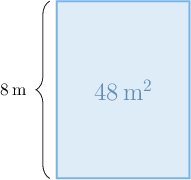
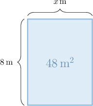
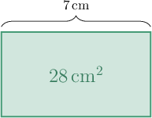
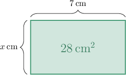
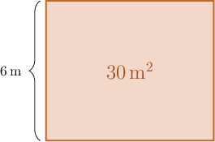
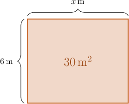
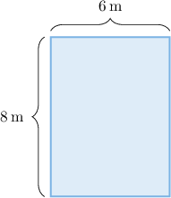
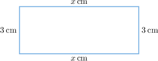

# Modeling With Rectangles

Source: https://www.mathacademy.com/topics/3960?courseId=75
Topic ID: 3960

## Prerequisites

- [Units of Length](./236-units-of-length.md)
- [Representing Comparison Statements as Equations](./3902-representing-comparison-statements-as-equations.md)

## Lesson

### Introduction

Consider a rectangle shown below.

From the diagram, we note the following:

- The *width* of the rectangle is $8 \, \text{m}.$

- The *area* of the rectangle is $48 \, \text{m}^2.$ The area units $(\text{m}^2)$ are called **square meters.**

How do we use this information to determine the *length* of this rectangle?

First, let's denote the unknown length using the letter $x.$

Now, remember that the area of a rectangle is given by the formula

$$

{\color{red}{\text{Area}}} = \text{Length} \times {\color{blue}{\text{Width}}}.

$$

In our example, the area is ${\color{red}{48}} \, \text{m}^2,$ the length is $x\,\text{m},$ and the width is ${\color{blue}{8}} \, \text{m}.$ Substituting these values into the equation above, we obtain

$$

{\color{red}{48}} = x \times {\color{blue}{8}}.

$$

Now, the number $x$ whose product with $8$ equals $48$ is given by

$$

48 \div 8 = 6.

$$

Therefore, the rectangle's length is $6 \, \text{m}.$

### Example: Finding an Equation for a Rectangle’s Area With an Unknown Factor

#### Question

The area of a rectangle is $28 \, \text{cm}^2$ and its length is $7 \, \text{cm}.$ If $x$ denotes the unknown width of the rectangle, what equation can be used to find that width?

**

#### Explanation

Remember that the area of a rectangle is given by

$$

\text{Area} = \text{Length} \times \text{Width}.

$$

In our example, the area is $28 \, \text{cm}^2,$ the length is $7 \, \text{cm},$ and the width is $x\, \text{cm}.$

Substituting these into the equation above, we obtain

$$

28 = 7 \times x.

$$

Notice that we can swap the factors on the right-hand side. Therefore, there are two possible equations:

$$

28 = 7 \times x \qquad\text{or}\qquad 28 = x \times 7

$$

### Example: Finding the Length or Width of a Rectangle Given Its Area

#### Question

The area of a rectangle is $30 \, \text{m}^2$ and its width is $6 \, \text{m}.$ What is the length of the rectangle?

**

#### Explanation

Remember that the area of a rectangle is given by

$$

\text{Area} = \text{Length} \times \text{Width}.

$$

In our example, the area is $30 \, \text{m}^2$ and the width is $6 \, \text{m}.$ Let's denote the unknown length as $x.$

Substituting the known values into the equation above, we obtain

$$

30 = x \times 6.

$$

Now, the number $x$ whose product with $6$ equals $30$ is

$$

30 \div 6 = 5.

$$

Therefore, the rectangle's length is $5 \, \text{m}.$

### Perimeters of Rectangles

The **perimeter** of a rectangle is the combined length of the rectangle's sides.

Let's compute the perimeter of the rectangle shown below.

Note the following:

- The rectangle's *length* is ${\color{red}{6}}\,\text{m}.$

- The rectangle's *width* is ${\color{blue}{8}}\,\text{m}.$

Now, notice that the rectangle has $2$ sides of length ${\color{red}{6}}\,\text{m},$ and $2$ sides of length ${\color{blue}{8}}\,\text{m}.$ Therefore, the perimeter of the rectangle, in meters, is given by

$$

\begin{aligned}Perimeter & =2×Length+2×Width \\ & =2×6+2×8 \\ & =12+16 \\ & =28.\end{aligned}

$$

Therefore, the perimeter of the rectangle is $28\,\text{m}.$

Sometimes, we might know the perimeter of a rectangle, and we need to use this to determine the rectangle's length or width. Let's see an example.

### Example: Finding the Length or Width of a Rectangle Given Its Perimeter

#### Question

The perimeter of a rectangle is $18 \, \text{cm}$ and its width is $3 \, \text{cm}.$ Which of the following options gives the length of the rectangle?

1. $4 \, \text{cm}$

2. $5 \, \text{cm}$

3. $6 \, \text{cm}$

#### Explanation

Remember that the perimeter of a rectangle is given by

$$

\text{Perimeter} = 2 \times \text{Length} + 2 \times \text{Width}.

$$

In our example, the perimeter is $18 \, \text{cm}$ and the width is $3 \, \text{cm}.$ Let's denote the unknown length as $x.$

Substituting the known values into the equation above, we obtain

$$

18 = 2 \times x+2 \times 3.

$$

Since ${\color{red}2 \times 3} = {\color{red}6},$ we have

$$

\begin{aligned}18=2×𝑥+6.\end{aligned}

$$

Now, to find $x,$ we try each of the given values, starting from the smallest:

$$

\begin{aligned}2×4+6 & =14≠18\, & × \\ 2×5+6 & =16≠18\, & × \\ 2×6+6 & =18\, & ✓\end{aligned}

$$

Therefore, the rectangle's length is $6 \, \text{cm}.$

****: The symbol $\neq$ means "is not equal to."

### Example: Modeling With Rectangles

#### Question

The perimeter of a rectangular laptop screen is $42 \, \text{in},$ and its length is $12 \, \text{in}.$ Which of the following gives the width of the laptop screen?

1. $7\, \text{in}$

2. $8 \, \text{in}$

3. $9 \, \text{in}$

#### Explanation

Remember that the perimeter of a rectangle is given by

$$

\text{Perimeter} = 2 \times \text{Length} + 2 \times \text{Width}.

$$

In our example, the perimeter is $42 \, \text{in}$ and the length is $12 \, \text{in}.$ Let's denote the unknown width as $x.$

Substituting the known values into the equation above, we obtain

$$

42 = 2 \times 12 + 2 \times x.

$$

Since ${\color{red}2 \times 12} = {\color{red}24},$ we have

$$

\begin{aligned}42=24+2×𝑥.\end{aligned}

$$

Now, to find $x,$ we try each of the given values, starting from the smallest:

$$

\begin{aligned}24+2×7 & =38≠42\, & × \\ 24+2×8 & =40≠42\, & × \\ 24+2×9 & =42\, & ✓\end{aligned}

$$

Therefore, the laptop screen's width is $9 \, \text{in}.$
