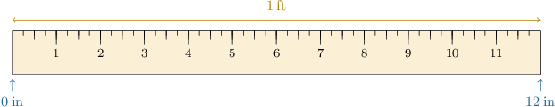
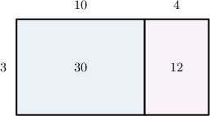
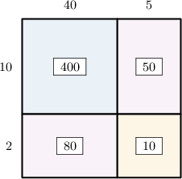

# Converting Customary Units of Length to Smaller Units

Source: https://www.mathacademy.com/topics/3994?courseId=75
Topic ID: 3994

## Prerequisites

- [Units of Length](./236-units-of-length.md)
- [Two-Digit by Two-Digit Multiplication Using Area Models](./2418-two-digit-by-two-digit-multiplication-using-area-models.md)

## Lesson

### Introduction

When solving problems with units, we often want to convert from one unit of measurement to another.

To convert between customary units of length, we use the following unit conversions:

- $1$ yard $=3$ feet

- $1$ foot $=12$ inches

We can visualize equivalent units of length using measuring devices. For example, the instrument below shows the equivalence between $1$ foot and $12$ inches.

Let's get some practice at converting between different units of length.

### Example: Converting Lengths From Yards to Feet

#### Question

How many feet are in $14$ yards?

#### Explanation

We start with the unit conversion between yards and feet:

$$

1\, \textrm{yard} =3 \, \textrm{feet}

$$

We want to figure out how many feet are in ${\color{blue}{14}}$ yards. So, we multiply ** sides of the above equation by ${\color{blue}{14}}\mathbin{:}$

$$

\begin{aligned}14×1\,yard=14×3\,feet \\ 14\,yards=14×3\,feet\end{aligned}

$$

We can calculate $14\times 3$ using an area model:

According to our model,

$$

14\times 3 = 30+12 = 42.

$$

Therefore, $14$ yards equals $42$ feet.

### Example: Converting Lengths From Feet to Inches

#### Question

What is $45 \, \textrm{ft}$ expressed in inches?

#### Explanation

We start with the unit conversion between feet and inches:

$$

1 \,\textrm{ft} = 12 \,\textrm{in}

$$

We want to figure out how many inches are in $45$ feet. So, we multiply both sides of the above equation by $45\mathbin{:}$

$$

\begin{aligned}45×1\,ft & =45×12\,in \\ 45\,ft & =45×12\,in\end{aligned}

$$

We can calculate $45 \times 12$ using an area model:

According to our model,

$$

45 \times 12 = 400+50+80+10=540.

$$

Therefore, $45 \, \textrm{ft}$ equals $540 \, \textrm{in}.$
