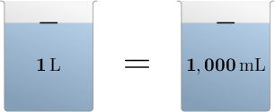

# Units of Volume

Source: https://www.mathacademy.com/topics/4198?courseId=75
Topic ID: 4198

## Prerequisites

- [Multiplying Fractions by Whole Numbers](./2360-multiplying-fractions-by-whole-numbers.md)

## Lesson

### Introduction

**Measuring** means finding a number that describes the size of something. The most popular measurement system within the scientific community is the **metric system**.

We determine how much space an object occupies by measuring its **volume**. We use **volume units** to specify an object's volume.

A common metric unit of volume is the **liter,** which we denote using the symbol "$\text{L}$." We can use **measuring jugs** like the ones below to measure the volume of a liquid.

We use **milliliters** to measure smaller volumes. The symbol for milliliters is "$\text{mL}.$" The prefix $\textrm m$ stands for **milli,** which means $\dfrac{1}{1\,000}.$ Therefore, $1\,\text{mL}$ equals $\dfrac{1}{1\,000}\,\textrm L.$

Notice that if we add $1\,\text{mL}$ to itself $1\,000$ times, we get exactly $1\,\text{L}{:}$

$$

\begin{aligned}\overset{1\,mL+1\,mL+⋯+1\,mL}{1\,000 times} & = \\ \frac{1}{1\,000}\,L+\frac{1}{1\,000}\,L+⋯+\frac{1}{1\,000}\,L & = \\ 1\,000×\frac{1}{1\,000}\,L & = \\ \frac{1\,000×1}{1\,000}\,L & = \\ \frac{1\,000}{1\,000}\,L & = \\ 1\,L & \end{aligned}

$$

Therefore, $1\,000\,\text{mL}$ equals $1\,\text{L},$ as stated in the diagram.

### Example: Metric Units of Volume

#### Question

A large bottle of tempera paint has a volume of $1\,\text{L}.$ What is this volume in milliliters?

#### Explanation

A table showing the metric units of volume is given below.

So, $1\,\text{L}$ is equivalent to $1\,000\,\text{mL}.$

### Customary Units of Volume

Another way to measure volume is to use **customary units.** The most common customary units for volume are **fluid ounce**, **cup**, **pint**, and **gallon**.

A table showing the customary units of volume is given below.

Note that "gallons" is the largest volume unit, and "fluid ounces" is the smallest.

Customary units are not standard in the scientific community. However, they are commonly used in the United States and other countries.

### Example: Identifying Customary Units of Volume

#### Question

A self-service restaurant offers ketchup in individual packets. Which customary unit of measurement could the restaurant use to quantify the volume of sauce in each packet?

1. ounces

2. fluid ounces

3. inches

#### Explanation

A table showing the customary units of volume is given below.

Therefore, from the given options, the only unit of volume is "fluid ounce."

### Example: Stating Volume Conversions in Customary Units

#### Question

A soap dispenser has a volume of $1$ pint. What is this volume in cups?

#### Explanation

A table showing the customary units of volume is given below.

So, $1\,\text{pint}$ is equivalent to $2\,\text{cups}.$
