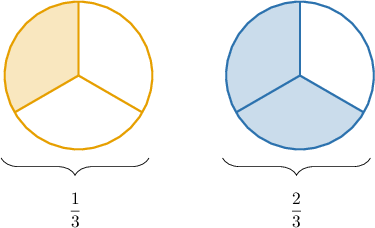
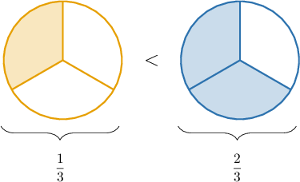
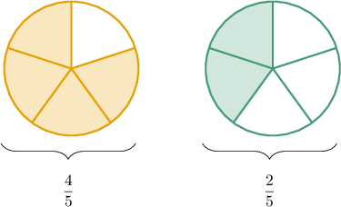
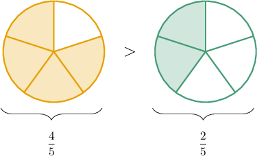
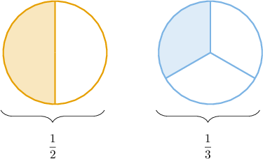
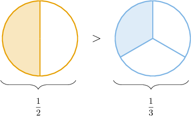
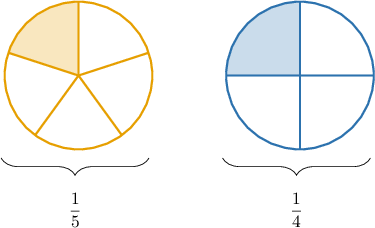
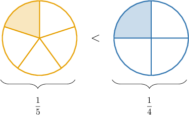
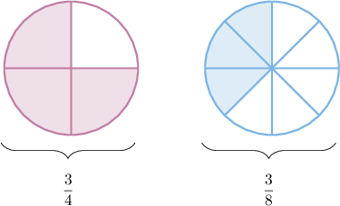
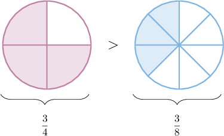

# Comparing Fractions

Source: https://www.mathacademy.com/topics/538?courseId=75
Topic ID: 538

## Prerequisites

- [Comparing Whole Numbers](./2324-comparing-whole-numbers.md)
- [Writing Unit Fractions in Words](./3951-writing-unit-fractions-in-words.md)

## Lesson

### Introduction

Let's remind ourselves of the symbols we use to compare numbers:

- the symbol "$>$" means "is greater than"

- the symbol "$<$" means "is less than"

- the symbol "$=$" means "is equal to"

We can also use these symbols to compare fractions.

For example, let's compare the following fractions:

$$

\dfrac{1}{3}, \qquad \dfrac{2}{3}

$$

The area models for these fractions are shown below:

To compare these fractions, we note the following:

- The fractions have the *same number of parts* (thirds). This means we only need to compare the number of *shaded* parts.

- Since the fraction on the left has *fewer* shaded parts, it must be *smaller* than the fraction on the right.

To express the fact that $\dfrac13$ is smaller than $\dfrac23,$ we use a "less than" symbol, as follows:

Finally, expressing this comparison using numbers only, we get the following:

$$

\dfrac{1}{3} \,< \,\dfrac{2}{3}

$$

### Example: Comparing Fractions With Common Denominators

#### Question

$$

\dfrac{4}{5} \,\square \,\dfrac{2}{5}

$$

Which symbols could replace the empty box above to make the statement true?

1. $=$

2. $<$

3. $>$

#### Explanation

Let's start by drawing the area models:

Notice that

- the two fractions have the same number of parts, and

- the fraction on the left has **.

Therefore, the fraction on the left must be ** than the fraction on the right.

Therefore, the correct statement is the following:

$$

\dfrac{4}{5} \,> \,\dfrac{2}{5}

$$

So, the correct answer is "III only."

### Comparing Fractions With Common Numerators

When two fraction models have the same number of shaded parts, we compare the size of the parts.

For example, let's compare the following fractions:

$$

\dfrac{1}{2}, \qquad \dfrac{1}{3}

$$

We start by drawing the fraction models.

Notice that

- both fractions have one shaded part, and

- the fraction on the left has *larger* parts (halves) than the fraction on the right (thirds).

This means that the fraction on the left is *larger* than the fraction on the right. Let's add a "greater than" symbol to show this.

Writing this inequality using numbers only, we have

$$

\dfrac{1}{2} > \dfrac{1}{3}.

$$

### Example: Comparing Unit Fractions

#### Question

$$

\dfrac{1}{5} \,\square \,\dfrac{1}{4}

$$

Which symbols could replace the empty box above to make the statement true?

1. $=$

2. $>$

3. $<$

#### Explanation

Let's start by drawing the area models:

Both fractions have the same number of shaded parts. However, the parts are of different sizes.

The fraction on the left has a smaller shaded part (one-fifth) than the fraction on the right (one-quarter). Therefore, the fraction on the left is smaller.

Therefore, the correct statement is the following:

$$

\dfrac{1}{5} < \dfrac{1}{4}

$$

So, the correct answer is "III only."

### Example: Comparing Fractions With a Common Numerator

#### Question

$$

\dfrac{3}{4} \,\square \,\dfrac{3}{8}

$$

Which symbols could replace the empty box above to make the statement true?

1. $=$

2. $<$

3. $>$

#### Explanation

Let's start by drawing the area models:

Both fractions have the same number of shaded parts. However, the parts are of different sizes.

The fraction on the left has larger parts (quarters) than the fraction on the right (eighths). Therefore, the fraction on the left is larger.

Therefore, the correct statement is the following:

$$

\dfrac{3}{4} > \dfrac{3}{8}

$$

So, the correct answer is "III only."
