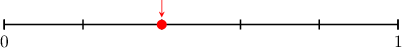
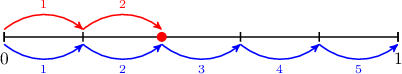
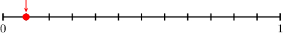
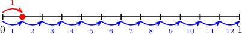
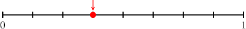
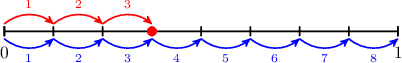

# Modeling Fractions Using Number Lines

Source: https://www.mathacademy.com/topics/7003?courseId=75
Topic ID: 7003

## Prerequisites

- [Fraction Models](./2366-fraction-models.md)

## Lesson

### Introduction

Another way to model fractions is with a point on a number line from $0$ to $1.$

In this case,

- the denominator is the total number of equal parts that the line is split into, and

- the numerator is the number of steps to the point from $0$ (left to right).

For example, let's find the fraction represented by the number line below.

Notice that the line is split into $\color{blue}5$ equal parts. And the number that we are interested in is located $\color{red}2$ steps from $0$ (left to right).

Therefore, the picture represents the fraction $\dfrac{\color{red}2}{\color{blue}5}.$

### Example: Representing a Unit Fraction Using a Number Line

#### Question

What fraction is represented on the number line above?

#### Explanation

Notice that the line is split into $\color{blue}12$ equal parts.

The number we are interested in is located $\color{red}1$ step from $0$ (left to right).

Therefore, the picture represents $\dfrac{\color{red}1}{\color{blue}12}.$

### Example: Representing a Non-Unit Fraction Using a Number Line

#### Question

What fraction is represented on the number line depicted below?

#### Explanation

Notice that the line is split into $\color{blue}8$ equal parts.

The number we are interested in is located $\color{red}3$ steps from $0$ (left to right).

Therefore, the picture represents the fraction $\dfrac{\color{red}3}{\color{blue}8}.$
