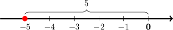
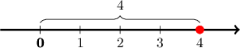
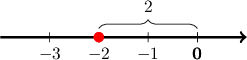
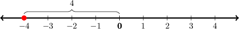

# Absolute Value

Source: https://www.mathacademy.com/topics/2281?courseId=30
Topic ID: 2281

## Prerequisites

- [Negative Numbers](./2442-negative-numbers.md)

## Lesson

### Introduction

The **absolute value** of a number is its *distance from zero* when viewed on a number line.

Distances are never negative. Therefore, the absolute value of a number is always positive or zero.

Let's consider the number $-5$ and its position on a number line, shown below.

The **distance** between $-5$ and zero equals $5$ because $-5$ is five steps away from zero.

Therefore, *the absolute value of* $-5$ *equals* $5.$ We write this as follows:

$$

| \, {-5} \, | = 5

$$

### A Fast Way of Finding the Absolute Value

There is a fast way to find the absolute value of a number:

- The absolute value of a positive number is equal to itself. For example,

- To find the absolute value of a negative number, we drop the negative sign. For instance,

### Example: Finding the Absolute Value of a Positive Number

#### Question

What is the value of $\mid 4\!\mid \,?$

#### Explanation

The absolute value of a positive number equals the number:

$$

\left|4\right| = 4

$$

The absolute value of a number gives the distance between the number and zero on a number line.

### Example: Finding the Absolute Value of a Negative Number

#### Question

Find $| {-2} |.$

#### Explanation

To find the absolute value of $-2,$ we simply drop the negative sign:

$$

\mid-2\!\mid=2

$$

The absolute value of a number gives the distance between the number and zero on a number line.

### Example: Finding a Number Given Its Absolute Value and Position on a Number Line

#### Question

The point shown below represents a number on a number line. The absolute value of this number is $4.$ What is the number?

#### Explanation

The number is ** because it is to the ** of zero.

The absolute value of the number is $4,$ so the distance between that number and zero on a number line is $4.$

The negative number at a distance of $4$ from zero is $-4,$ so the number is $-4.$

