# Multiplying Decimals by Powers of Ten Using Decimal Point Placement

Source: https://www.mathacademy.com/topics/2318?courseId=30
Topic ID: 2318

## Prerequisites

- [Multiplying Decimals by Powers of Ten Using Place Value](./110-multiplying-decimals-by-powers-of-ten-using-place-value.md)

## Lesson

### Introduction

To multiply a decimal by $10,$ we shift the decimal point one space to the right.

To demonstrate, let's find the value of

$$

0.31 \times 10.

$$

First, we write down our number. We can attach as many trailing zeros as we want to the decimal part.

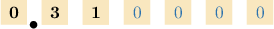

Now, we count the zeros in $10.$ Since $10$ contains $1$ zero, we move the decimal point $1$ place to the right:

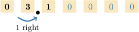

This gives the following diagram:

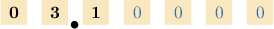

We ignore the leading zeros in the whole number part and trailing zeros in the decimal part. This gives the following number:

$$

3.1

$$

Therefore:

$$

0.31 \times 10 = 3.1

$$

### Example: Multiplying a Number by Ten

#### Question

What is $40.7 \times 10?$

#### Explanation

First, we write down our number. We can attach as many trailing zeros as we want to the decimal part.

Now, we count the zeros in $10.$ Since $10$ contains $1$ zero, we move the decimal point $1$ place to the right:

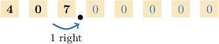

This gives the following diagram:

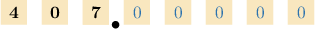

We ignore the leading zeros in the whole number part and trailing zeros in the decimal part. This gives the following number:

$$

407.0 = 407

$$

Therefore:

$$

40.7 \times 10 =407

$$

### Multiplying Numbers by Larger Powers of Ten

To multiply decimals by larger powers of ten, we shift the decimal point $n$ spaces to the right, where $n$ is the number of zeros in the power of ten.

To illustrate, let's compute the value of

$$

5.723 \times 100.

$$

First, we write down our number. We can attach as many trailing zeros as we want to the decimal part.

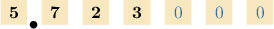

Now, we count the zeros in $100.$ Since $100$ contains $2$ zeros, we move the decimal point $2$ places to the right:

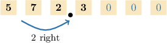

This gives the following diagram:

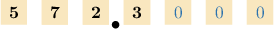

We ignore the leading zeros in the whole number part and trailing zeros in the decimal part. This gives the following number:

$$

572.3

$$

Therefore:

$$

5.723 \times 100 = 572.3

$$

### Example: Multiplying a Number by a Larger Power of Ten

#### Question

Find the value of $69.184 \times 1,000.$

#### Explanation

First, we write down our number. We can attach as many trailing zeros as we want to the decimal part.

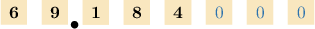

Now, we count the zeros in $1,000.$ Since $1,000$ contains $3$ zeros, we move the decimal point $3$ places to the right:

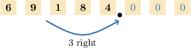

This gives the following diagram:

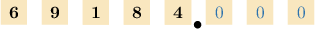

We ignore the leading zeros in the whole number part and trailing zeros in the decimal part. This gives the following number:

$$

69,184.0 =69,184

$$

Therefore:

$$

69.184 \times 1,000 = 69,184

$$

### Example: Multiplying a Number by a Power of Ten Using Equivalent Decimals

#### Question

What is the value of $65.61 \times 1,000?$

#### Explanation

First, we write down our number. We can attach as many trailing zeros as we want to the decimal part.

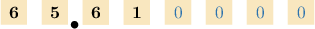

Now, we count the zeros in $1,000.$ Since $1,000$ contains $3$ zeros, we move the decimal point $3$ places to the right:

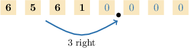

This gives the following diagram:

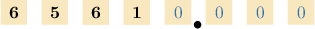

We ignore the leading zeros in the whole number part and trailing zeros in the decimal part. This gives the following number:

$$

65,610.0 = 65,610

$$

Therefore:

$$

65.61 \times 1,000 = 65,610

$$

### Example: Multiplying a Number by a Larger Power of Ten Using Equivalent Decimals

#### Question

Find the value of $70.04 \times 100,000.$

#### Explanation

First, we write down our number. We can attach as many trailing zeros as we want to the decimal part.

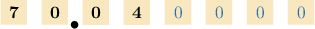

Now, we count the zeros in $100,000.$ Since $100,000$ contains $5$ zeros, we move the decimal point $5$ places to the right:

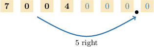

This gives the following diagram:

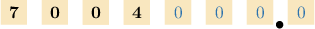

We ignore the leading zeros in the whole number part and trailing zeros in the decimal part. This gives the following number:

$$

7,004,000.0 = 7,004,000

$$

Therefore:

$$

70.04 \times 100,000 = 7,004,000

$$
