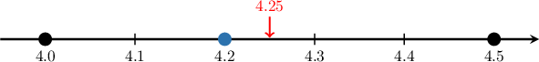
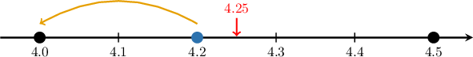
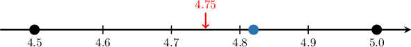
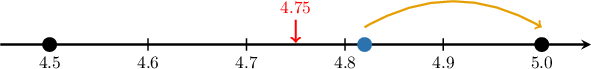
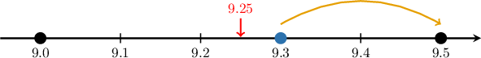

# Estimating Decimal Addition With Benchmarks

Source: https://www.mathacademy.com/topics/2389?courseId=30
Topic ID: 2389

## Prerequisites

- [Addition With Unequal Numbers of Decimals](./2339-addition-with-unequal-numbers-of-decimals.md)

## Lesson

### Introduction

**Decimal benchmarks** are the numbers containing decimal parts of $0.0$ or $0.5.$ The first few decimal benchmarks are the following:

$$

0.0, \qquad 0.5, \qquad 1.0, \qquad 1.5, \qquad 2.0, \qquad 2.5,\qquad \ldots

$$

**Rounding a number to the nearest benchmark** means finding the closest decimal benchmark to our number.

For example, let's round the number $4.2$ to the nearest benchmark.

The number $\color{blue}4.2$ falls between the benchmarks $4.0$ and $4.5.$ Let's mark these three numbers on a number line.

The point that's halfway between our two benchmarks lies one-quarter of a step (or $0.25$ units) from the left benchmark. In this case, the halfway point is $4.25.$

Finally, since $4.2$ is closest to $4.0,$ this is the number we round to.

Therefore, rounding $4.2$ to the nearest benchmark gives $4.0$

**Watch Out!** If a number coincides with the halfway point, the convention is to round *up!* For example, $4.25$ rounded to the nearest benchmark is $4.5,$ not $4.0.$

Let's look at another example.

### Example: Rounding a Number to the Nearest Benchmark Using a Number Line

#### Question

The number $4.82$ is shown on the number line above. Using benchmarks with decimal parts of $0.0$ and $0.5,$ round $4.82$ to the nearest benchmark.

#### Explanation

Rounding to the nearest benchmark means finding the closest number with a decimal part of $0.0$ or $0.5$ to our number.

The number $\color{blue}4.82$ falls between the benchmarks $4.5$ and $5.0.$ Let's add these benchmarks to our diagram:

The point that lies halfway between our two benchmarks is ${\color{red}4.75}.$

Since $4.82$ is closest to $5.0,$ this is the number we round to.

Therefore, rounding $4.82$ to the nearest benchmark gives $5.$

### Example: Rounding a Number to the Nearest Benchmark

#### Question

Using benchmarks with decimal parts of $0.0$ and $0.5,$ round $9.3$ to the nearest benchmark.

#### Explanation

Rounding to the nearest benchmark means finding the closest number with a decimal part of $0.0$ or $0.5$ to our number.

Let's list the benchmarks with decimal parts $0.0$ and $0.5$ that are near $9.3{:}$

$$

9.0, \qquad 9.5, \qquad 10.0

$$

The number $\color{blue}9.3$ falls between the benchmarks $9.0$ and $9.5,$ and the point that lies halfway between our two benchmarks is ${\color{red}9.25}.$

Since $9.3$ is closest to $9.5,$ this is the number we round to.

Therefore, rounding $9.3$ to the nearest benchmark gives $9.5.$

### Estimating Decimal Addition

We can estimate the sum of two decimals by rounding each decimal to the nearest benchmark before adding.

For instance, let's use benchmarks to estimate the following sum:

$$

4.62 + 1.97

$$

First, we round each number to the nearest benchmark:

- The number $\color{blue}4.62$ falls between the benchmarks $4.5$ and $5.0.$ The point that lies halfway between our two benchmarks is ${\color{red}4.75}.$ Since $4.62$ is closest to $4.5,$ this is the number we round to.

- The number $\color{blue}1.97$ falls between the benchmarks $1.5$ and $2.0.$ The point that lies halfway between our two benchmarks is ${\color{red}1.75}.$ Since $1.97$ is closest to $2.0,$ this is the number we round to.

So, rounding both numbers to the nearest benchmark, we obtain the following:

$$

\begin{aligned}4.62 & + & 1.97 \\ & & \\ 4.5 & + & 2.0\end{aligned}

$$

Next, we calculate the sum:

$$

\begin{aligned} & & \,\,\,\,4\,\,\,\, & \,\,\,\,.\,\,\,\, & \,\,\,\,5\,\,\,\, \\ \,\,\,\,+\,\,\,\, & & \,\,\,\,2\,\,\,\, & \,\,\,\,.\,\,\,\, & \,\,\,\,0\,\,\,\, \\ & \,\,\,\,\,\,\,\, & \,\,\,\,6\,\,\,\, & \,\,\,\,.\,\,\,\, & \,\,\,\,5\,\,\,\,\end{aligned}

$$

Therefore, $4.62 + 1.97$ is approximately $6.5.$ We can express this fact using an "is approximately equal to" symbol $(\approx)$ as follows:

$$

4.62 + 1.97\approx 6.5

$$

### Example: Estimating Decimal Addition With Benchmarks

#### Question

Estimate the sum $3.68 + 5.42$ using benchmarks with decimal parts of $0.0$ or $0.5.$

#### Explanation

First, we round both numbers to the nearest benchmark:

$$

\begin{aligned}3.68 & + & 5.42 \\ & & \\ 3.5 & + & 5.5\end{aligned}

$$

Next, we calculate the sum:

$$

\begin{aligned} & & \,\,\,\,\begin{aligned} \\ 1\end{aligned}\,\,\,\, & & \,\,\,\,\begin{aligned}\end{aligned}\,\,\,\, & \\ & & \,\,\,\,3\,\,\,\, & \,\,\,\,.\,\,\,\, & \,\,\,\,5\,\,\,\, & \,\,\,\,\,\,\,\, \\ \,\,\,\,+\,\,\,\, & & \,\,\,\,5\,\,\,\, & \,\,\,\,.\,\,\,\, & \,\,\,\,5\,\,\,\, & \,\,\,\,\,\,\,\, \\ & \,\,\,\,\,\,\,\, & \,\,\,\,9\,\,\,\, & \,\,\,\,.\,\,\,\, & \,\,\,\,0\,\,\,\, & \,\,\,\,\,\,\,\,\end{aligned}

$$

Therefore, $3.68 + 5.42 \approx 9.$

### Example: Word Problems

#### Question

To make a fruit juice drink, Maria mixes $0.73$ liters of fruit concentrate with $4.18$ liters of water. Using benchmarks with decimal parts of $0.0$ or $0.5,$ estimate the total amount of fruit juice that Maria prepared.

#### Explanation

To estimate the amount of fruit juice that Maria prepared, we have to find an approximation for the sum $0.73 + 4.18.$

First, we round both numbers to the nearest benchmark:

$$

\begin{aligned}0.73 & + & 4.18 \\ & & \\ 0.5 & + & 4.0\end{aligned}

$$

Next, we calculate the sum:

$$

\begin{aligned} & & \,\,\,\,0\,\,\,\, & \,\,\,\,.\,\,\,\, & \,\,\,\,5\,\,\,\, & \\ \,\,\,\,+\,\,\,\, & & \,\,\,\,4\,\,\,\, & \,\,\,\,.\,\,\,\, & \,\,\,\,0\,\,\,\, & \\ & & \,\,\,\,4\,\,\,\, & \,\,\,\,.\,\,\,\, & \,\,\,\,5\,\,\,\, & \end{aligned}

$$

Therefore, Maria prepared approximately $4.5$ liters of fruit juice.
