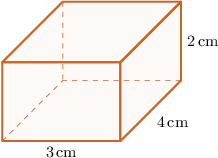
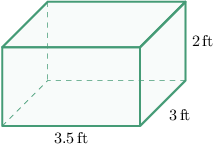
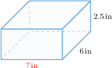

# Volumes of Right Rectangular Prisms: Word Problems

Source: https://www.mathacademy.com/topics/2411?courseId=30
Topic ID: 2411

## Prerequisites

- [Multiplying a Decimal by a One-Digit Whole Number](./2346-multiplying-a-decimal-by-a-one-digit-whole-number.md)
- [Volumes of Right Rectangular Prisms](./2404-volumes-of-right-rectangular-prisms.md)

## Lesson

### Introduction

We can find or approximate volumes of real-world objects by representing them as right rectangular prisms.

For example, suppose that Timmy has $12$ wooden blocks. If each block measures $3$ centimeters long, $4$ centimeters wide, and $2$ centimeters high, what is the total volume of all the blocks combined?

First, we note that each block has the following dimensions:

- the length is $3 \, \text{cm}$

- the width is $4\, \text{cm}$

- the height is $2 \, \text{cm}$

We can describe each block as a rectangular prism:

So, the volume of each block is

$$

\begin{aligned}𝑉 & =length×width×height \\ & =3×4×2 \\ & =24\,cm^{3}.\end{aligned}

$$

Since Timmy has $12$ blocks, the total volume of all blocks combined is

$$

12 \times 24 = 288 \, \text{cm}^3.

$$

### Example: Solving Problems Using Volumes of Rectangular Prisms

#### Question

A statue is mounted on a pedestal consisting of a concrete block. It is $3.5$ feet long, $3$ feet wide, and $2$ feet high. If a cubic foot of concrete requires $40$ pounds of gravel, how much gravel was used to build the pedestal? You may assume the pedestal takes the form of a rectangular prism.

#### Explanation

The volume of our pedestal is

$$

\begin{aligned}𝑉 & =length×width×height=3.5×3×2=21\,ft^{3}.\end{aligned}

$$

Since each cubic foot of concrete requires $40$ pounds of gravel, we get

$$

40 \times 21 = 840.

$$

Therefore, $840$ pounds of gravel were used to make the pedestal.

### Example: Finding a Missing Dimension

#### Question

Denise sends a package to her father. The total volume of the package is $75$ cubic inches, and it is $6$ inches wide and $2.5$ inches high. By modeling the package as a rectangular prism, what is the length of the package according to this model?

#### Explanation

First, recall that the volume of a rectangular package can be calculated as

$$

V = \text{length} \times \text{width} \times \text{height},

$$

and we are told that this volume is equal to $75 \, \text{in}^3.$

Therefore, we have:

$$

\,0\,

$$

So, since $6 \times 2.5 = 15$, we obtain:

$$

\begin{aligned}75 & =\,\phantom{0}\,×\underset{15}{\underset{}{6×2.5}} \\ 75 & =\,\phantom{0}\,×15\end{aligned}

$$

Therefore, using the relationship between multiplication and division, we obtain that the length of the package must be

$$

\,0\,

$$
