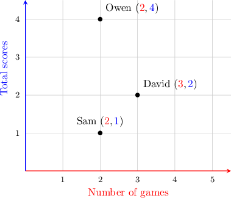
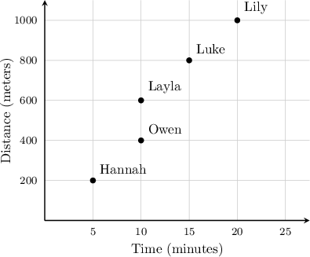
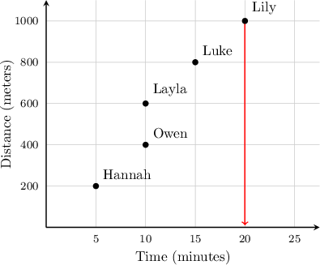
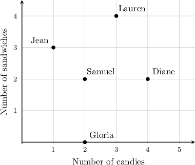
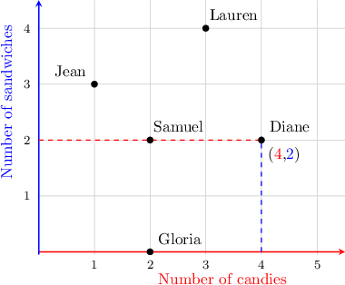
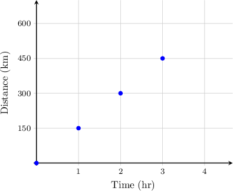
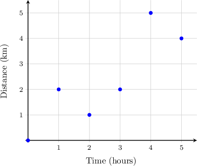

# Solving Real World Problems Using Coordinates

Source: https://www.mathacademy.com/topics/2413?courseId=30
Topic ID: 2413

## Prerequisites

- [Describing the Coordinate Plane](./2410-describing-the-coordinate-plane.md)

## Lesson

### Introduction

We can use graphs to analyze relationships between different sets of real-world data.

For instance, suppose that the coach of a soccer club keeps track of the number of goals scored by the best players, as well as the number of games played by each player. The table below represents some of this data.

We can draw a coordinate plane to represent the same data as the table. There are two variables, the number of goals and the number of games, and each axis will correspond to one variable.

We choose the horizontal $\color{red}x$-axis to represent the number of games and the vertical $\color{blue}y$-axis to represent the total number of goals.

This gives us $3$ points, one for each player, with the following coordinates:

Plotting this on the coordinate plane, we get the following graph:

### Example: Finding a Particular Point on a Graph

#### Question

The graph below shows the distances from students' houses to their school, in meters, and the total time required to get to school, in minutes. Which student requires the longest time to get to school?

#### Explanation

"Time" is represented by the $x$-axis. So, we need to find the point with the greatest $x$-coordinate.

Therefore, Lily requires the longest time to get to school.

### Example: Interpreting a Point on a Graph

#### Question

The diagram below shows the number of candies and the number of sandwiches that $5$ friends ate during a holiday party. How many sandwiches did Diane eat?

#### Explanation

In the given coordinate plane, the horizontal $\color{red}x$-axis corresponds to the number of candies, and the vertical $\color{blue}y$-axis corresponds to the number of sandwiches.

The point that represents Diane has coordinates $({\color{red}4},{\color{blue}2}).$ The $\color{blue}y$-coordinate is $\color{blue}2$, which means that Diane ate $2$ sandwiches.

### Example: Plotting Data Points

#### Question

Jack, a locomotive driver, recorded the distance traveled by a train every hour. The following ordered pairs are recorded:

$$

(0,0), \quad (1,150),\quad (2,300),\quad (3,450)

$$

Given that the first number in each ordered pair is the time, and the second is the distance, which plot corresponds to the given data?

#### Explanation

We have $4$ points with the following coordinates:

Plotting these, we get the following graph:

### Example: Identifying True Statements

#### Question

Linda took a walk around Paris. She started at the Eiffel Tower, and she walked for $5$ hours. Using a GPS navigator, she recorded her distance from the Eiffel Tower after every hour. The results are shown below.

Which of the following statements are true regarding Linda's walk?

1. After $5$ hours, her distance from the Eiffel Tower was $2$ kilometers.

2. After $4$ hours, she was at her maximum distance from the Eiffel Tower.

3. Her distance from the Eiffel Tower after $1$ hour and after $3$ hours was the same.

#### Explanation

Let's analyze each statement in turn.

- From the graph, the distance to the Eiffel Tower after $\color{red}5$ hours was $\color{blue}4$ kilometers, not $2$ kilometers. So, statement I is false.

- From the graph, the largest distance from the Eiffel Tower was after $\color{red}4$ hours, and this distance was $\color{blue}5$ kilometers. So, statement II is true.

- From the graph, the distance to the Eiffel tower after $\color{red}1$ hour and after $\color{red}3$ hours was $\color{blue}2$ kilometers. Therefore, statement III is true.

In conclusion, only statements II and III are true.
