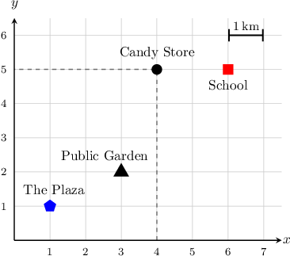
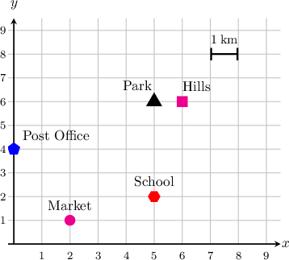
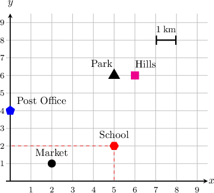
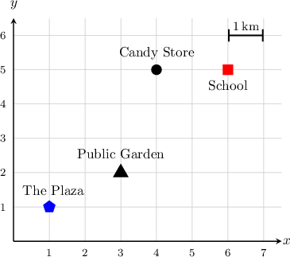
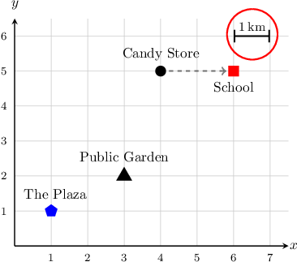
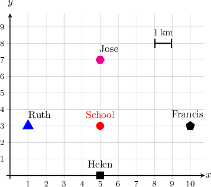
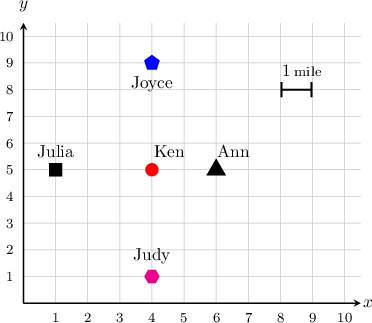
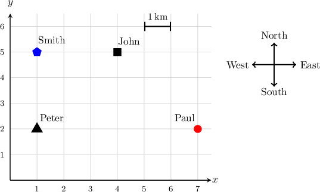
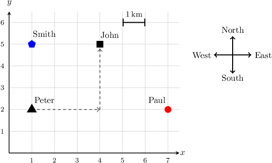

# Coordinate Planes as Maps

Source: https://www.mathacademy.com/topics/2414?courseId=30
Topic ID: 2414

## Prerequisites

- [Solving Real World Problems Using Coordinates](./2413-solving-real-world-problems-using-coordinates.md)

## Lesson

### Introduction

We can use coordinate planes as maps. For example, the diagram below shows a map of a town.

We can find the coordinates of the candy store in the same way that we usually find coordinates of points.

The $x$-coordinate of the candy store is $4,$ and the $y$-coordinate is $5.$ So, the ordered pair of coordinates is $(4,5).$

### Example: Finding the Object Located at Some Given Coordinates

#### Question

The diagram shows a map of a town. What is at $(5,2)?$

#### Explanation

The ordered pair $(5,2)$ means that the $x$-coordinate of the location is $5$ and the $y$-coordinate is $2.$

We see that, at $(5,2)$, there is a school.

### Coordinate Planes as Maps With Distances

With maps, we can include units of distance. For example, let's use the map below to find the distance from the candy store to the school.

From the candy store to the school, we move $2$ units to the right.

The scale, circled in the top right corner, tells us that each unit is $1$ kilometer in distance.

We moved $2$ units to the right, and each unit is $1$ kilometer in distance, so the distance from the candy store to the school is $2\:\text{km}.$

### Example: Finding Distances on a Graph

#### Question

The diagram shows the location of $4$ students around their school. How far away from the school does the furthest student live?

#### Explanation

From the map, we see that:

- The distance from Francis to the school (parallel to the $x$-axis) is $5\:\text{km}.$

- The distance from Helen to the school (parallel to the $y$-axis) is $3\:\text{km}.$

- The distance from Jose to the school (parallel to the $y$-axis) is $4\:\text{km}.$

- The distance from Ruth to the school (parallel to the $x$-axis) is $4\:\text{km}.$

So we conclude that Francis lives furthest away from the school, at a distance of $5\:\text{km}$ from the school.

### Example: Identifying True Statements About Distances in Coordinate Planes

#### Question

Ken maps his friends' houses on the coordinate plane. Which of the following are true?

1. Ken lives furthest from Julia

2. Ken lives at an equal distance from Judy and Joyce

3. Ken lives $1\:\text{mile}$ from Ann

#### Explanation

From the map, we see that:

- The distance from Ken's house to Julia's house is $3\:\text{miles}.$

- The distance from Ken's house to Joyce's house is $4\:\text{miles}.$

- The distance from Ken's house to Judy's house is $4\:\text{miles}.$

- The distance from Ken's house to Ann's house is $2\:\text{miles}.$

Now, we can analyze each statement in turn:

- We conclude that Ken lives furthest from Joyce and Judy, not Julia. So statement I is false.

- Ken lives at an equal distance of $4\:\text{miles}$ from both Judy and Joyce, so statement II is true.

- Ken lives $2\:\text{miles}$ from Ann, not $1\:\text{mile},$ so statement III is false.

In conclusion, only statement II is true.

### Example: Finding the Destination Given a Starting Point and a Path

#### Question

Peter is going for a walk. Starting from his house, Peter travels $3$ kilometers east, and then $3$ kilometers north. He arrives at the home of one of his friends. Who is this friend?

#### Explanation

Moving $3\:\text{km}$ east means a shift of $3$ unit right, parallel to the $x$-axis.

Moving $3\:\text{km}$ north means a shift of $3$ units up, parallel to the $y$-axis.

Consequently, Peter arrives at John's house.
