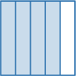
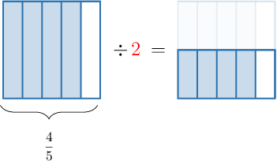
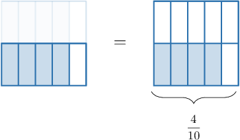
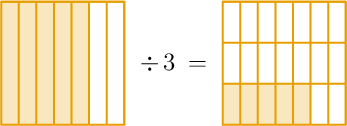
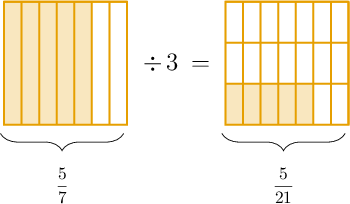
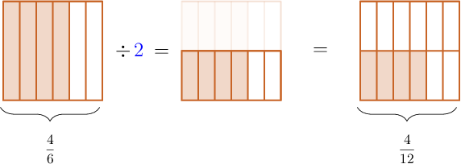
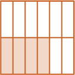
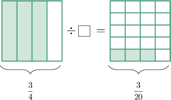
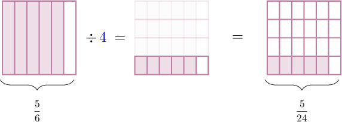

# Dividing Fractions by Whole Numbers Using Models

Source: https://www.mathacademy.com/topics/2436?courseId=30
Topic ID: 2436

## Prerequisites

- [Dividing Unit Fractions by Whole Numbers Using Models](./528-dividing-unit-fractions-by-whole-numbers-using-models.md)

## Lesson

### Introduction

When we divide a fraction by a whole number, say ${\color{red}{2}},$ the idea is to

- split the fraction into ${\color{red}{2}}$ equal parts, and

- determine the fraction that makes up each part.

For example, suppose we wish to find the value of

$$

\dfrac{4}{5} \div 2.

$$

Let's start by drawing the fraction model for $\dfrac45\mathbin{:}$

We need to divide this fraction by ${\color{red}{2}}.$ To do this, we draw a horizontal line through our fraction that splits it into $\color{red}2$ *equal parts*.

We only need to determine the fraction that makes up one of the parts. Therefore, we can focus on only one row (i.e., the bottom row).

Now, we remove all the shaded parts not in the bottom row.

From the picture on the right, we obtain that the shaded part represents $\dfrac{4}{10}$ of the whole. Therefore, we conclude that

$$

\dfrac{4}{5} \div 2 = \dfrac{4}{10} \, .

$$

### Example: Interpreting a Division Model

#### Question

What division problem is represented by the model below?

#### Explanation

We have $\dfrac{5}{7}$ on the left and $\dfrac{5}{21}$ on the right.

Therefore, the division problem shown is

$$

\dfrac{5}{7} \div 3 = \dfrac{5}{21}.

$$

### Example: Finding a Missing Quotient From a Division Model

#### Question

What picture is missing from the division model below?

#### Explanation

In the model, we have $\dfrac{4}{6}$ on the left.

Since we need to divide by $\color{blue}2$, we split the whole into $\color{blue}2$ equal parts horizontally.

From the picture on the right, we obtain that the shaded part represents $\dfrac{4}{12}$ of the whole.

Therefore, the missing picture is the following:

### Example: Finding a Missing Divisor From a Division Model

#### Question

What number is missing from the division problem below?

#### Explanation

We have $\dfrac{3}{4}$ on the left and $\dfrac{3}{20}$ on the right.

The division operation splits each vertical line into $\color{blue}5$ equal parts. So the shaded parts on the left are $\color{blue}5$ times larger than the shaded parts on the right.

Therefore, the division problem shown is

$$

\dfrac 3 4 \div {\color{blue}{5}} = \dfrac{3}{20}.

$$

So, the missing number is $\color{blue}5.$

### Example: Dividing a Fraction by a Whole Number Using a Division Model

#### Question

Use the model below to calculate $\dfrac{5}{6} \div 4.$

#### Explanation

Since we need to divide by $\color{blue}4$, we split the whole into $\color{blue}4$ equal parts horizontally.

From the picture on the right, we obtain that the shaded part represents $\dfrac{5}{24}$ of the whole.

Therefore,

$$

\dfrac{5}{6} \div 4 = \dfrac{5}{24} \, .

$$
