# Polygons

Source: https://www.mathacademy.com/topics/2470?courseId=30
Topic ID: 2470

## Prerequisites

- None listed on the topic page.

## Lesson

### Introduction

A polygon is any shape where all the sides are straight. Here are some examples of polygons:

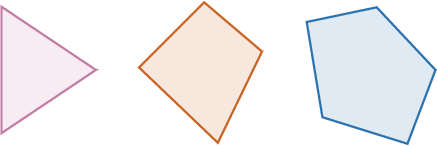

However, the following shape is *not* a polygon, since it doesn't have all straight sides:

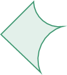

The corners of a polygon are called **vertices**, and the sides are called **edges**. For a polygon, the number of vertices always equals the number of edges.

Now, how many vertices does the polygon shown below have?

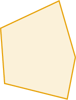

The vertices are the corners. The polygon has $5$ vertices in total, as shown below.

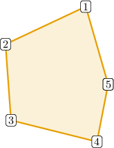

### Example: Identifying Polygons

#### Question

Which of the following is **** a polygon?

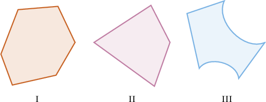

#### Explanation

A polygon is any shape where all the sides are straight.

The shape below has curved sides.

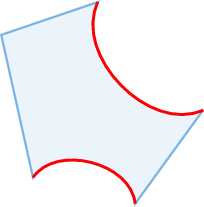

Therefore, III is not a polygon.

### Example: Counting the Number of Edges or Vertices

#### Question

How many edges does the polygon shown below have?

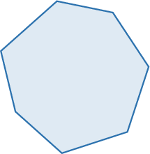

#### Explanation

Edges are straight line segments that connect the vertices of a polygon.

The polygon has $7$ edges in total, as shown below.

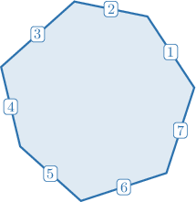

### Types of Polygons

Polygons with a specific number of sides, or vertices, have special names.

Only one of the following is a **heptagon**, but which? Let's find out.

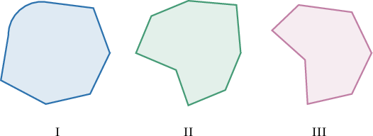

A heptagon has $7$ vertices and $7$ straight sides. Therefore, the answer is III.

Notice that shape I is not a polygon since it has a curved side. Shape II has $8$ vertices, making it an **octagon**.

### Example: Classifying Polygons

#### Question

What is the name of the polygon shown below?

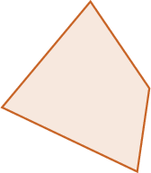

#### Explanation

The polygon has $4$ vertices, as shown below.

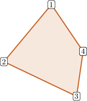

The polygon also has $4$ straight sides connecting its vertices.

Therefore, it's a ****.

### Example: Identifying Types of Polygons

#### Question

Which of the following is a ****?

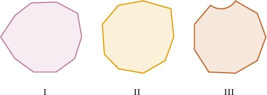

#### Explanation

A nonagon has $9$ vertices and $9$ straight sides. Therefore, the answer is II.

Notice that shape I has $10$ vertices, and shape III is not a polygon since it has a curved side.
