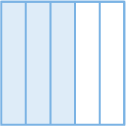
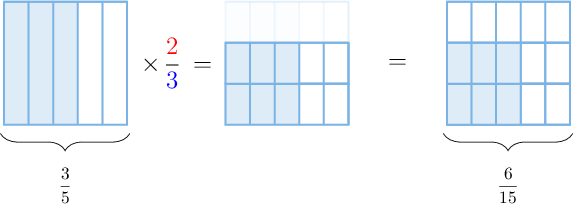
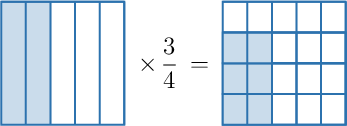
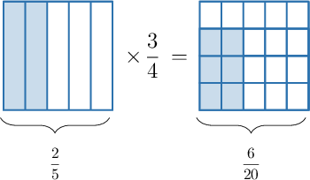
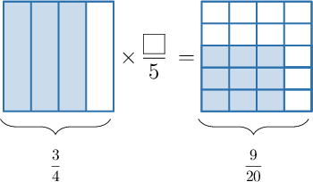
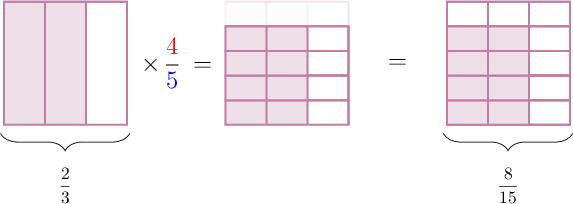
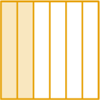
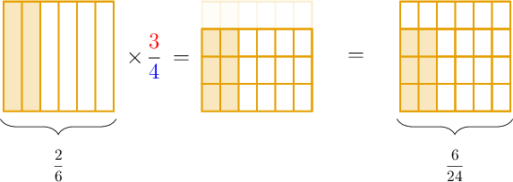

# Multiplying Fractions Using Models

Source: https://www.mathacademy.com/topics/3079?courseId=30
Topic ID: 3079

## Prerequisites

- [Multiplying Fractions by Unit Fractions Using Models](./565-multiplying-fractions-by-unit-fractions-using-models.md)

## Lesson

### Introduction

We can use fraction models to multiply any two fractions.

Let's figure out how to use models to compute the following product:

$$

\dfrac{3}{5} \times \dfrac{2}{3}

$$

We start with the model of $\dfrac{3}{5}.$

Since we need to multiply by $\dfrac{\color{red}2}{\color{blue}3}$, we split the whole into $\color{blue}3$ equal parts *horizontally*. But this time, we keep the shaded pieces in the bottom $\color{red}2$ rows.

From the picture on the right, we see that the shaded part represents $\dfrac{6}{15}$ of the whole.

Therefore,

$$

\dfrac{3}{5} \times \dfrac{2}{3} = \dfrac{6}{15}.

$$

### Example: Identifying a Multiplication Problem Corresponding to a Model

#### Question

What multiplication problem is represented by the model above?

#### Explanation

We have $\dfrac{2}{5}$ on the left and $\dfrac{6}{20}$ on the right.

Therefore, the multiplication problem shown is:

$$

\dfrac{2}{5} \times \dfrac{3}{4} = \dfrac{6}{20}

$$

### Example: Identifying a Missing Number

#### Question

What number is missing from the multiplication problem above?

#### Explanation

We have $\dfrac{3}{4}$ on the left and $\dfrac{9}{20}$ on the right.

The shape on the right-hand side is split into $5$ equal parts by horizontal lines. So, the shaded part on the right is $\dfrac{\color{blue}3}{5}$ of the shaded part on the left.

Therefore, the multiplication problem shown is

$$

\dfrac{3}{4} \times \dfrac{\color{blue}3}{5} = \dfrac{9}{20}.

$$

So, the missing number is $\color{blue}3.$

### Example: Identifying a Fraction Model Representing a Product of Two Fractions

#### Question

What picture is missing from the multiplication model below?

#### Explanation

In the model, we have $\dfrac{2}{3}$ on the left.

Since we need to multiply by $\dfrac{\color{red}4}{\color{blue}5}$, we split the whole into $\color{blue}5$ equal parts horizontally and ensure that $\color{red}4$ of the parts remain shaded.

From the picture on the right, we see that the shaded part represents $\dfrac{8}{15}$ of the whole.

Therefore, the missing picture is as follows:

### Example: Multiplying Two Fractions Using Fraction Models

#### Question

Use the model above to calculate $\dfrac{2}{6} \times \dfrac{3}{4}.$

#### Explanation

Since we need to multiply by $\dfrac{\color{red}3}{\color{blue}4}$, we split the whole into $\color{blue}4$ equal parts horizontally and ensure that $\color{red}3$ of the parts remain shaded.

From the picture on the right, we see that the shaded part represents $\dfrac{6}{24}$ of the whole.

Therefore,

$$

\dfrac{2}{6} \times \dfrac{3}{4} = \dfrac{6}{24}.

$$
