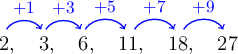
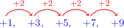
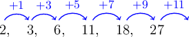
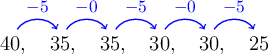
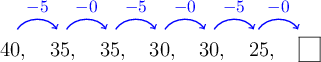
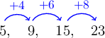
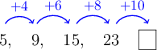

# Connecting Patterns

Source: https://www.mathacademy.com/topics/3971?courseId=30
Topic ID: 3971

## Prerequisites

- [Identifying Patterns](../grade-4/2431-identifying-patterns.md)
- [Representing Comparison Statements as Equations](../grade-4/3902-representing-comparison-statements-as-equations.md)

## Lesson

### Introduction

Let's find the next number in the pattern below.

$$

2,\quad 3,\quad 6,\quad 11,\quad 18,\quad 27

$$

First, we need to find the rule. We begin by inspecting what is happening at each step:

In this case, the rule has its own rule!

The amount we add starts at $1$ and increases by $2$ on each step.

So, to find the number after $27$, we find the size of the next step by adding $9+2=11.$

Therefore, the next number is

$$

27+11=38 \, .

$$

### Example: Identifying Patterns Within Patterns

#### Question

What is the next number in the sequence below?

$$

40,\, 35,\,35,\,30,\,30,\,25

$$

#### Explanation

We begin by inspecting what is happening at each step:

We see that on the odd-numbered steps, we should subtract $5$, while on the even-numbered steps, we should subtract $0.$

So, to find the number after $25,$ we should subtract $0.$

Therefore, the next number is

$$

25-0=25.

$$

### Example: Identifying Patterns Within Patterns: Word Problems

#### Question

Daphne started a bake sale at her school. She sold $5$ cakes on the first day, $9$ on the second day, $15$ on the third day, and $23$ on the fourth day. How many cakes will Daphne sell on the fifth day if the same pattern continues?

#### Explanation

We have the following pattern:

$$

5,\,9,\,15,\,23

$$

Let's find out how much we should add to each element to get the next one.

The amount we add starts at $4$ and increases by $2$ on each step.

So, to find the number after $23$, we should add $8+2=10.$

Therefore, the next number is

$$

23+10=33 \, .

$$

We conclude that Daphne will sell $33$ cakes on the fifth day.

### Example: Generating a Pattern Given Its Relationship With Another Pattern

#### Question

Each term in pattern B is $2$ larger than the corresponding term in pattern A. Pattern A is given below.

$$

3,\, 5,\,9,\,17

$$

What is pattern B?

#### Explanation

To find pattern B, we add $2$ to each term of pattern A:

$$

\begin{aligned}3+2 & =5 \\ 5+2 & =7 \\ 9+2 & =11 \\ 17+2 & =19\end{aligned}

$$

So, pattern B is given by

$$

5,\, 7,\,11,\,19.

$$
