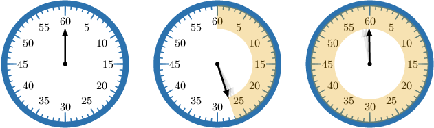

# Converting Units of Time to Larger Units

Source: https://www.mathacademy.com/topics/3976?courseId=30
Topic ID: 3976

## Prerequisites

- [Converting Units of Time to Smaller Units](../grade-4/2429-converting-units-of-time-to-smaller-units.md)
- [Dividing by 10, 100, and 1,000 Using the Pattern of Zeros](../grade-4/3882-dividing-by-10-100-and-1-000-using-the-pattern-of-zeros.md)
- [Dividing Numbers Using Place-Value Strategies](../grade-4/3886-dividing-numbers-using-place-value-strategies.md)

## Lesson

### Introduction

In previous lessons, we explored converting larger units of time to smaller ones. In this lesson, we will learn how to convert smaller units of time to larger ones.

To convert between units of time, we use the following unit conversions:

- $1 \text{week} = 7 \,\text{days}$

- $1 \,\text{day} = 24 \,\text{hours}$

- $1 \,\text{hour} = 60 \,\text{minutes}$

- $1 \,\text{minute} = 60 \,\text{seconds}$

Time is typically measured using clocks, and we can use clocks to visualize equivalent units of time.

For example, the image below shows one complete revolution of the *seconds* hand on a stopwatch. It takes precisely one minute (or $60$ seconds) for this hand to complete one full rotation.

Let's get some practice at converting between different units of time.

### A Worked Example

Suppose we want to determine how many weeks are in $35$ days.

We start with the unit conversion between weeks and days:

$$

1\, \text{week} = 7 \, \text{days}

$$

Since we wish to convert *from* days *to* weeks, we divide both sides by $7$ and obtain the following:

$$

\dfrac{1}{7} \, \text{weeks} = 1 \, \text{day}

$$

This equation tells us how many weeks are in $1$ day. To figure out how many weeks are in $35$ days, we multiply both sides of the above equation by ${\color{blue}{35}}{:}$

$$

\begin{aligned}35×\frac{1}{7}\,weeks & =35×1\,day \\ \frac{35}{7}\,weeks & =35\,days \\ (35÷7)\,weeks & =35\,days \\ 5\,weeks & =35\,days\end{aligned}

$$

Therefore, $35$ days equals $5$ weeks.

### Example: Converting From Days to Weeks

#### Question

How many weeks are in $40$ days?

#### Explanation

We start with the unit conversion between weeks and days:

$$

1\, \text{week} = 7 \, \text{days}

$$

Now, we divide both sides by $7$ and obtain the following:

$$

\dfrac{1}{7} \, \text{weeks} = 1 \, \text{day}

$$

We want to figure out how many weeks are in $40$ days. So, we multiply both sides of the above equation by $40{:}$

$$

\begin{aligned}40×\frac{1}{7}\,weeks & =40×1\,day \\ \frac{40}{7}\,weeks & =40\,days \\ 5\,\frac{5}{7}\,weeks & =40\,days\end{aligned}

$$

Therefore, $40$ days equals $5\,\dfrac{5}{7}$ weeks.

### Example: Converting From Minutes to Hours

#### Question

How many hours are in $110$ minutes?

#### Explanation

We start with the unit conversion between hours and minutes:

$$

1\, \text{hour} = 60 \, \text{minutes}

$$

Now, we divide both sides by $60$ and obtain the following:

$$

\dfrac{1}{60} \, \text{hours} = 1 \, \text{minute}

$$

We want to figure out how many hours are in $110$ minutes. So, we multiply both sides of the above equation by $110{:}$

$$

\begin{aligned}110×\frac{1}{60}\,hours & =110×1\,minute \\ \frac{110}{60}\,hours & =110\,minutes \\ \frac{110÷10}{60÷10}\,hours & =110\,minutes \\ \frac{11}{6}\,hours & =110\,minutes \\ 1\,\frac{5}{6}\,hours & =110\,minutes\end{aligned}

$$

Therefore, $110$ minutes equals $1\,\dfrac{5}{6}$ hours.

### Example: Converting From Seconds to Minutes

#### Question

How many minutes are in $270$ seconds?

#### Explanation

We start with the unit conversion between minutes and seconds:

$$

1\, \text{minute} = 60 \, \text{seconds}

$$

Now, we divide both sides by $60$ and obtain the following:

$$

\dfrac{1}{60} \, \text{minutes} = 1 \, \text{second}

$$

We want to figure out how many minutes are in $270$ seconds. So, we multiply both sides of the above equation by $270{:}$

$$

\begin{aligned}270×\frac{1}{60}\,minutes & =270×1\,second \\ \frac{270}{60}\,minutes & =270\,seconds \\ \frac{270÷30}{60÷30}\,minutes & =270\,seconds \\ \frac{9}{2}\,minutes & =270\,seconds \\ 4\,\frac{1}{2}\,minutes & =270\,seconds\end{aligned}

$$

Therefore, $270$ seconds equals $4\,\dfrac{1}{2}$ minutes.
