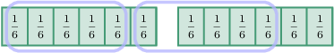
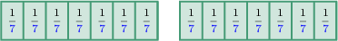
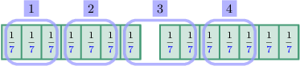

# Dividing Whole Numbers by Fractions Using Models: Fractional Results

Source: https://www.mathacademy.com/topics/4698?courseId=30
Topic ID: 4698

## Prerequisites

- [Dividing Whole Numbers by Fractions Using Models: Whole Number Results](./2437-dividing-whole-numbers-by-fractions-using-models-whole-number-results.md)

## Lesson

### Introduction

When we divide a whole number by a non-unit fraction, the answer is often not a whole number.

In this lesson, we'll learn how to solve division problems in these cases using models. The process is similar to cases when the answer is a whole number (we saw this in a previous lesson). The difference now is that we have to deal with a remainder.

To demonstrate, let's use a model to solve the following division problem:

$$

{\color{blue}{1}} \div \dfrac{2}{3}

$$

We start with a model that represents $\color{blue}1$ whole:

We need to determine how many times $\dfrac{\boxed{2}}3$ fits into $\color{blue}1$ whole. So, we proceed as follows:

- First, we split our whole into *thirds* (the denominator of our fraction):

- Next, we break this into groups of $\boxed{2}$:

Note the following:

- We have $\fbox{1}$ full group. This is the whole number part of our answer.

- We see that there is $\boxed{1}$ piece left over out of a possible group of $\boxed{2}.$ So, the fractional part of our answer is

Therefore, the solution to our division problem is as follows:

$$

1 \div \dfrac{2}{3} = \fbox{1} \, \dfrac{\boxed{1}}{\boxed{2}}

$$

Let's see another example.

### Example: Finding the Remainder in a Division Problem

#### Question

Use the model above to determine the missing fraction in the following division problem.

$$

\,0\,

$$

#### Explanation

Let's start by interpreting our model:

- The model shows $2$ wholes split into sixths.

- There are $\boxed{5}$ sixths in each group, with $\boxed{2}$ remaining.

Note the following:

- There are $\color{red}2$ full groups.

- There are $\boxed{2}$ sixths left over out of a possible group of $\boxed{5}.$ So the fractional part of our answer is

Therefore,

$$

2 \div \dfrac{5}{6} = {\color{red}{2}} \, \dfrac{\boxed{2}}{\boxed{5}}.

$$

### Example: Dividing a Whole Number by a Non-Unit Fraction

#### Question

Use the model above to calculate the value of $2 \div \dfrac{3}{7}.$

#### Explanation

To calculate ${\color{red}2} \div \dfrac{\boxed{3}}{\color{blue}7}$, we first need to divide each of the $\color{red}2$ wholes into $\color{blue}7$ equal parts.

Next, we break this into groups of $\boxed{3}$:

Note the following:

- We got $\fbox{4}$ full groups.

- There are $\boxed{2}$ pieces left over out of a possible group of $\boxed{3}.$ So the fractional part of our answer is

Therefore,

$$

2 \div \dfrac{3}{7} = \fbox{4} \, \dfrac{\boxed{2}}{\boxed{3}}.

$$
