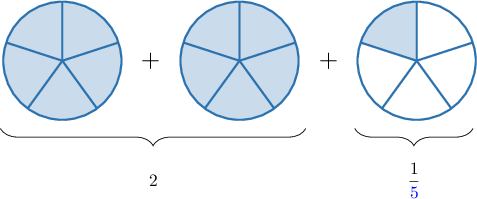

# Adding Fractions and Whole Numbers

Source: https://www.mathacademy.com/topics/539?courseId=30
Topic ID: 539

## Prerequisites

- [Adding Fractions and Whole Numbers Using Models](./543-adding-fractions-and-whole-numbers-using-models.md)
- [Adding Fractions With Like Denominators](../grade-4/2351-adding-fractions-with-like-denominators.md)

## Lesson

### Introduction

It's straightforward to find the sum of a whole number and a proper fraction when we want the final answer to be a mixed number.

For instance, we can add $6$ and $\dfrac{1}{5}$ as follows:

$$

{\color{red}6} + {\color{blue}\dfrac{1}{5}} = {\color{red}6}\,{\color{blue}\dfrac{1}{5}}

$$

Okay, that was pretty easy. And notice that we didn't need a fraction model to do it.

There are other ways to add whole numbers and fractions, which we'll discuss shortly. But first, let's see a few examples of this idea.

### Example: Expressing a Sum as a Mixed Number

#### Question

$8 + \dfrac{1}{4}$ is equivalent to which mixed number?

#### Explanation

The number $8$ is a whole number, and $\dfrac{1}{4}$ is a proper fraction. Therefore, their sum is a mixed number:

$$

8 + \dfrac{1}{4} = 8 \, \dfrac{1}{4}

$$

### Adding Proper Fractions and Whole Numbers

Suppose that we want to add a whole number and a fraction. If we want the final answer to be an improper fraction, then we can proceed by turning the whole number into an improper fraction.

For example, let's find $2+\dfrac{1}{\color{blue}5}$ as an improper fraction.

We start by writing $2$ as an improper fraction with $1$ in the denominator:

$$

2 =\dfrac{2}{1}

$$

Then, we put this fraction over a denominator of $\color{blue}5$ by multiplying the numerator and denominator by ${\color{blue}5}$:

$$

\dfrac{2\times {\color{blue}{5}}}{1\times {\color{blue}{5}}} = \dfrac{10}{\color{blue}5}

$$

Now, we can add the two numbers:

$$

\begin{aligned}2+\frac{1}{5}=\underset{2}{\underset{}{\frac{10}{5}}}+\frac{1}{5}=\frac{11}{5}\end{aligned}

$$

And we're done!

To use some math jargon, we put the numbers $2$ and $\dfrac 1{\color{blue}5}$ over a **common denominator** of ${\color{blue}5}$ before adding them.

Notice that this process is very similar to using fraction models.

To add $2$ to $\dfrac 1{\color{blue}5}$ using a model, we split each whole into ${\color{blue}5}$ equal parts. When we do, we see that there are $11$ shaded parts in total. So we arrive at the same answer:

$$

2 +\dfrac{1}{\color{blue}5} = \dfrac{11}{{\color{blue}5}}

$$

### Example: Expressing a Sum as an Improper Fraction

#### Question

Sophia walked $\dfrac{5}{6}$ of a mile and then ran another $2$ miles. Expressing the result as an improper fraction, how many miles did Sophia travel?

#### Explanation

To find out how many miles Sophia traveled, we have to calculate the sum:

$$

\dfrac{5}{6} + 2

$$

To add $\dfrac{5}{\color{blue}{6}}$ and $2$, we need to express the whole number $2$ as an equivalent fraction with a denominator of ${\color{blue}{6}}.$

First, we write $2$ as an improper fraction:

$$

\dfrac{2}{1}

$$

Then, we put this fraction over a denominator of $\color{blue}6$ by multiplying the numerator and denominator by ${\color{blue}{6}}$:

$$

\dfrac{2 \times {\color{blue}{6}}}{1 \times{\color{blue}{6}}} = \dfrac{12}{6}

$$

So now, we have to find the following sum:

$$

\dfrac{5}{6} + \dfrac{12}{6}

$$

To add two fractions with like denominators, we add the numerators and keep the denominators the same:

$$

\begin{aligned}\frac{5}{6}+\frac{12}{6}=\frac{5+12}{6}=\frac{17}{6}\end{aligned}

$$

Therefore, Sophia traveled $\dfrac{17}{6}$ miles.

### Adding Improper Fractions and Whole Numbers

How do we write $\dfrac{7}{\color{blue}4} + 5$ as a mixed number?

Notice that we cannot write $5\,\dfrac 7 4$ because $\dfrac 7 4$ is an improper fraction. Instead, let's find this sum using the same method as before.

First, we write $5$ as an improper fraction:

$$

\dfrac{5}{1}

$$

Then, we put this fraction over a denominator of $\color{blue}4$ by multiplying the numerator and denominator by ${\color{blue}{4}}$:

$$

\dfrac{5 \times {\color{blue}{4}}}{1 \times{\color{blue}{4}}} = \dfrac{20}{4}

$$

So now, we have to find the following sum:

$$

\dfrac{7}{4} + \dfrac{20}{4}

$$

To add two fractions with like denominators, we add the numerators and keep the denominators the same:

$$

\begin{aligned}\frac{7}{4}+\frac{20}{4}=\frac{7+20}{4}=\frac{27}{4}\end{aligned}

$$

Finally, we convert this to a mixed number:

$$

27 \div 4 = 6 \, \text{R} \, 3 = 6 \, \dfrac{3}{4}

$$

### Example: Finding the Sum of an Improper Fraction and a Whole Number

#### Question

Tom and Margaret went to a fruit store to buy apples and pears. Tom bought $3$ kilograms of apples while Margaret bought $\dfrac{11}{3}$ kilograms of pears. Expressing the result as a mixed number, how many kilograms of fruit did they buy together?

#### Explanation

To know how many kilograms they bought, we have to calculate the sum:

$$

3 + \dfrac{11}{3}

$$

To add $3 + \dfrac{11}{\color{blue}{3}}$, we need to express the whole number $3$ as an equivalent fraction with a denominator of ${\color{blue}{3}}.$

First, we write $3$ as an improper fraction:

$$

\dfrac{3}{1}

$$

Then, we put this fraction over a denominator of $\color{blue}3$ by multiplying the numerator and denominator by ${\color{blue}{3}}$:

$$

\dfrac{3 \times {\color{blue}{3}}}{1 \times{\color{blue}{3}}} = \dfrac{9}{3}

$$

So now, we have to find the following sum:

$$

\dfrac{9}{3} + \dfrac{11}{3}

$$

To add two fractions with like denominators, we add the numerators and keep the denominators the same.

$$

\begin{aligned}\frac{9}{3}+\frac{11}{3}=\frac{9+11}{3}=\frac{20}{3}\end{aligned}

$$

Finally, we convert this to a mixed number:

$$

20 \div 3 = 6 \, \text{R} \, 2 = 6 \, \dfrac{2}{3}

$$

Thus, Tom and Margaret bought $6 \, \dfrac{2}{3}$ kilograms of fruit.
