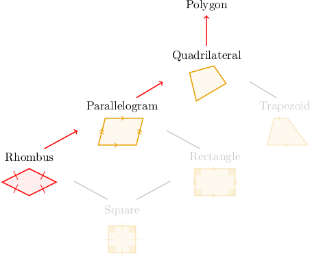
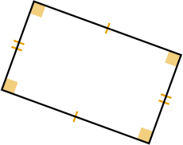
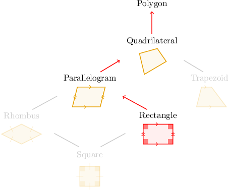
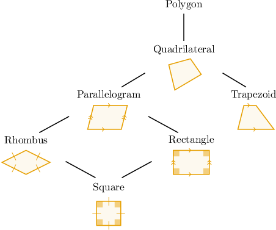
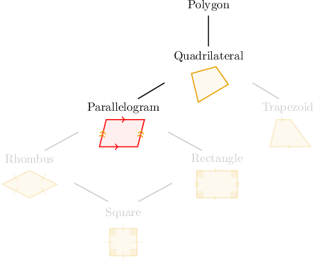
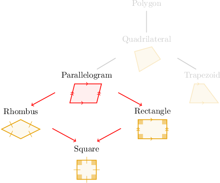
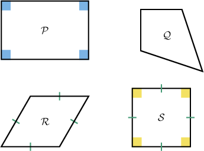
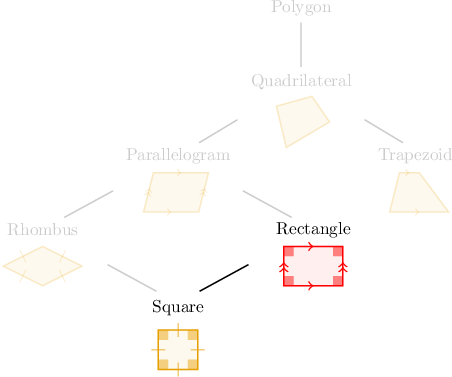

# Classifying Quadrilaterals

Source: https://www.mathacademy.com/topics/570?courseId=30
Topic ID: 570

## Prerequisites

- [Rectangles, Rhombuses, and Squares](./3751-rectangles-rhombuses-and-squares.md)

## Lesson

### Introduction

We classify quadrilaterals using their properties, such as the number of parallel sides or the number of right angles.

Quite often, a specific type of quadrilateral, such as a "rhombus," also meets the criteria of other quadrilaterals.

For this reason, it's helpful to group quadrilaterals using a **hierarchy diagram** like the one below.

**Watch Out!** We'll use this diagram often, so you need to remember it. Take a piece of paper and sketch this diagram yourself. Make sure you can reproduce it.

Here's the key takeaway: *Every shape in the diagram can be classified as any shape above it!*

For example, to find the other ways in which "rhombus" may be classified, we write down all the names moving up (but never down) in the hierarchy diagram from "rhombus."

By doing this, we can deduce that a rhombus is *always* a

$\qquad$ ${\color{darkgreen}\checkmark}\:$ parallelogram

$\qquad$ ${\color{darkgreen}\checkmark}\:$ quadrilateral

$\qquad$ ${\color{darkgreen}\checkmark}\:$ polygon

However, it may *not* be described as the following:

$\qquad$ ${\color{red}\times}\:$ trapezoid

$\qquad$ ${\color{red}\times}\:$ rectangle

$\qquad$ ${\color{red}\times}\:$ square

### Classifying a Rectangle

As another example, let's find all the ways to classify the following shape.

The shape is a rectangle, so let's highlight "rectangle" on our hierarchy diagram.

To find the other ways in which "rectangle" may always be classified, we write down all the names moving up (but never down) in the hierarchy diagram from "rectangle."

By doing this, we can deduce that a rectangle is *always* a

$\qquad$ ${\color{darkgreen}\checkmark}\:$ parallelogram

$\qquad$ ${\color{darkgreen}\checkmark}\:$ quadrilateral

$\qquad$ ${\color{darkgreen}\checkmark}\:$ polygon

However, it may *not* be described as the following:

$\qquad$ ${\color{red}\times}\:$ square

$\qquad$ ${\color{red}\times}\:$ rhombus

$\qquad$ ${\color{red}\times}\:$ trapezoid

### Example: Classifying Quadrilaterals Using "Always"

#### Question

Use the hierarchy diagram above to determine which of the following statements are true.

1. A parallelogram is ** a polygon.

2. A parallelogram is ** a square.

3. A parallelogram is ** a rhombus.

#### Explanation

To find the other ways in which "parallelogram" may ** be classified, we write down all the names moving up (but never down) in the hierarchy diagram from "parallelogram."

By doing this, we can deduce that a parallelogram is ** a

$\qquad$ ${\color{darkgreen}\checkmark}\:$ quadrilateral

$\qquad$ ${\color{darkgreen}\checkmark}\:$ polygon

However, it may ** be described as the following:

$\qquad$ ${\color{red}\times}\:$ a rectangle

$\qquad$ ${\color{red}\times}\:$ a trapezoid

$\qquad$ ${\color{red}\times}\:$ a rhombus

$\qquad$ ${\color{red}\times}\:$ a square

Therefore, the correct answer is "I only."

### Describing a Parallelogram

Another way to use our hierarchy diagram is to determine how particular shapes may *sometimes* be classified.

For example, let's consider the following statements:

1. A parallelogram is *sometimes* a square.

2. A parallelogram is *sometimes* a trapezoid.

3. A parallelogram is *sometimes* a quadrilateral.

Which of them are true?

First, let's highlight "parallelogram" in our hierarchy diagram.

To find the other ways in which "parallelogram" may *sometimes* be classified, we write down all the names moving down (but never up) in the hierarchy diagram.

By doing this, we can deduce that a parallelogram is *sometimes* a

$\qquad$ ${\color{darkgreen}\checkmark}\:$ rectangle

$\qquad$ ${\color{darkgreen}\checkmark}\:$ rhombus

$\qquad$ ${\color{darkgreen}\checkmark}\:$ square

However, note that a parallelogram is

$\qquad$ *always* a quadrilateral

$\qquad$ *always* a polygon

$\qquad$ ****** a trapezoid

Therefore, the correct answer is "I only."

### Example: Classifying Quadrilaterals Using "Sometimes"

#### Question

Which of the figures below is a rectangle?

#### Explanation

First, let's highlight "rectangle" in our hierarchy diagram.

To find the other ways in which "rectangle" may ** be classified, we write down all the names moving down (but never up) in the hierarchy diagram.

By doing this, we can deduce that a rectangle is ** a

$\qquad$ ${\color{darkgreen}\checkmark}\:$ square

With that in mind, let's look at each shape in turn.

- $\mathcal{P}$ is a rectangle.

- $\mathcal{Q}$ is a quadrilateral. However, it is ** a rectangle.

- $\mathcal{R}$ is a rhombus. However, it is ** a rectangle.

- $\mathcal{S}$ is a square. Therefore, it is also a rectangle.

Therefore, only $\mathcal{P}$ and $\mathcal{S}$ are rectangles.

### Example: Completing a Classification Statement

#### Question

From left to right, what words are missing from the sentence below?

$\qquad$ **

1. sometimes, trapezoid

2. always, trapezoid

3. always, polygon

#### Explanation

First, recall the hierarchy diagram of quadrilaterals.

From the diagram, we can deduce the following:

- A rectangle is ** a ${\color{darkgreen}\checkmark}\:$ polygon ${\color{darkgreen}\checkmark}\:$ quadrilateral ${\color{darkgreen}\checkmark}\:$ parallelogram

- A rectangle is ** a ${\color{darkgreen}\checkmark}\:$ square

Therefore, the correct statement is

$\qquad$ "**"
